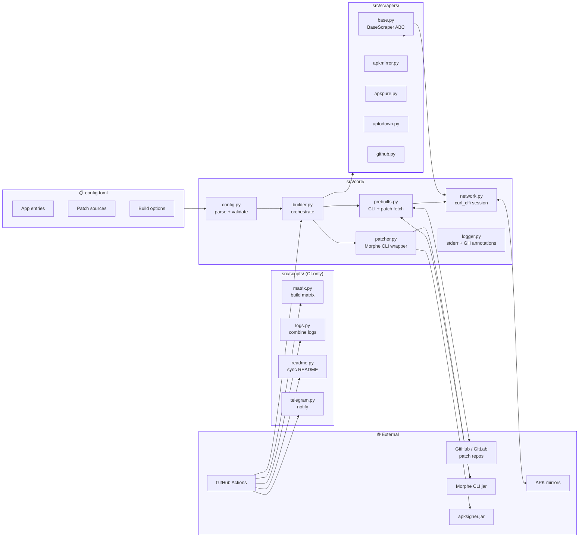

<div align="center">
<a href="#-features"></a>

[](https://github.com/softpsycho/apkforge/actions/workflows/ci.yml)
[](https://www.python.org/downloads/)
[](./LICENSE)
[](https://t.me/apkforge)
<br>
[](#-list-of-apps-by-patch-source)
[](#-list-of-apps-by-patch-source)
[](https://github.com/softpsycho/apkforge/commits)

<br>

**apkforge** is a fully automated, GitHub-Actions-driven build pipeline that fetches stock Android APKs from public mirrors, applies community patches from multiple sources, signs the result with a project-wide keystore, and publishes reproducible releases with auto-generated changelogs.

Everything happens in public CI — nothing is built on a personal machine, nothing is hidden. You can read every line of the build code in this repo and reproduce any release locally.

</div>

---

## Table of Contents

- [Features](#-features)
- [List of Apps by Patch Source](#-list-of-apps-by-patch-source)
- [How It Works](#-how-it-works)
- [Architecture](#-architecture)
- [Getting Started](#-getting-started)
- [Configuration Reference](#-configuration-reference)
- [Verifying Authenticity](#-verifying-authenticity)
- [Troubleshooting](#-troubleshooting)
- [FAQ](#-faq)
- [Contributing](#-contributing)
- [Roadmap](#-roadmap)
- [License & Copyright](#-license--copyright)
- [Disclaimer](#-disclaimer)

---

## Features

- **Multi-source APK acquisition.** Fetches stock APKs from APKMirror, Uptodown, APKPure, or GitHub Releases — with automatic fallback when a source is unavailable or a version is missing.
- **Multi-patch-source support.** Each app can pull patches from one or more GitHub/GitLab patch repositories, with per-source version pinning (`latest`, `dev`, or a specific tag).
- **Signature verification.** Every stock APK is checked against a known SHA-256 fingerprint before patching, so a tampered or repackaged upstream APK is caught before it reaches your device.
- **Bundle optimization.** For split-APK bundles (`.apkm` / `.xapk`), non-target architectures, non-English languages, and non-`xxhdpi` densities are stripped before patching — shrinking the final APK by up to 60%.
- **Self-healing patch loop.** If an individual patch fails (upstream broke compatibility for a specific app version), apkforge automatically excludes it and retries up to 5 times, then records which patches were excluded in the release notes.
- **Smart version resolution.** Picks the highest version that the patch source officially supports, falling back to lower versions or experimental patches when the latest is unavailable.
- **Reproducible signing.** All official releases share a single SHA-256 fingerprint, so updates install seamlessly over previous versions. Forks can use the bundled `morphe.keystore` or supply their own.
- **Telegram notifications.** Each release auto-publishes a summary message to the project's Telegram channel.
- **Obtainium deep links.** Each app in the table below has a one-tap "Add to Obtainium" link for OTA updates directly from GitHub Releases — no Play Store required.
- **Transparent CI.** Builds run daily on GitHub Actions; you can inspect every workflow run, every log, and every artifact.

---

## List of Apps by Patch Source

Apps are grouped by the patch repository they use. Click a badge to open the app's Play Store page; click "Add to Obtainium" to subscribe to updates.

<!-- APPS_START -->

> The table below is auto-generated from `config.toml` by `src/scripts/readme.py`. To add or remove apps, edit `config.toml` and run `uv run python -m src.scripts.readme update`. The CI does this automatically on every push.

<!-- APPS_END -->

<details>
<summary><b>📦 How to use the "Add to Obtainium" link</b></summary>

1. Install [Obtainium](https://github.com/ImranR98/Obtainium) from F-Droid or its GitHub Releases.
2. Tap the **⬇️ Add** link in any app row above on your Android device.
3. Obtainium will open and prompt you to confirm the addition.
4. Obtainium will now check this repo for new releases every time you open it (or on a schedule you set), and install updates with the same signature — no uninstall/reinstall needed.

</details>

---

## How It Works

```
┌─────────────────────────────────────────────────────────────────┐
│                     apkforge Build Pipeline                     │
├─────────────────────────────────────────────────────────────────┤
│                                                                 │
│  1. 🔍 Check for Updates    CI runs daily at 10:00 UTC           │
│      (.github/workflows/   Compares upstream patch release       │
│       ci.yml)               dates against our last release      │
│                                                                 │
│  2. 🧮 Compute Matrix       Groups apps by release-group,        │
│      (src/scripts/          splits arm64+v7a builds, skips       │
│       matrix.py)            apps whose changelog keywords        │
│                             don't appear upstream                │
│                                                                 │
│  3. 📥 Fetch Prebuilts      Downloads Morphe CLI jar +           │
│      (src/core/             patch bundles from GitHub/GitLab     │
│       prebuilts.py)         Releases, caches them in temp/       │
│                                                                 │
│  4. 📥 Fetch Stock APK      Per-domain-locked download with      │
│      (src/scrapers/)        3-retry fallback across mirrors      │
│                                                                 │
│  5. 🔏 Verify Signature     apksigner verify --print-certs      │
│      (src/core/             against sig.txt; strict or           │
│       patcher.py)           lenient mode per config              │
│                                                                 │
│  6. 🧹 Optimize Bundle      Strip non-target arches, non-EN     │
│      (src/core/             langs, non-xxhdpi densities          │
│       builder.py)                                                │
│                                                                 │
│  7. 🧩 Apply Patches        java -jar morphe-cli patch ...      │
│      (src/core/             Dynamic exclude-and-retry loop       │
│       patcher.py)           for failing patches (max 5)          │
│                                                                 │
│  8. ✍️  Sign APK             Sign with project keystore          │
│      (morphe.keystore       or KEYSTORE_BASE64 env secret        │
│       / env secret)                                              │
│                                                                 │
│  9. 📦 Publish Release      Upload to GitHub Releases as         │
│      (.github/workflows/    draft, then combine logs and         │
│       build.yml)            publish with auto-generated          │
│                             changelog + Telegram ping            │
│                                                                 │
│ 10. 📝 Sync README          Update patches_info.json + README    │
│      (src/scripts/          apps table via auto-commit           │
│       readme.py)                                                 │
│                                                                 │
└─────────────────────────────────────────────────────────────────┘
```

Each step is a discrete module — click the file path to read its source.

---

## Architecture



**Layered design:**

| Layer | Responsibility | Key files |
|:------|:---------------|:----------|
| **CLI entry** | Argv parsing, signal handling, env loading | `main.py` |
| **Config** | Parse + validate `config.toml` | `src/core/config.py` |
| **Network** | `curl_cffi` session, retries, per-domain locks | `src/core/network.py` |
| **Prebuilts** | Fetch CLI jar + patch bundles | `src/core/prebuilts.py` |
| **Scrapers** | Per-mirror download strategies | `src/scrapers/*.py` |
| **Patcher** | Wrap Morphe CLI, signature checks | `src/core/patcher.py` |
| **Builder** | Orchestrate end-to-end build | `src/core/builder.py` |
| **Scripts** | CI-only helpers (matrix, logs, README, Telegram) | `src/scripts/*.py` |
| **CI** | GitHub Actions workflows | `.github/workflows/*.yml` |

---

## Getting Started

### Prerequisites

| Tool | Version | Why |
|:-----|:--------|:----|
| [Python](https://www.python.org/downloads/) | 3.13+ | Runtime (uses `match`/`case`, `tomllib`, PEP 695 generics) |
| [uv](https://docs.astral.sh/uv/) | latest | Dependency + venv management |
| [Java](https://adoptium.net/temurin/releases/?version=21) | 21+ | Morphe CLI + apksigner are JVM tools |
| [Git](https://git-scm.com/) | any | Cloning this repo |

### Build locally

```bash
# 1. Clone
git clone --depth 1 https://github.com/softpsycho/apkforge.git
cd apkforge

# 2. Build all apps (uv creates the venv automatically)
uv run main.py

# 3. Or build a specific app
uv run main.py Reddit

# 4. Or override the architecture
uv run main.py Reddit arm64-v8a

# 5. Clean build artifacts
uv run main.py clear
```

Output APKs land in `build/`. Intermediate artifacts (cached stock APKs, downloaded CLI jars, patch bundles) live in `temp/` and `unmodified-apks/` — these are reused across runs to speed up rebuilds.

### Run in CI

The repo ships with four workflows:

| Workflow | Trigger | Purpose |
|:---------|:--------|:--------|
| [`ci.yml`](./.github/workflows/ci.yml) | Daily 10:00 UTC or manual | Check upstream for new releases; trigger builds |
| [`build.yml`](./.github/workflows/build.yml) | Called by `ci.yml` | Build a single release-group, publish draft release |
| [`lint.yml`](./.github/workflows/lint.yml) | Push / PR to `config.toml` or `src/**` | Validate config, sync README |
| [`cleanup.yml`](./.github/workflows/cleanup.yml) | Weekly Sunday 00:00 UTC | Delete pre-release tags older than 14 days |

To run a build manually: **Actions → CI → Run workflow → select patch source → Run**.

---

## Configuration Reference

All configuration lives in [`config.toml`](./config.toml). The full reference, including how to add a new app, a new patch source, a new keystore, or a new release-group, is in [CONTRIBUTING.md](./CONTRIBUTING.md).

### Quick reference

| Key | Default | Scope | Description |
|:----|:-------:|:-----:|:------------|
| `parallel-jobs` | CPU count (capped at 2 on CI) | Global | Concurrent build workers |
| `brand` | `Morphe` | Global / Per-app | Used in output filenames |
| `release-group` | `brand` value | Per-app | Maps to release tag suffix and CI job |
| `cli-source` | `github:MorpheApp/morphe-desktop` | Global / Per-app | CLI repo (`github:owner/repo` or `gitlab:owner/repo`) |
| `cli-version` | `latest` | Global / Per-app | `latest`, `dev`, or a specific tag |
| `strict-sigcheck` | `true` | Global only | Fail if an app is missing from `sig.txt` |
| `app-name` | table name | Per-app | Display name in output filename |
| `arch` | `all` | Per-app | `all` / `both` / `arm64-v8a` / `armeabi-v7a` / `x86_64` / `x86` |
| `version` | `auto` | Per-app | `auto` (stable) / `latest` (incl. experimental) / specific version |
| `changelog-keywords` | `[]` | Per-app | Keywords to gate builds on upstream changelog |
| `apkmirror-dlurl` | — | Per-app | APKMirror page URL |
| `uptodown-dlurl` | — | Per-app | Uptodown page URL |
| `apkpure-dlurl` | — | Per-app | APKPure page URL |
| `github-dlurl` | — | Per-app | GitHub Releases tag URL |
| `exclusive-patches` | `false` | Per-app | Only apply listed patches, disable everything else |
| `patcher-args` | — | Per-app | Extra args passed to Morphe CLI |
| `skip-sigcheck` | `false` | Per-app only | Total bypass for pre-modified APKs |
| `enabled` | `true` | Per-app | Skip this entry when `false` |

### Adding a new app (30-second recipe)

```toml
[MyApp]
pkg-name = "com.example.app"
apkmirror-dlurl = "https://www.apkmirror.com/apk/example/example-app"
uptodown-dlurl = "https://example-app.en.uptodown.com/android"
apkpure-dlurl = "https://apkpure.com/example-app/com.example.app"
release-group = "morphe"
arch = "arm64-v8a"

[MyApp.patches]
"github:owner/myapp-patches" = []   # empty list = apply all default patches
```

Commit, push — `lint.yml` will auto-sync the README's app table within seconds.

---

## Verifying Authenticity

All official apkforge releases share a single SHA-256 signing certificate. Before installing any APK downloaded from this repo's Releases page, verify its fingerprint:

```bash
# Using apksigner (ships in Android SDK build-tools)
apksigner verify --print-certs my-app.apk | grep SHA-256

# Using keytool (ships with JDK)
keytool -printcert -jarfile my-app.apk | grep SHA256
```

The expected SHA-256 fingerprint is:

```text
1894fee4df44d1823f3666db4743566d043dd72cbc13566433c1908270a4be10
```

If the fingerprint doesn't match, **do not install the APK** — it has been tampered with or repackaged by a third party. Report it via [Issues](https://github.com/softpsycho/apkforge/issues/new?template=script.yml).

---

## Troubleshooting

<details>
<summary><b>Java version mismatch</b></summary>

```
ABORT: Java 17 found, but Java 21+ is required
```

apkforge uses Morphe CLI which requires Java 21+. Install Temurin 21 from [Adoptium](https://adoptium.net/temurin/releases/?version=21):

```bash
# Linux
sudo apt install temurin-21-jdk
# macOS
brew install --cask temurin@21
```

Verify with `java -version` — the output should mention `21.x.x`.

</details>

<details>
<summary><b>APK signature mismatch</b></summary>

```
SignatureError: APK signature mismatch
```

The stock APK downloaded from a mirror doesn't match the SHA-256 fingerprint recorded in `sig.txt`. Possible causes:

1. **Upstream rotated their signing key** — update `sig.txt` with the new fingerprint from a trusted source (e.g. APKMirror's cert listing).
2. **The mirror served a tampered APK** — try a different mirror by reordering `*-dlurl` entries.
3. **You're patching a pre-modified APK** (e.g. PairIP-stripped) — set `skip-sigcheck = true` for this app.

</details>

<details>
<summary><b>Download timeout from a mirror</b></summary>

```
NetworkError: Download failed after 3 attempts: https://www.apkmirror.com/...
```

APKMirror and APKPure frequently rate-limit or Cloudflare-challenge automated clients. apkforge uses `curl_cffi` with Chrome TLS fingerprint impersonation to bypass this, but it's not foolproof. Workarounds:

1. **Reorder your `*-dlurl` entries** to put the most reliable mirror first for your region.
2. **Use the `github-dlurl` source** if the upstream app publishes on GitHub Releases (e.g. Instagram, Greenify in this repo).
3. **Wait and retry** — Cloudflare challenges usually clear within minutes.
4. **Set `GITHUB_TOKEN`** in your env to get higher API rate-limits on GitHub scrapers.

</details>

<details>
<summary><b>Build fails after upstream patch release</b></summary>

```
PatcherError: FAILED: Some Patch Name
```

A new patch version broke compatibility with the current app version. apkforge auto-excludes the failing patch and retries up to 5 times; if it still fails:

1. Check the release notes — excluded patches are listed under each app with a ⚠️ marker.
2. Pin the patch source to the previous working version in `config.toml`:
   ```toml
   [MyApp.patches]
   "github:owner/myapp-patches" = { version = "v1.2.3" }
   ```
3. File an issue on the upstream patch repo (not here — apkforge just applies patches, it doesn't write them).

</details>

<details>
<summary><b>"No asset (.jar) found" or "No asset (.mpp) found"</b></summary>

The patch source repo published a release without the expected artifact extension, or the release tag doesn't exist. Verify:

1. The release tag exists in the upstream repo.
2. The release contains a `.jar` (for CLI) or `.mpp`/`.rvp` (for patch bundles) asset.
3. If the asset name has a `-dev` suffix and there are multiple matches, apkforge prefers non-`-dev` unless you set `version = "dev"`.

</details>

<details>
<summary><b>Build succeeds but APK is missing from the release</b></summary>

Check the workflow run logs for the `release` job. Common causes:

1. **All builds failed** — the draft release is auto-deleted if no APKs were uploaded.
2. **`gh release upload --clobber` failed** — usually a transient API error; re-run the workflow.
3. **The APK is larger than 2GB** — GitHub's per-asset limit. Unlikely for patched apps.

</details>

---

## FAQ

<details>
<summary><b>Is this legal?</b></summary>

Patching APKs for personal use is legal in most jurisdictions but may violate the terms of service of the original app or its distribution platform. apkforge doesn't redistribute stock APKs — it downloads them on-demand from public mirrors and patches them in CI. The patched APKs are signed with apkforge's own keystore, not the original developer's.

That said: **use at your own risk**. The project is not affiliated with any patch creator or app developer.

</details>

<details>
<summary><b>Why are some apps marked "Latest (dev)"?</b></summary>

Some patch sources (e.g. `crimera/piko` for Instagram) publish breaking fixes in a `-dev` release channel before promoting to stable. Setting `version = "dev"` in the patch spec tells apkforge to fetch the highest `-dev` tag. These builds are marked as pre-releases and auto-deleted after 14 days by `cleanup.yml`.

</details>

<details>
<summary><b>Can I use my own keystore?</b></summary>

Yes — see [CONTRIBUTING.md → Keystore](./CONTRIBUTING.md#5--keystore). Set `KEYSTORE_BASE64`, `KEYSTORE_PASS`, and `KEYSTORE_ALIAS` as environment variables (locally in `.env`, on CI as repository secrets). APKs you sign will not be interchangeable with official apkforge releases — users will need to uninstall before switching.

</details>

<details>
<summary><b>How do I add a new patch source?</b></summary>

See [CONTRIBUTING.md → Adding a new patch source](./CONTRIBUTING.md#4--adding-a-new-patch-source). The short version: add your app entries to `config.toml` with `release-group = "your-group"`, then add a `build-<your-group>` job to `ci.yml` that calls `build.yml` with `patch_source: '<your-group>'`.

</details>

<details>
<summary><b>Why does the build use `curl_cffi` instead of `requests`?</b></summary>

`curl_cffi` impersonates real browser TLS fingerprints (JA3/JA4), which lets it bypass Cloudflare's bot detection on APKMirror and APKPure. `requests` uses CPython's default TLS profile and gets challenged immediately.

</details>

<details>
<summary><b>Can I run this on Termux?</b></summary>

Yes, with caveats. You need Termux + `python-is-python3` + `openjdk-21` + `uv`. The build will be slow (no cached APKs, single-threaded) but functional. Join the [Telegram channel](https://t.me/apkforge) for community Termux setup tips.

</details>

<details>
<summary><b>How do I undo a patch that broke an app?</b></summary>

In `config.toml`, add the patch name to the `exclude` list:

```toml
[MyApp.patches]
"github:owner/myapp-patches" = { exclude = ["Patch That Broke Things"] }
```

Push, and the next CI build will skip that patch.

</details>

---

## Contributing

Contributions are welcome! Before opening a PR:

1. **Read [CONTRIBUTING.md](./CONTRIBUTING.md)** — it covers the build setup, config reference, keystore handling, and the PR checklist.
2. **Search [Issues](https://github.com/softpsycho/apkforge/issues)** and [Discussions](https://github.com/softpsycho/apkforge/discussions) for related threads.
3. **Pick the right template:**
   - 🐞 Build script bug → [Script Bug Report](https://github.com/softpsycho/apkforge/issues/new?template=script.yml)
   - 📱 Patched app bug → [Build Result Bug Report](https://github.com/softpsycho/apkforge/issues/new?template=build.yml)
   - 💡 Feature idea → [Discussions](https://github.com/softpsycho/apkforge/discussions)
4. **Test locally** with `uv run main.py <your-app>` before submitting.
5. **AI-assisted PRs are accepted** but you must manually review every line. You are responsible for every line you put your name on.

By submitting a PR, you agree to license your contribution under the GNU GPLv3.

---

## Roadmap

The full improvement backlog is tracked in [`IMPROVEMENTS.md`](./IMPROVEMENTS.md). The following items from the original audit have been **implemented** in this revision:

- **P0 correctness fixes.** `_build_single` return type fixed; `_find_cached` glob bug (1.1 vs 1.10) fixed; dead APKMirror DPI regex removed; `_find_pkg_name` `getattr` removed; `known_pkgs` moved to `[aliases]` in `config.toml`; CLI/patch-fetch failures now always surface in `build.json`.
- **Architecture.** Module-level mutable state centralized in a thread-safe `BuildState` dataclass; unified exception taxonomy in `src/core/exceptions.py` with `retryable` flag; lazy imports removed; `apksigner`/keystore paths moved to `Config`; `NetworkManager` now enforces HTTPS.
- **Network robustness.** Fixed `time.sleep(0.5)` per request removed; `curl_cffi` HTTP/2 enabled; configurable `allow_insecure`; SSRF guard against loopback/private IPs; `Retry-After` honored on 429s; broader retries on fallback metadata fetches.
- **CLI/UX.** Switched to `argparse` with `--help`, `--version`, `-v/--verbose`; new `list` subcommand (dry-run); `apkforge` console script; `python-dotenv` for `.env` loading; `hooked_run` routes through logger; `build.json` enriched with timings, source, and APK size; dedicated `merge_patches_info.py` script replaces inline CI one-liner.
- **CI/CD.** `ruff check` + `ruff format --check` added to lint workflow; consistent action SHA-pinning; `concurrency` cancellation on push; JVM (Maven + Gradle) cache added; issue template URLs fixed.
- **Performance.** `_get_versions_below` sorts once; `_optimize_bundle` iterates `infolist()` once instead of re-looking up by name.
- **Security.** `SECURITY.md` documents the signing model, threat surface, and apksigner native-access rationale.
- **Tests.** 51 unit tests covering version parsing, patch-name parsing, download validation, `BuildState` thread safety, config parsing/validation, SSRF guard, cache lookup, and patches-info merging.
- **Type-checker.** `mypy --strict` config added to `pyproject.toml` (warn-only in CI until all violations are resolved).

**Still on the roadmap** (not yet implemented, see `IMPROVEMENTS.md`):
- APKPure scraper refactor to JSON-LD (2.5)
- Reproducible builds via `--source-date-epoch` (10.5)
- Async I/O refactor of the network layer (10.1)
- Plugin scraper system via entry-points (10.2)
- Per-app patch-source pinning in CI matrix (10.3)

Vote on next priorities in [Discussions](https://github.com/softpsycho/apkforge/discussions).

---

## License & Copyright

**Copyright (C) 2026 softpsycho**

This project is open-source and distributed under the **GNU GPLv3** license. You are free to use, modify, and redistribute this software, but you **must** keep the original copyright notices intact.

- **Full license:** [LICENSE](./LICENSE)
- **Contributors:** [AUTHORS](./AUTHORS)
- **Assets:** Base icon designs by [kazimmt](https://github.com/kazimmt), modified for this project. See [icons/README.md](./icons/README.md).
- **Canonical source:** [github.com/softpsycho/apkforge](https://github.com/softpsycho/apkforge)

---

## Disclaimer

- This project is **not affiliated with any patch creator or app developer mentioned here**, and is intended for educational and personal use only.
- All builds are produced using **publicly available tools**. This repository simply automates the process for convenience.
- Everything runs through **public GitHub Actions** to ensure security and transparency. For maximum security, you can always build the applications yourself using the provided source code.
- The build code is a **complete Python rewrite** based on an adaptation first implemented by [j-hc](https://github.com/j-hc). All credits go to him for laying down the initial foundation.
- This repository only provides pre-built APKs. If a build fails due to upstream app or patch changes, please report it to the patch creators or wait for an update.

---

<p align="center"><i>Maintained with care by <a href="https://github.com/softpsycho">softpsycho</a> · Join us on <a href="https://t.me/apkforge">Telegram</a></i></p>
