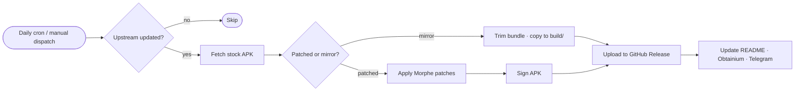

<div align="center">
<a href="#-features"></a>

[](https://github.com/softpyscho/apkforge/actions/workflows/ci.yml)   [](https://www.python.org/downloads/)   [](LICENSE)   [](https://t.me/apkforge)
<br>
[](https://github.com/softpyscho/apkforge#-supported-applications)   [](https://github.com/softpyscho/apkforge#-supported-applications)
<br><br>

**apkforge** automatically downloads stock Android apps, applies [Morphe](https://github.com/MorpheApp) patch bundles, signs them, and publishes daily releases — plus it mirrors unpatched stock APKs you can install with [Obtainium](https://github.com/ImranR98/Obtainium).

<a href="#-features">Features</a> · <a href="#-supported-applications">Apps</a> · <a href="#%EF%B8%8F-how-it-works">How it works</a> · <a href="#-quick-start">Quick start</a> · <a href="#%EF%B8%8F-configuration">Configuration</a> · <a href="CONTRIBUTING.md">Contributing</a> · <a href="docs/ARCHITECTURE.md">Architecture</a> · <a href="docs/ROADMAP.md">Roadmap</a>
</div>

---

## ✨ Features

| | |
|:--|:--|
| 🛑 **Ad-blocking** | Removes ads and trackers across supported apps. |
| 🚀 **Enhanced features** | Unlocks premium and quality-of-life functionality. |
| 🎨 **Customization** | Personalise branding, theming, icons and more via patches. |
| 💉 **Optimized output** | Split bundles are trimmed to your target ABI, `xxhdpi` and English only. |
| 🔒 **Persistent** | Patched apps are not overwritten or auto-updated by the Play Store. |
| 🔄 **Auto-updates** | One-tap updates through per-app [Obtainium](https://github.com/ImranR98/Obtainium) configs. |
| 🪞 **Stock mirroring** | Re-hosts unmodified APKs for apps that have no patches. |
| 🤖 **Fully automated** | A daily GitHub Actions cron builds, signs and publishes everything. |
| 🔍 **Update detection** | Only rebuilds when an upstream patch source or stock version actually changes. |

## 📦 Supported Applications

All applications are patched and built automatically via GitHub Actions. They are grouped by patch source, with the applied patches listed per app.

<!-- APPS_START -->

### 

> **Source:** [`MorpheApp/morphe-patches`](https://github.com/MorpheApp/morphe-patches)

<div align="center">

| App | Arch | Version | APK Source | Patches | Obtainium |
|:---|:----:|:-------:|:----------:|:--------|:---------:|
| [](https://play.google.com/store/apps/details?id=com.reddit.frontpage) | `arm64-v8a` |  | [APKMirror](https://www.apkmirror.com/apk/redditinc/reddit) | <details><summary><b>2 patches</b></summary><br>`Custom branding`<br>`Hide ads`</details> | [](https://apps.obtainium.imranr.dev/redirect?r=obtainium%3A%2F%2Fapp%2F%7B%22id%22%3A%22com.reddit.frontpage%22%2C%22url%22%3A%22https%3A%2F%2Fgithub.com%2Fsoftpyscho%2Fapkforge%2Freleases%2Flatest%22%2C%22author%22%3A%22github.com%22%2C%22name%22%3A%22Reddit%20Morphe%22%2C%22installedVersion%22%3A%22%22%2C%22latestVersion%22%3A%22%22%2C%22apkUrls%22%3A%22%5B%5D%22%2C%22otherAssetUrls%22%3A%22%5B%5D%22%2C%22preferredApkIndex%22%3A0%2C%22additionalSettings%22%3A%22%7B%5C%22intermediateLink%5C%22%3A%5B%5D%2C%5C%22customLinkFilterRegex%5C%22%3A%5C%22reddit-morphe%5C%22%2C%5C%22filterByLinkText%5C%22%3Afalse%2C%5C%22matchLinksOutsideATags%5C%22%3Afalse%2C%5C%22skipSort%5C%22%3Afalse%2C%5C%22reverseSort%5C%22%3Afalse%2C%5C%22sortByLastLinkSegment%5C%22%3Afalse%2C%5C%22versionExtractWholePage%5C%22%3Afalse%2C%5C%22requestHeader%5C%22%3A%5B%7B%5C%22requestHeader%5C%22%3A%5C%22User-Agent%3A%20Mozilla%2F5.0%20(Linux%3B%20Android%2010%3B%20K)%20AppleWebKit%2F537.36%20(KHTML%2C%20like%20Gecko)%20Chrome%2F114.0.0.0%20Mobile%20Safari%2F537.36%5C%22%7D%5D%2C%5C%22defaultPseudoVersioningMethod%5C%22%3A%5C%22partialAPKHash%5C%22%2C%5C%22trackOnly%5C%22%3Afalse%2C%5C%22versionExtractionRegEx%5C%22%3A%5C%22reddit-morphe-v(%5B0-9.%5D%2B)%5C%22%2C%5C%22matchGroupToUse%5C%22%3A%5C%221%5C%22%2C%5C%22versionDetection%5C%22%3Atrue%2C%5C%22useVersionCodeAsOSVersion%5C%22%3Afalse%2C%5C%22apkFilterRegEx%5C%22%3A%5C%22%5C%22%2C%5C%22invertAPKFilter%5C%22%3Afalse%2C%5C%22autoApkFilterByArch%5C%22%3Atrue%2C%5C%22appName%5C%22%3A%5C%22%5C%22%2C%5C%22appAuthor%5C%22%3A%5C%22%5C%22%2C%5C%22shizukuPretendToBeGooglePlay%5C%22%3Afalse%2C%5C%22allowInsecure%5C%22%3Afalse%2C%5C%22exemptFromBackgroundUpdates%5C%22%3Afalse%2C%5C%22skipUpdateNotifications%5C%22%3Afalse%2C%5C%22about%5C%22%3A%5C%22%5C%22%2C%5C%22refreshBeforeDownload%5C%22%3Afalse%7D%22%2C%22lastUpdateCheck%22%3A1786344697135921%2C%22pinned%22%3Afalse%2C%22categories%22%3A%5B%5D%2C%22releaseDate%22%3Anull%2C%22changeLog%22%3Anull%2C%22overrideSource%22%3A%22HTML%22%2C%22allowIdChange%22%3Afalse%2C%22pendingRepoRenameUrl%22%3Anull%7D) |

</div>

---

### 

> **Source:** [`crimera/piko`](https://github.com/crimera/piko)

<div align="center">

| App | Arch | Version | APK Source | Patches | Obtainium |
|:---|:----:|:-------:|:----------:|:--------|:---------:|
| [](https://play.google.com/store/apps/details?id=com.twitter.android) | `arm64-v8a` |  | [APKMirror](https://www.apkmirror.com/apk/x-corp/twitter) | <details><summary><b>73 patches</b></summary><br>`Add ability to copy media link`<br>`Block redirecting to X Lite`<br>`Bring back twitter`<br>`Change app icon`<br>`Clear tracking params`<br>`Control video auto scroll`<br>`Custom download folder`<br>`Custom emoji font`<br>`Custom font`<br>`Custom share menu`<br>`Custom sharing domain`<br>`Customise post font size`<br>`Customize default reply sorting`<br>`Customize explore tabs`<br>`Customize Inline action Bar items`<br>`Customize Navigation Bar items`<br>`Customize notification tabs`<br>`Customize profile tabs`<br>`Customize search suggestions`<br>`Customize search tab items`<br>`Customize side bar items`<br>`Customize timeline top bar`<br>`Delete from database`<br>`Disable auto timeline scroll on launch`<br>`Disable chirp font`<br>`Disunify xchat system`<br>`Download patch`<br>`Dynamic color`<br>`Enable debug menu for posts`<br>`Enable force HD videos`<br>`Enable PiP mode automatically`<br>`Enable Undo Posts`<br>`Export all activities`<br>`Force enable translate`<br>`Handle custom twitter links`<br>`Hide badges from navigation bar icons`<br>`Hide Banner`<br>`Hide bookmark icon in timeline`<br>`Hide community badges`<br>`Hide Community Notes`<br>`Hide FAB`<br>`Hide FAB Menu Buttons`<br>`Hide followed by context`<br>`Hide hidden replies`<br>`Hide immersive player`<br>`Hide Live Threads`<br>`Hide nudge button`<br>`Hide post metrics`<br>`Hide promote button`<br>`Hide recommendation items`<br>`Hide Recommended Users`<br>`Hook feature flag`<br>`Import/Export login token`<br>`Legacy share links`<br>`Log server response`<br>`More information on profile`<br>`Native downloader`<br>`Native reader mode`<br>`Native translator`<br>`No shortened URL`<br>`Pause search suggestions`<br>`Remove Ads`<br>`Remove premium upsell`<br>`Remove search suggestions`<br>`Remove view count`<br>`Round off numbers`<br>`Selectable Text`<br>`Share Tweet as Image`<br>`Show changelogs`<br>`Show poll results`<br>`Show post source label`<br>`Show sensitive media`<br>`Support external downloader`</details> | [](https://apps.obtainium.imranr.dev/redirect?r=obtainium%3A%2F%2Fapp%2F%7B%22id%22%3A%22com.twitter.android%22%2C%22url%22%3A%22https%3A%2F%2Fgithub.com%2Fsoftpyscho%2Fapkforge%2Freleases%2Flatest%22%2C%22author%22%3A%22github.com%22%2C%22name%22%3A%22Twitter%20Morphe%22%2C%22installedVersion%22%3A%22%22%2C%22latestVersion%22%3A%22%22%2C%22apkUrls%22%3A%22%5B%5D%22%2C%22otherAssetUrls%22%3A%22%5B%5D%22%2C%22preferredApkIndex%22%3A0%2C%22additionalSettings%22%3A%22%7B%5C%22intermediateLink%5C%22%3A%5B%5D%2C%5C%22customLinkFilterRegex%5C%22%3A%5C%22twitter-morphe%5C%22%2C%5C%22filterByLinkText%5C%22%3Afalse%2C%5C%22matchLinksOutsideATags%5C%22%3Afalse%2C%5C%22skipSort%5C%22%3Afalse%2C%5C%22reverseSort%5C%22%3Afalse%2C%5C%22sortByLastLinkSegment%5C%22%3Afalse%2C%5C%22versionExtractWholePage%5C%22%3Afalse%2C%5C%22requestHeader%5C%22%3A%5B%7B%5C%22requestHeader%5C%22%3A%5C%22User-Agent%3A%20Mozilla%2F5.0%20(Linux%3B%20Android%2010%3B%20K)%20AppleWebKit%2F537.36%20(KHTML%2C%20like%20Gecko)%20Chrome%2F114.0.0.0%20Mobile%20Safari%2F537.36%5C%22%7D%5D%2C%5C%22defaultPseudoVersioningMethod%5C%22%3A%5C%22partialAPKHash%5C%22%2C%5C%22trackOnly%5C%22%3Afalse%2C%5C%22versionExtractionRegEx%5C%22%3A%5C%22twitter-morphe-v(%5B0-9.%5D%2B)%5C%22%2C%5C%22matchGroupToUse%5C%22%3A%5C%221%5C%22%2C%5C%22versionDetection%5C%22%3Atrue%2C%5C%22useVersionCodeAsOSVersion%5C%22%3Afalse%2C%5C%22apkFilterRegEx%5C%22%3A%5C%22%5C%22%2C%5C%22invertAPKFilter%5C%22%3Afalse%2C%5C%22autoApkFilterByArch%5C%22%3Atrue%2C%5C%22appName%5C%22%3A%5C%22%5C%22%2C%5C%22appAuthor%5C%22%3A%5C%22%5C%22%2C%5C%22shizukuPretendToBeGooglePlay%5C%22%3Afalse%2C%5C%22allowInsecure%5C%22%3Afalse%2C%5C%22exemptFromBackgroundUpdates%5C%22%3Afalse%2C%5C%22skipUpdateNotifications%5C%22%3Afalse%2C%5C%22about%5C%22%3A%5C%22%5C%22%2C%5C%22refreshBeforeDownload%5C%22%3Afalse%7D%22%2C%22lastUpdateCheck%22%3A1786344697135921%2C%22pinned%22%3Afalse%2C%22categories%22%3A%5B%5D%2C%22releaseDate%22%3Anull%2C%22changeLog%22%3Anull%2C%22overrideSource%22%3A%22HTML%22%2C%22allowIdChange%22%3Afalse%2C%22pendingRepoRenameUrl%22%3Anull%7D) |
| [](https://play.google.com/store/apps/details?id=com.instagram.android) | `arm64-v8a` |  | [GitHub](https://github.com/softpyscho/apkforge/releases/tag/com.instagram.android) | <details><summary><b>54 patches</b></summary><br>`Add settings`<br>`Allow user network certificate`<br>`Change like animation`<br>`Clone`<br>`Copy comment`<br>`Customise story ring size`<br>`Customise story timestamp`<br>`Disable ads`<br>`Disable analytics`<br>`Disable comments`<br>`Disable discover people`<br>`Disable double tap like`<br>`Disable explore`<br>`Disable highlights`<br>`Disable onboarding permission prompts`<br>`Disable Reels scrolling`<br>`Disable screenshot detection`<br>`Disable stories`<br>`Disable story flipping`<br>`Disable swipe to create`<br>`Disable typing status`<br>`Disable video autoplay`<br>`Download media`<br>`Download voice message`<br>`External downloader`<br>`Filter stories`<br>`Friendship status indicator`<br>`Hide group creation button on sharesheet`<br>`Hide navigation buttons`<br>`Hide notes tray`<br>`Hide reshare button`<br>`Hide stories tray`<br>`Hide suggested content`<br>`Improve image viewing`<br>`Limit feed to following profiles`<br>`Make ephemeral media permanent`<br>`Mark chat as read manually`<br>`More options on post`<br>`More options on profile`<br>`Open links externally`<br>`Remove build expired popup`<br>`Remove empty bottom space`<br>`Sanitize share links`<br>`Save media comment`<br>`Stories audio autoplay`<br>`Theme`<br>`Unlock developer options`<br>`Unlock employee options`<br>`Unlock Plus benefits`<br>`Validate links`<br>`View DMs anonymously`<br>`View live anonymously`<br>`View stories anonymously`<br>`View story mentions`</details> | [](https://apps.obtainium.imranr.dev/redirect?r=obtainium%3A%2F%2Fapp%2F%7B%22id%22%3A%22com.instagram.android%22%2C%22url%22%3A%22https%3A%2F%2Fgithub.com%2Fsoftpyscho%2Fapkforge%2Freleases%2Flatest%22%2C%22author%22%3A%22github.com%22%2C%22name%22%3A%22Instagram%20Morphe%22%2C%22installedVersion%22%3A%22%22%2C%22latestVersion%22%3A%22%22%2C%22apkUrls%22%3A%22%5B%5D%22%2C%22otherAssetUrls%22%3A%22%5B%5D%22%2C%22preferredApkIndex%22%3A0%2C%22additionalSettings%22%3A%22%7B%5C%22intermediateLink%5C%22%3A%5B%5D%2C%5C%22customLinkFilterRegex%5C%22%3A%5C%22instagram-morphe%5C%22%2C%5C%22filterByLinkText%5C%22%3Afalse%2C%5C%22matchLinksOutsideATags%5C%22%3Afalse%2C%5C%22skipSort%5C%22%3Afalse%2C%5C%22reverseSort%5C%22%3Afalse%2C%5C%22sortByLastLinkSegment%5C%22%3Afalse%2C%5C%22versionExtractWholePage%5C%22%3Afalse%2C%5C%22requestHeader%5C%22%3A%5B%7B%5C%22requestHeader%5C%22%3A%5C%22User-Agent%3A%20Mozilla%2F5.0%20(Linux%3B%20Android%2010%3B%20K)%20AppleWebKit%2F537.36%20(KHTML%2C%20like%20Gecko)%20Chrome%2F114.0.0.0%20Mobile%20Safari%2F537.36%5C%22%7D%5D%2C%5C%22defaultPseudoVersioningMethod%5C%22%3A%5C%22partialAPKHash%5C%22%2C%5C%22trackOnly%5C%22%3Afalse%2C%5C%22versionExtractionRegEx%5C%22%3A%5C%22instagram-morphe-v(%5B0-9.%5D%2B)%5C%22%2C%5C%22matchGroupToUse%5C%22%3A%5C%221%5C%22%2C%5C%22versionDetection%5C%22%3Atrue%2C%5C%22useVersionCodeAsOSVersion%5C%22%3Afalse%2C%5C%22apkFilterRegEx%5C%22%3A%5C%22%5C%22%2C%5C%22invertAPKFilter%5C%22%3Afalse%2C%5C%22autoApkFilterByArch%5C%22%3Atrue%2C%5C%22appName%5C%22%3A%5C%22%5C%22%2C%5C%22appAuthor%5C%22%3A%5C%22%5C%22%2C%5C%22shizukuPretendToBeGooglePlay%5C%22%3Afalse%2C%5C%22allowInsecure%5C%22%3Afalse%2C%5C%22exemptFromBackgroundUpdates%5C%22%3Afalse%2C%5C%22skipUpdateNotifications%5C%22%3Afalse%2C%5C%22about%5C%22%3A%5C%22%5C%22%2C%5C%22refreshBeforeDownload%5C%22%3Afalse%7D%22%2C%22lastUpdateCheck%22%3A1786344697135921%2C%22pinned%22%3Afalse%2C%22categories%22%3A%5B%5D%2C%22releaseDate%22%3Anull%2C%22changeLog%22%3Anull%2C%22overrideSource%22%3A%22HTML%22%2C%22allowIdChange%22%3Afalse%2C%22pendingRepoRenameUrl%22%3Anull%7D) |

</div>

---

### 

> **Source:** [`rushiranpise/morphe-patches`](https://github.com/rushiranpise/morphe-patches)

<div align="center">

| App | Arch | Version | APK Source | Patches | Obtainium |
|:---|:----:|:-------:|:----------:|:--------|:---------:|
| [](https://play.google.com/store/apps/details?id=com.cloudflare.onedotonedotonedotone) | `arm64-v8a` |  | [APKMirror](https://www.apkmirror.com/apk/cloudflare/1-1-1-1-faster-safer-internet) | <details><summary><b>2 patches</b></summary><br>`Disable Analytics / Telemetry`<br>`Spoof WARP+ Unlimited UI`</details> | [](https://apps.obtainium.imranr.dev/redirect?r=obtainium%3A%2F%2Fapp%2F%7B%22id%22%3A%22com.cloudflare.onedotonedotonedotone%22%2C%22url%22%3A%22https%3A%2F%2Fgithub.com%2Fsoftpyscho%2Fapkforge%2Freleases%2Flatest%22%2C%22author%22%3A%22github.com%22%2C%22name%22%3A%22WARP%20Morphe%22%2C%22installedVersion%22%3A%22%22%2C%22latestVersion%22%3A%22%22%2C%22apkUrls%22%3A%22%5B%5D%22%2C%22otherAssetUrls%22%3A%22%5B%5D%22%2C%22preferredApkIndex%22%3A0%2C%22additionalSettings%22%3A%22%7B%5C%22intermediateLink%5C%22%3A%5B%5D%2C%5C%22customLinkFilterRegex%5C%22%3A%5C%22warp-morphe%5C%22%2C%5C%22filterByLinkText%5C%22%3Afalse%2C%5C%22matchLinksOutsideATags%5C%22%3Afalse%2C%5C%22skipSort%5C%22%3Afalse%2C%5C%22reverseSort%5C%22%3Afalse%2C%5C%22sortByLastLinkSegment%5C%22%3Afalse%2C%5C%22versionExtractWholePage%5C%22%3Afalse%2C%5C%22requestHeader%5C%22%3A%5B%7B%5C%22requestHeader%5C%22%3A%5C%22User-Agent%3A%20Mozilla%2F5.0%20(Linux%3B%20Android%2010%3B%20K)%20AppleWebKit%2F537.36%20(KHTML%2C%20like%20Gecko)%20Chrome%2F114.0.0.0%20Mobile%20Safari%2F537.36%5C%22%7D%5D%2C%5C%22defaultPseudoVersioningMethod%5C%22%3A%5C%22partialAPKHash%5C%22%2C%5C%22trackOnly%5C%22%3Afalse%2C%5C%22versionExtractionRegEx%5C%22%3A%5C%22warp-morphe-v(%5B0-9.%5D%2B)%5C%22%2C%5C%22matchGroupToUse%5C%22%3A%5C%221%5C%22%2C%5C%22versionDetection%5C%22%3Atrue%2C%5C%22useVersionCodeAsOSVersion%5C%22%3Afalse%2C%5C%22apkFilterRegEx%5C%22%3A%5C%22%5C%22%2C%5C%22invertAPKFilter%5C%22%3Afalse%2C%5C%22autoApkFilterByArch%5C%22%3Atrue%2C%5C%22appName%5C%22%3A%5C%22%5C%22%2C%5C%22appAuthor%5C%22%3A%5C%22%5C%22%2C%5C%22shizukuPretendToBeGooglePlay%5C%22%3Afalse%2C%5C%22allowInsecure%5C%22%3Afalse%2C%5C%22exemptFromBackgroundUpdates%5C%22%3Afalse%2C%5C%22skipUpdateNotifications%5C%22%3Afalse%2C%5C%22about%5C%22%3A%5C%22%5C%22%2C%5C%22refreshBeforeDownload%5C%22%3Afalse%7D%22%2C%22lastUpdateCheck%22%3A1786344697135921%2C%22pinned%22%3Afalse%2C%22categories%22%3A%5B%5D%2C%22releaseDate%22%3Anull%2C%22changeLog%22%3Anull%2C%22overrideSource%22%3A%22HTML%22%2C%22allowIdChange%22%3Afalse%2C%22pendingRepoRenameUrl%22%3Anull%7D) |
| [](https://play.google.com/store/apps/details?id=com.Splitwise.SplitwiseMobile) | `arm64-v8a` |  | [APKMirror](https://www.apkmirror.com/apk/splitwise/splitwise) | <details><summary><b>1 patches</b></summary><br>`Unlock Pro`</details> | [](https://apps.obtainium.imranr.dev/redirect?r=obtainium%3A%2F%2Fapp%2F%7B%22id%22%3A%22com.Splitwise.SplitwiseMobile%22%2C%22url%22%3A%22https%3A%2F%2Fgithub.com%2Fsoftpyscho%2Fapkforge%2Freleases%2Flatest%22%2C%22author%22%3A%22github.com%22%2C%22name%22%3A%22Splitwise%20Morphe%22%2C%22installedVersion%22%3A%22%22%2C%22latestVersion%22%3A%22%22%2C%22apkUrls%22%3A%22%5B%5D%22%2C%22otherAssetUrls%22%3A%22%5B%5D%22%2C%22preferredApkIndex%22%3A0%2C%22additionalSettings%22%3A%22%7B%5C%22intermediateLink%5C%22%3A%5B%5D%2C%5C%22customLinkFilterRegex%5C%22%3A%5C%22splitwise-morphe%5C%22%2C%5C%22filterByLinkText%5C%22%3Afalse%2C%5C%22matchLinksOutsideATags%5C%22%3Afalse%2C%5C%22skipSort%5C%22%3Afalse%2C%5C%22reverseSort%5C%22%3Afalse%2C%5C%22sortByLastLinkSegment%5C%22%3Afalse%2C%5C%22versionExtractWholePage%5C%22%3Afalse%2C%5C%22requestHeader%5C%22%3A%5B%7B%5C%22requestHeader%5C%22%3A%5C%22User-Agent%3A%20Mozilla%2F5.0%20(Linux%3B%20Android%2010%3B%20K)%20AppleWebKit%2F537.36%20(KHTML%2C%20like%20Gecko)%20Chrome%2F114.0.0.0%20Mobile%20Safari%2F537.36%5C%22%7D%5D%2C%5C%22defaultPseudoVersioningMethod%5C%22%3A%5C%22partialAPKHash%5C%22%2C%5C%22trackOnly%5C%22%3Afalse%2C%5C%22versionExtractionRegEx%5C%22%3A%5C%22splitwise-morphe-v(%5B0-9.%5D%2B)%5C%22%2C%5C%22matchGroupToUse%5C%22%3A%5C%221%5C%22%2C%5C%22versionDetection%5C%22%3Atrue%2C%5C%22useVersionCodeAsOSVersion%5C%22%3Afalse%2C%5C%22apkFilterRegEx%5C%22%3A%5C%22%5C%22%2C%5C%22invertAPKFilter%5C%22%3Afalse%2C%5C%22autoApkFilterByArch%5C%22%3Atrue%2C%5C%22appName%5C%22%3A%5C%22%5C%22%2C%5C%22appAuthor%5C%22%3A%5C%22%5C%22%2C%5C%22shizukuPretendToBeGooglePlay%5C%22%3Afalse%2C%5C%22allowInsecure%5C%22%3Afalse%2C%5C%22exemptFromBackgroundUpdates%5C%22%3Afalse%2C%5C%22skipUpdateNotifications%5C%22%3Afalse%2C%5C%22about%5C%22%3A%5C%22%5C%22%2C%5C%22refreshBeforeDownload%5C%22%3Afalse%7D%22%2C%22lastUpdateCheck%22%3A1786344697135921%2C%22pinned%22%3Afalse%2C%22categories%22%3A%5B%5D%2C%22releaseDate%22%3Anull%2C%22changeLog%22%3Anull%2C%22overrideSource%22%3A%22HTML%22%2C%22allowIdChange%22%3Afalse%2C%22pendingRepoRenameUrl%22%3Anull%7D) |
| [](https://play.google.com/store/apps/details?id=com.oasisfeng.greenify) | `arm64-v8a` |  | [APKMirror](https://www.apkmirror.com/apk/oasisfeng/greenify) | <details><summary><b>1 patches</b></summary><br>`Unlock Donation Features`</details> | [](https://apps.obtainium.imranr.dev/redirect?r=obtainium%3A%2F%2Fapp%2F%7B%22id%22%3A%22com.oasisfeng.greenify%22%2C%22url%22%3A%22https%3A%2F%2Fgithub.com%2Fsoftpyscho%2Fapkforge%2Freleases%2Flatest%22%2C%22author%22%3A%22github.com%22%2C%22name%22%3A%22Greenify%20Morphe%22%2C%22installedVersion%22%3A%22%22%2C%22latestVersion%22%3A%22%22%2C%22apkUrls%22%3A%22%5B%5D%22%2C%22otherAssetUrls%22%3A%22%5B%5D%22%2C%22preferredApkIndex%22%3A0%2C%22additionalSettings%22%3A%22%7B%5C%22intermediateLink%5C%22%3A%5B%5D%2C%5C%22customLinkFilterRegex%5C%22%3A%5C%22greenify-morphe%5C%22%2C%5C%22filterByLinkText%5C%22%3Afalse%2C%5C%22matchLinksOutsideATags%5C%22%3Afalse%2C%5C%22skipSort%5C%22%3Afalse%2C%5C%22reverseSort%5C%22%3Afalse%2C%5C%22sortByLastLinkSegment%5C%22%3Afalse%2C%5C%22versionExtractWholePage%5C%22%3Afalse%2C%5C%22requestHeader%5C%22%3A%5B%7B%5C%22requestHeader%5C%22%3A%5C%22User-Agent%3A%20Mozilla%2F5.0%20(Linux%3B%20Android%2010%3B%20K)%20AppleWebKit%2F537.36%20(KHTML%2C%20like%20Gecko)%20Chrome%2F114.0.0.0%20Mobile%20Safari%2F537.36%5C%22%7D%5D%2C%5C%22defaultPseudoVersioningMethod%5C%22%3A%5C%22partialAPKHash%5C%22%2C%5C%22trackOnly%5C%22%3Afalse%2C%5C%22versionExtractionRegEx%5C%22%3A%5C%22greenify-morphe-v(%5B0-9.%5D%2B)%5C%22%2C%5C%22matchGroupToUse%5C%22%3A%5C%221%5C%22%2C%5C%22versionDetection%5C%22%3Atrue%2C%5C%22useVersionCodeAsOSVersion%5C%22%3Afalse%2C%5C%22apkFilterRegEx%5C%22%3A%5C%22%5C%22%2C%5C%22invertAPKFilter%5C%22%3Afalse%2C%5C%22autoApkFilterByArch%5C%22%3Atrue%2C%5C%22appName%5C%22%3A%5C%22%5C%22%2C%5C%22appAuthor%5C%22%3A%5C%22%5C%22%2C%5C%22shizukuPretendToBeGooglePlay%5C%22%3Afalse%2C%5C%22allowInsecure%5C%22%3Afalse%2C%5C%22exemptFromBackgroundUpdates%5C%22%3Afalse%2C%5C%22skipUpdateNotifications%5C%22%3Afalse%2C%5C%22about%5C%22%3A%5C%22%5C%22%2C%5C%22refreshBeforeDownload%5C%22%3Afalse%7D%22%2C%22lastUpdateCheck%22%3A1786344697135921%2C%22pinned%22%3Afalse%2C%22categories%22%3A%5B%5D%2C%22releaseDate%22%3Anull%2C%22changeLog%22%3Anull%2C%22overrideSource%22%3A%22HTML%22%2C%22allowIdChange%22%3Afalse%2C%22pendingRepoRenameUrl%22%3Anull%7D) |

</div>

---

### 

> **Source:** [`Paresh-Maheshwari/paresh-patches`](https://gitlab.com/Paresh-Maheshwari/paresh-patches) (GitLab)

<div align="center">

| App | Arch | Version | APK Source | Patches | Obtainium |
|:---|:----:|:-------:|:----------:|:--------|:---------:|
| [](https://play.google.com/store/apps/details?id=com.truecaller) | `arm64-v8a` |  | [APKMirror](https://www.apkmirror.com/apk/true-software-scandinavia-ab/truecaller-caller-id-block) | <details><summary><b>10 patches</b></summary><br>`Disable telemetry`<br>`Disable update check`<br>`GMS sign-in bypass`<br>`Hide Assistant tab`<br>`Hide Family Protection button`<br>`Hide Premium from settings`<br>`Hide Premium tab`<br>`Hide Scams tab`<br>`Neutralize third-party SDKs`<br>`Truecaller Premium`</details> | [](https://apps.obtainium.imranr.dev/redirect?r=obtainium%3A%2F%2Fapp%2F%7B%22id%22%3A%22com.truecaller%22%2C%22url%22%3A%22https%3A%2F%2Fgithub.com%2Fsoftpyscho%2Fapkforge%2Freleases%2Flatest%22%2C%22author%22%3A%22github.com%22%2C%22name%22%3A%22Truecaller%20Morphe%22%2C%22installedVersion%22%3A%22%22%2C%22latestVersion%22%3A%22%22%2C%22apkUrls%22%3A%22%5B%5D%22%2C%22otherAssetUrls%22%3A%22%5B%5D%22%2C%22preferredApkIndex%22%3A0%2C%22additionalSettings%22%3A%22%7B%5C%22intermediateLink%5C%22%3A%5B%5D%2C%5C%22customLinkFilterRegex%5C%22%3A%5C%22truecaller-morphe%5C%22%2C%5C%22filterByLinkText%5C%22%3Afalse%2C%5C%22matchLinksOutsideATags%5C%22%3Afalse%2C%5C%22skipSort%5C%22%3Afalse%2C%5C%22reverseSort%5C%22%3Afalse%2C%5C%22sortByLastLinkSegment%5C%22%3Afalse%2C%5C%22versionExtractWholePage%5C%22%3Afalse%2C%5C%22requestHeader%5C%22%3A%5B%7B%5C%22requestHeader%5C%22%3A%5C%22User-Agent%3A%20Mozilla%2F5.0%20(Linux%3B%20Android%2010%3B%20K)%20AppleWebKit%2F537.36%20(KHTML%2C%20like%20Gecko)%20Chrome%2F114.0.0.0%20Mobile%20Safari%2F537.36%5C%22%7D%5D%2C%5C%22defaultPseudoVersioningMethod%5C%22%3A%5C%22partialAPKHash%5C%22%2C%5C%22trackOnly%5C%22%3Afalse%2C%5C%22versionExtractionRegEx%5C%22%3A%5C%22truecaller-morphe-v(%5B0-9.%5D%2B)%5C%22%2C%5C%22matchGroupToUse%5C%22%3A%5C%221%5C%22%2C%5C%22versionDetection%5C%22%3Atrue%2C%5C%22useVersionCodeAsOSVersion%5C%22%3Afalse%2C%5C%22apkFilterRegEx%5C%22%3A%5C%22%5C%22%2C%5C%22invertAPKFilter%5C%22%3Afalse%2C%5C%22autoApkFilterByArch%5C%22%3Atrue%2C%5C%22appName%5C%22%3A%5C%22%5C%22%2C%5C%22appAuthor%5C%22%3A%5C%22%5C%22%2C%5C%22shizukuPretendToBeGooglePlay%5C%22%3Afalse%2C%5C%22allowInsecure%5C%22%3Afalse%2C%5C%22exemptFromBackgroundUpdates%5C%22%3Afalse%2C%5C%22skipUpdateNotifications%5C%22%3Afalse%2C%5C%22about%5C%22%3A%5C%22%5C%22%2C%5C%22refreshBeforeDownload%5C%22%3Afalse%7D%22%2C%22lastUpdateCheck%22%3A1786344697135921%2C%22pinned%22%3Afalse%2C%22categories%22%3A%5B%5D%2C%22releaseDate%22%3Anull%2C%22changeLog%22%3Anull%2C%22overrideSource%22%3A%22HTML%22%2C%22allowIdChange%22%3Afalse%2C%22pendingRepoRenameUrl%22%3Anull%7D) |
| [](https://play.google.com/store/apps/details?id=com.ticktick.task) | `arm64-v8a` |  | [APKMirror](https://www.apkmirror.com/apk/ticktick-limited/ticktick-to-do-list-with-reminder-day-planner) | <details><summary><b>1 patches</b></summary><br>`TickTick Premium`</details> | [](https://apps.obtainium.imranr.dev/redirect?r=obtainium%3A%2F%2Fapp%2F%7B%22id%22%3A%22com.ticktick.task%22%2C%22url%22%3A%22https%3A%2F%2Fgithub.com%2Fsoftpyscho%2Fapkforge%2Freleases%2Flatest%22%2C%22author%22%3A%22github.com%22%2C%22name%22%3A%22TickTick%20Morphe%22%2C%22installedVersion%22%3A%22%22%2C%22latestVersion%22%3A%22%22%2C%22apkUrls%22%3A%22%5B%5D%22%2C%22otherAssetUrls%22%3A%22%5B%5D%22%2C%22preferredApkIndex%22%3A0%2C%22additionalSettings%22%3A%22%7B%5C%22intermediateLink%5C%22%3A%5B%5D%2C%5C%22customLinkFilterRegex%5C%22%3A%5C%22ticktick-morphe%5C%22%2C%5C%22filterByLinkText%5C%22%3Afalse%2C%5C%22matchLinksOutsideATags%5C%22%3Afalse%2C%5C%22skipSort%5C%22%3Afalse%2C%5C%22reverseSort%5C%22%3Afalse%2C%5C%22sortByLastLinkSegment%5C%22%3Afalse%2C%5C%22versionExtractWholePage%5C%22%3Afalse%2C%5C%22requestHeader%5C%22%3A%5B%7B%5C%22requestHeader%5C%22%3A%5C%22User-Agent%3A%20Mozilla%2F5.0%20(Linux%3B%20Android%2010%3B%20K)%20AppleWebKit%2F537.36%20(KHTML%2C%20like%20Gecko)%20Chrome%2F114.0.0.0%20Mobile%20Safari%2F537.36%5C%22%7D%5D%2C%5C%22defaultPseudoVersioningMethod%5C%22%3A%5C%22partialAPKHash%5C%22%2C%5C%22trackOnly%5C%22%3Afalse%2C%5C%22versionExtractionRegEx%5C%22%3A%5C%22ticktick-morphe-v(%5B0-9.%5D%2B)%5C%22%2C%5C%22matchGroupToUse%5C%22%3A%5C%221%5C%22%2C%5C%22versionDetection%5C%22%3Atrue%2C%5C%22useVersionCodeAsOSVersion%5C%22%3Afalse%2C%5C%22apkFilterRegEx%5C%22%3A%5C%22%5C%22%2C%5C%22invertAPKFilter%5C%22%3Afalse%2C%5C%22autoApkFilterByArch%5C%22%3Atrue%2C%5C%22appName%5C%22%3A%5C%22%5C%22%2C%5C%22appAuthor%5C%22%3A%5C%22%5C%22%2C%5C%22shizukuPretendToBeGooglePlay%5C%22%3Afalse%2C%5C%22allowInsecure%5C%22%3Afalse%2C%5C%22exemptFromBackgroundUpdates%5C%22%3Afalse%2C%5C%22skipUpdateNotifications%5C%22%3Afalse%2C%5C%22about%5C%22%3A%5C%22%5C%22%2C%5C%22refreshBeforeDownload%5C%22%3Afalse%7D%22%2C%22lastUpdateCheck%22%3A1786344697135921%2C%22pinned%22%3Afalse%2C%22categories%22%3A%5B%5D%2C%22releaseDate%22%3Anull%2C%22changeLog%22%3Anull%2C%22overrideSource%22%3A%22HTML%22%2C%22allowIdChange%22%3Afalse%2C%22pendingRepoRenameUrl%22%3Anull%7D) |

</div>

---

### 

> **Source:** [`hoo-dles/morphe-patches`](https://github.com/hoo-dles/morphe-patches)

<div align="center">

| App | Arch | Version | APK Source | Patches | Obtainium |
|:---|:----:|:-------:|:----------:|:--------|:---------:|
| [](https://play.google.com/store/apps/details?id=com.xodo.pdf.reader) | `arm64-v8a` |  | [APKMirror](https://www.apkmirror.com/apk/apryse-software-inc/xodo-pdf-reader-editor) | <details><summary><b>1 patches</b></summary><br>`Enable Pro`</details> | [](https://apps.obtainium.imranr.dev/redirect?r=obtainium%3A%2F%2Fapp%2F%7B%22id%22%3A%22com.xodo.pdf.reader%22%2C%22url%22%3A%22https%3A%2F%2Fgithub.com%2Fsoftpyscho%2Fapkforge%2Freleases%2Flatest%22%2C%22author%22%3A%22github.com%22%2C%22name%22%3A%22Xodo%20Morphe%22%2C%22installedVersion%22%3A%22%22%2C%22latestVersion%22%3A%22%22%2C%22apkUrls%22%3A%22%5B%5D%22%2C%22otherAssetUrls%22%3A%22%5B%5D%22%2C%22preferredApkIndex%22%3A0%2C%22additionalSettings%22%3A%22%7B%5C%22intermediateLink%5C%22%3A%5B%5D%2C%5C%22customLinkFilterRegex%5C%22%3A%5C%22xodo-morphe%5C%22%2C%5C%22filterByLinkText%5C%22%3Afalse%2C%5C%22matchLinksOutsideATags%5C%22%3Afalse%2C%5C%22skipSort%5C%22%3Afalse%2C%5C%22reverseSort%5C%22%3Afalse%2C%5C%22sortByLastLinkSegment%5C%22%3Afalse%2C%5C%22versionExtractWholePage%5C%22%3Afalse%2C%5C%22requestHeader%5C%22%3A%5B%7B%5C%22requestHeader%5C%22%3A%5C%22User-Agent%3A%20Mozilla%2F5.0%20(Linux%3B%20Android%2010%3B%20K)%20AppleWebKit%2F537.36%20(KHTML%2C%20like%20Gecko)%20Chrome%2F114.0.0.0%20Mobile%20Safari%2F537.36%5C%22%7D%5D%2C%5C%22defaultPseudoVersioningMethod%5C%22%3A%5C%22partialAPKHash%5C%22%2C%5C%22trackOnly%5C%22%3Afalse%2C%5C%22versionExtractionRegEx%5C%22%3A%5C%22xodo-morphe-v(%5B0-9.%5D%2B)%5C%22%2C%5C%22matchGroupToUse%5C%22%3A%5C%221%5C%22%2C%5C%22versionDetection%5C%22%3Atrue%2C%5C%22useVersionCodeAsOSVersion%5C%22%3Afalse%2C%5C%22apkFilterRegEx%5C%22%3A%5C%22%5C%22%2C%5C%22invertAPKFilter%5C%22%3Afalse%2C%5C%22autoApkFilterByArch%5C%22%3Atrue%2C%5C%22appName%5C%22%3A%5C%22%5C%22%2C%5C%22appAuthor%5C%22%3A%5C%22%5C%22%2C%5C%22shizukuPretendToBeGooglePlay%5C%22%3Afalse%2C%5C%22allowInsecure%5C%22%3Afalse%2C%5C%22exemptFromBackgroundUpdates%5C%22%3Afalse%2C%5C%22skipUpdateNotifications%5C%22%3Afalse%2C%5C%22about%5C%22%3A%5C%22%5C%22%2C%5C%22refreshBeforeDownload%5C%22%3Afalse%7D%22%2C%22lastUpdateCheck%22%3A1786344697135921%2C%22pinned%22%3Afalse%2C%22categories%22%3A%5B%5D%2C%22releaseDate%22%3Anull%2C%22changeLog%22%3Anull%2C%22overrideSource%22%3A%22HTML%22%2C%22allowIdChange%22%3Afalse%2C%22pendingRepoRenameUrl%22%3Anull%7D) |
| [](https://play.google.com/store/apps/details?id=com.amazon.avod.thirdpartyclient) | `arm64-v8a` |  | [APKMirror](https://www.apkmirror.com/apk/amazon-mobile-llc/amazon-prime-video) | <details><summary><b>3 patches</b></summary><br>`Enable speed control`<br>`Rename shared permissions`<br>`Skip ads`</details> | [](https://apps.obtainium.imranr.dev/redirect?r=obtainium%3A%2F%2Fapp%2F%7B%22id%22%3A%22com.amazon.avod.thirdpartyclient%22%2C%22url%22%3A%22https%3A%2F%2Fgithub.com%2Fsoftpyscho%2Fapkforge%2Freleases%2Flatest%22%2C%22author%22%3A%22github.com%22%2C%22name%22%3A%22Amazon%20Prime%20Video%20Morphe%22%2C%22installedVersion%22%3A%22%22%2C%22latestVersion%22%3A%22%22%2C%22apkUrls%22%3A%22%5B%5D%22%2C%22otherAssetUrls%22%3A%22%5B%5D%22%2C%22preferredApkIndex%22%3A0%2C%22additionalSettings%22%3A%22%7B%5C%22intermediateLink%5C%22%3A%5B%5D%2C%5C%22customLinkFilterRegex%5C%22%3A%5C%22amazon-prime-video-morphe%5C%22%2C%5C%22filterByLinkText%5C%22%3Afalse%2C%5C%22matchLinksOutsideATags%5C%22%3Afalse%2C%5C%22skipSort%5C%22%3Afalse%2C%5C%22reverseSort%5C%22%3Afalse%2C%5C%22sortByLastLinkSegment%5C%22%3Afalse%2C%5C%22versionExtractWholePage%5C%22%3Afalse%2C%5C%22requestHeader%5C%22%3A%5B%7B%5C%22requestHeader%5C%22%3A%5C%22User-Agent%3A%20Mozilla%2F5.0%20(Linux%3B%20Android%2010%3B%20K)%20AppleWebKit%2F537.36%20(KHTML%2C%20like%20Gecko)%20Chrome%2F114.0.0.0%20Mobile%20Safari%2F537.36%5C%22%7D%5D%2C%5C%22defaultPseudoVersioningMethod%5C%22%3A%5C%22partialAPKHash%5C%22%2C%5C%22trackOnly%5C%22%3Afalse%2C%5C%22versionExtractionRegEx%5C%22%3A%5C%22amazon-prime-video-morphe-v(%5B0-9.%5D%2B)%5C%22%2C%5C%22matchGroupToUse%5C%22%3A%5C%221%5C%22%2C%5C%22versionDetection%5C%22%3Atrue%2C%5C%22useVersionCodeAsOSVersion%5C%22%3Afalse%2C%5C%22apkFilterRegEx%5C%22%3A%5C%22%5C%22%2C%5C%22invertAPKFilter%5C%22%3Afalse%2C%5C%22autoApkFilterByArch%5C%22%3Atrue%2C%5C%22appName%5C%22%3A%5C%22%5C%22%2C%5C%22appAuthor%5C%22%3A%5C%22%5C%22%2C%5C%22shizukuPretendToBeGooglePlay%5C%22%3Afalse%2C%5C%22allowInsecure%5C%22%3Afalse%2C%5C%22exemptFromBackgroundUpdates%5C%22%3Afalse%2C%5C%22skipUpdateNotifications%5C%22%3Afalse%2C%5C%22about%5C%22%3A%5C%22%5C%22%2C%5C%22refreshBeforeDownload%5C%22%3Afalse%7D%22%2C%22lastUpdateCheck%22%3A1786344697135921%2C%22pinned%22%3Afalse%2C%22categories%22%3A%5B%5D%2C%22releaseDate%22%3Anull%2C%22changeLog%22%3Anull%2C%22overrideSource%22%3A%22HTML%22%2C%22allowIdChange%22%3Afalse%2C%22pendingRepoRenameUrl%22%3Anull%7D) |

</div>

---

### 

> **Source:** [`arandomhooman/hoomans-morphe-patches`](https://github.com/arandomhooman/hoomans-morphe-patches)

<div align="center">

| App | Arch | Version | APK Source | Patches | Obtainium |
|:---|:----:|:-------:|:----------:|:--------|:---------:|
| [](https://play.google.com/store/apps/details?id=com.paget96.batteryguru) | `arm64-v8a` |  | [APKMirror](https://www.apkmirror.com/apk/paget96/battery-guru-health-saver) | <details><summary><b>1 patches</b></summary><br>`Unlock PRO`</details> | [](https://apps.obtainium.imranr.dev/redirect?r=obtainium%3A%2F%2Fapp%2F%7B%22id%22%3A%22com.paget96.batteryguru%22%2C%22url%22%3A%22https%3A%2F%2Fgithub.com%2Fsoftpyscho%2Fapkforge%2Freleases%2Flatest%22%2C%22author%22%3A%22github.com%22%2C%22name%22%3A%22Battery%20Guru%20Morphe%22%2C%22installedVersion%22%3A%22%22%2C%22latestVersion%22%3A%22%22%2C%22apkUrls%22%3A%22%5B%5D%22%2C%22otherAssetUrls%22%3A%22%5B%5D%22%2C%22preferredApkIndex%22%3A0%2C%22additionalSettings%22%3A%22%7B%5C%22intermediateLink%5C%22%3A%5B%5D%2C%5C%22customLinkFilterRegex%5C%22%3A%5C%22battery-guru-morphe%5C%22%2C%5C%22filterByLinkText%5C%22%3Afalse%2C%5C%22matchLinksOutsideATags%5C%22%3Afalse%2C%5C%22skipSort%5C%22%3Afalse%2C%5C%22reverseSort%5C%22%3Afalse%2C%5C%22sortByLastLinkSegment%5C%22%3Afalse%2C%5C%22versionExtractWholePage%5C%22%3Afalse%2C%5C%22requestHeader%5C%22%3A%5B%7B%5C%22requestHeader%5C%22%3A%5C%22User-Agent%3A%20Mozilla%2F5.0%20(Linux%3B%20Android%2010%3B%20K)%20AppleWebKit%2F537.36%20(KHTML%2C%20like%20Gecko)%20Chrome%2F114.0.0.0%20Mobile%20Safari%2F537.36%5C%22%7D%5D%2C%5C%22defaultPseudoVersioningMethod%5C%22%3A%5C%22partialAPKHash%5C%22%2C%5C%22trackOnly%5C%22%3Afalse%2C%5C%22versionExtractionRegEx%5C%22%3A%5C%22battery-guru-morphe-v(%5B0-9.%5D%2B)%5C%22%2C%5C%22matchGroupToUse%5C%22%3A%5C%221%5C%22%2C%5C%22versionDetection%5C%22%3Atrue%2C%5C%22useVersionCodeAsOSVersion%5C%22%3Afalse%2C%5C%22apkFilterRegEx%5C%22%3A%5C%22%5C%22%2C%5C%22invertAPKFilter%5C%22%3Afalse%2C%5C%22autoApkFilterByArch%5C%22%3Atrue%2C%5C%22appName%5C%22%3A%5C%22%5C%22%2C%5C%22appAuthor%5C%22%3A%5C%22%5C%22%2C%5C%22shizukuPretendToBeGooglePlay%5C%22%3Afalse%2C%5C%22allowInsecure%5C%22%3Afalse%2C%5C%22exemptFromBackgroundUpdates%5C%22%3Afalse%2C%5C%22skipUpdateNotifications%5C%22%3Afalse%2C%5C%22about%5C%22%3A%5C%22%5C%22%2C%5C%22refreshBeforeDownload%5C%22%3Afalse%7D%22%2C%22lastUpdateCheck%22%3A1786344697135921%2C%22pinned%22%3Afalse%2C%22categories%22%3A%5B%5D%2C%22releaseDate%22%3Anull%2C%22changeLog%22%3Anull%2C%22overrideSource%22%3A%22HTML%22%2C%22allowIdChange%22%3Afalse%2C%22pendingRepoRenameUrl%22%3Anull%7D) |

</div>

---

### 

> **Source:** [`rabilrbl/fluffy-patches`](https://github.com/rabilrbl/fluffy-patches)

<div align="center">

| App | Arch | Version | APK Source | Patches | Obtainium |
|:---|:----:|:-------:|:----------:|:--------|:---------:|
| [](https://play.google.com/store/apps/details?id=droom.sleepIfUCan) | `arm64-v8a` |  | [APKMirror](https://www.apkmirror.com/apk/sleep-tracker-alarm-clock-by-delightroom/alarmy-challenge-alarm-clock) | <details><summary><b>1 patches</b></summary><br>`Alarmy Premium`</details> | [](https://apps.obtainium.imranr.dev/redirect?r=obtainium%3A%2F%2Fapp%2F%7B%22id%22%3A%22droom.sleepIfUCan%22%2C%22url%22%3A%22https%3A%2F%2Fgithub.com%2Fsoftpyscho%2Fapkforge%2Freleases%2Flatest%22%2C%22author%22%3A%22github.com%22%2C%22name%22%3A%22Alarmy%20Morphe%22%2C%22installedVersion%22%3A%22%22%2C%22latestVersion%22%3A%22%22%2C%22apkUrls%22%3A%22%5B%5D%22%2C%22otherAssetUrls%22%3A%22%5B%5D%22%2C%22preferredApkIndex%22%3A0%2C%22additionalSettings%22%3A%22%7B%5C%22intermediateLink%5C%22%3A%5B%5D%2C%5C%22customLinkFilterRegex%5C%22%3A%5C%22alarmy-morphe%5C%22%2C%5C%22filterByLinkText%5C%22%3Afalse%2C%5C%22matchLinksOutsideATags%5C%22%3Afalse%2C%5C%22skipSort%5C%22%3Afalse%2C%5C%22reverseSort%5C%22%3Afalse%2C%5C%22sortByLastLinkSegment%5C%22%3Afalse%2C%5C%22versionExtractWholePage%5C%22%3Afalse%2C%5C%22requestHeader%5C%22%3A%5B%7B%5C%22requestHeader%5C%22%3A%5C%22User-Agent%3A%20Mozilla%2F5.0%20(Linux%3B%20Android%2010%3B%20K)%20AppleWebKit%2F537.36%20(KHTML%2C%20like%20Gecko)%20Chrome%2F114.0.0.0%20Mobile%20Safari%2F537.36%5C%22%7D%5D%2C%5C%22defaultPseudoVersioningMethod%5C%22%3A%5C%22partialAPKHash%5C%22%2C%5C%22trackOnly%5C%22%3Afalse%2C%5C%22versionExtractionRegEx%5C%22%3A%5C%22alarmy-morphe-v(%5B0-9.%5D%2B)%5C%22%2C%5C%22matchGroupToUse%5C%22%3A%5C%221%5C%22%2C%5C%22versionDetection%5C%22%3Atrue%2C%5C%22useVersionCodeAsOSVersion%5C%22%3Afalse%2C%5C%22apkFilterRegEx%5C%22%3A%5C%22%5C%22%2C%5C%22invertAPKFilter%5C%22%3Afalse%2C%5C%22autoApkFilterByArch%5C%22%3Atrue%2C%5C%22appName%5C%22%3A%5C%22%5C%22%2C%5C%22appAuthor%5C%22%3A%5C%22%5C%22%2C%5C%22shizukuPretendToBeGooglePlay%5C%22%3Afalse%2C%5C%22allowInsecure%5C%22%3Afalse%2C%5C%22exemptFromBackgroundUpdates%5C%22%3Afalse%2C%5C%22skipUpdateNotifications%5C%22%3Afalse%2C%5C%22about%5C%22%3A%5C%22%5C%22%2C%5C%22refreshBeforeDownload%5C%22%3Afalse%7D%22%2C%22lastUpdateCheck%22%3A1786344697135921%2C%22pinned%22%3Afalse%2C%22categories%22%3A%5B%5D%2C%22releaseDate%22%3Anull%2C%22changeLog%22%3Anull%2C%22overrideSource%22%3A%22HTML%22%2C%22allowIdChange%22%3Afalse%2C%22pendingRepoRenameUrl%22%3Anull%7D) |

</div>

---

### 

> **Source:** Direct stock APK mirrors (Unpatched)

<div align="center">

| App | Arch | Version | APK Source | Patches | Obtainium |
|:---|:----:|:-------:|:----------:|:--------|:---------:|
| [](https://play.google.com/store/apps/details?id=com.bitget.exchange) | `arm64-v8a` |  | [Uptodown](https://bitget.en.uptodown.com/android) | *(None - Stock Mirror)* | [](https://apps.obtainium.imranr.dev/redirect?r=obtainium%3A%2F%2Fapp%2F%7B%22id%22%3A%22com.bitget.exchange%22%2C%22url%22%3A%22https%3A%2F%2Fgithub.com%2Fsoftpyscho%2Fapkforge%2Freleases%2Flatest%22%2C%22author%22%3A%22github.com%22%2C%22name%22%3A%22Bitget%22%2C%22installedVersion%22%3A%22%22%2C%22latestVersion%22%3A%22%22%2C%22apkUrls%22%3A%22%5B%5D%22%2C%22otherAssetUrls%22%3A%22%5B%5D%22%2C%22preferredApkIndex%22%3A0%2C%22additionalSettings%22%3A%22%7B%5C%22intermediateLink%5C%22%3A%5B%5D%2C%5C%22customLinkFilterRegex%5C%22%3A%5C%22bitget-mirror%5C%22%2C%5C%22filterByLinkText%5C%22%3Afalse%2C%5C%22matchLinksOutsideATags%5C%22%3Afalse%2C%5C%22skipSort%5C%22%3Afalse%2C%5C%22reverseSort%5C%22%3Afalse%2C%5C%22sortByLastLinkSegment%5C%22%3Afalse%2C%5C%22versionExtractWholePage%5C%22%3Afalse%2C%5C%22requestHeader%5C%22%3A%5B%7B%5C%22requestHeader%5C%22%3A%5C%22User-Agent%3A%20Mozilla%2F5.0%20(Linux%3B%20Android%2010%3B%20K)%20AppleWebKit%2F537.36%20(KHTML%2C%20like%20Gecko)%20Chrome%2F114.0.0.0%20Mobile%20Safari%2F537.36%5C%22%7D%5D%2C%5C%22defaultPseudoVersioningMethod%5C%22%3A%5C%22partialAPKHash%5C%22%2C%5C%22trackOnly%5C%22%3Afalse%2C%5C%22versionExtractionRegEx%5C%22%3A%5C%22bitget-mirror-v(%5B0-9a-zA-Z._-%5D%2B)%5C%22%2C%5C%22matchGroupToUse%5C%22%3A%5C%221%5C%22%2C%5C%22versionDetection%5C%22%3Atrue%2C%5C%22useVersionCodeAsOSVersion%5C%22%3Afalse%2C%5C%22apkFilterRegEx%5C%22%3A%5C%22%5C%22%2C%5C%22invertAPKFilter%5C%22%3Afalse%2C%5C%22autoApkFilterByArch%5C%22%3Atrue%2C%5C%22appName%5C%22%3A%5C%22%5C%22%2C%5C%22appAuthor%5C%22%3A%5C%22%5C%22%2C%5C%22shizukuPretendToBeGooglePlay%5C%22%3Afalse%2C%5C%22allowInsecure%5C%22%3Afalse%2C%5C%22exemptFromBackgroundUpdates%5C%22%3Afalse%2C%5C%22skipUpdateNotifications%5C%22%3Afalse%2C%5C%22about%5C%22%3A%5C%22%5C%22%2C%5C%22refreshBeforeDownload%5C%22%3Afalse%7D%22%2C%22lastUpdateCheck%22%3A1786344697135921%2C%22pinned%22%3Afalse%2C%22categories%22%3A%5B%5D%2C%22releaseDate%22%3Anull%2C%22changeLog%22%3Anull%2C%22overrideSource%22%3A%22HTML%22%2C%22allowIdChange%22%3Afalse%2C%22pendingRepoRenameUrl%22%3Anull%7D) |
| [](https://play.google.com/store/apps/details?id=com.stremio.one) | `arm64-v8a` |  | [Direct](https://www.stremio.com/downloads) | *(None - Stock Mirror)* | [](https://apps.obtainium.imranr.dev/redirect?r=obtainium%3A%2F%2Fapp%2F%7B%22id%22%3A%22com.stremio.one%22%2C%22url%22%3A%22https%3A%2F%2Fgithub.com%2Fsoftpyscho%2Fapkforge%2Freleases%2Flatest%22%2C%22author%22%3A%22github.com%22%2C%22name%22%3A%22Stremio%22%2C%22installedVersion%22%3A%22%22%2C%22latestVersion%22%3A%22%22%2C%22apkUrls%22%3A%22%5B%5D%22%2C%22otherAssetUrls%22%3A%22%5B%5D%22%2C%22preferredApkIndex%22%3A0%2C%22additionalSettings%22%3A%22%7B%5C%22intermediateLink%5C%22%3A%5B%5D%2C%5C%22customLinkFilterRegex%5C%22%3A%5C%22stremio-mirror%5C%22%2C%5C%22filterByLinkText%5C%22%3Afalse%2C%5C%22matchLinksOutsideATags%5C%22%3Afalse%2C%5C%22skipSort%5C%22%3Afalse%2C%5C%22reverseSort%5C%22%3Afalse%2C%5C%22sortByLastLinkSegment%5C%22%3Afalse%2C%5C%22versionExtractWholePage%5C%22%3Afalse%2C%5C%22requestHeader%5C%22%3A%5B%7B%5C%22requestHeader%5C%22%3A%5C%22User-Agent%3A%20Mozilla%2F5.0%20(Linux%3B%20Android%2010%3B%20K)%20AppleWebKit%2F537.36%20(KHTML%2C%20like%20Gecko)%20Chrome%2F114.0.0.0%20Mobile%20Safari%2F537.36%5C%22%7D%5D%2C%5C%22defaultPseudoVersioningMethod%5C%22%3A%5C%22partialAPKHash%5C%22%2C%5C%22trackOnly%5C%22%3Afalse%2C%5C%22versionExtractionRegEx%5C%22%3A%5C%22stremio-mirror-v(%5B0-9a-zA-Z._-%5D%2B)%5C%22%2C%5C%22matchGroupToUse%5C%22%3A%5C%221%5C%22%2C%5C%22versionDetection%5C%22%3Atrue%2C%5C%22useVersionCodeAsOSVersion%5C%22%3Afalse%2C%5C%22apkFilterRegEx%5C%22%3A%5C%22%5C%22%2C%5C%22invertAPKFilter%5C%22%3Afalse%2C%5C%22autoApkFilterByArch%5C%22%3Atrue%2C%5C%22appName%5C%22%3A%5C%22%5C%22%2C%5C%22appAuthor%5C%22%3A%5C%22%5C%22%2C%5C%22shizukuPretendToBeGooglePlay%5C%22%3Afalse%2C%5C%22allowInsecure%5C%22%3Afalse%2C%5C%22exemptFromBackgroundUpdates%5C%22%3Afalse%2C%5C%22skipUpdateNotifications%5C%22%3Afalse%2C%5C%22about%5C%22%3A%5C%22%5C%22%2C%5C%22refreshBeforeDownload%5C%22%3Afalse%7D%22%2C%22lastUpdateCheck%22%3A1786344697135921%2C%22pinned%22%3Afalse%2C%22categories%22%3A%5B%5D%2C%22releaseDate%22%3Anull%2C%22changeLog%22%3Anull%2C%22overrideSource%22%3A%22HTML%22%2C%22allowIdChange%22%3Afalse%2C%22pendingRepoRenameUrl%22%3Anull%7D) |
| [](https://play.google.com/store/apps/details?id=com.mixplorer) | `arm64-v8a` |  | [APKMirror](https://www.apkmirror.com/apk/hootan-parsa/mixplorer-hootanparsa) | *(None - Stock Mirror)* | [](https://apps.obtainium.imranr.dev/redirect?r=obtainium%3A%2F%2Fapp%2F%7B%22id%22%3A%22com.mixplorer%22%2C%22url%22%3A%22https%3A%2F%2Fgithub.com%2Fsoftpyscho%2Fapkforge%2Freleases%2Flatest%22%2C%22author%22%3A%22github.com%22%2C%22name%22%3A%22Mixplorer%22%2C%22installedVersion%22%3A%22%22%2C%22latestVersion%22%3A%22%22%2C%22apkUrls%22%3A%22%5B%5D%22%2C%22otherAssetUrls%22%3A%22%5B%5D%22%2C%22preferredApkIndex%22%3A0%2C%22additionalSettings%22%3A%22%7B%5C%22intermediateLink%5C%22%3A%5B%5D%2C%5C%22customLinkFilterRegex%5C%22%3A%5C%22mixplorer-mirror%5C%22%2C%5C%22filterByLinkText%5C%22%3Afalse%2C%5C%22matchLinksOutsideATags%5C%22%3Afalse%2C%5C%22skipSort%5C%22%3Afalse%2C%5C%22reverseSort%5C%22%3Afalse%2C%5C%22sortByLastLinkSegment%5C%22%3Afalse%2C%5C%22versionExtractWholePage%5C%22%3Afalse%2C%5C%22requestHeader%5C%22%3A%5B%7B%5C%22requestHeader%5C%22%3A%5C%22User-Agent%3A%20Mozilla%2F5.0%20(Linux%3B%20Android%2010%3B%20K)%20AppleWebKit%2F537.36%20(KHTML%2C%20like%20Gecko)%20Chrome%2F114.0.0.0%20Mobile%20Safari%2F537.36%5C%22%7D%5D%2C%5C%22defaultPseudoVersioningMethod%5C%22%3A%5C%22partialAPKHash%5C%22%2C%5C%22trackOnly%5C%22%3Afalse%2C%5C%22versionExtractionRegEx%5C%22%3A%5C%22mixplorer-mirror-v(%5B0-9a-zA-Z._-%5D%2B)%5C%22%2C%5C%22matchGroupToUse%5C%22%3A%5C%221%5C%22%2C%5C%22versionDetection%5C%22%3Atrue%2C%5C%22useVersionCodeAsOSVersion%5C%22%3Afalse%2C%5C%22apkFilterRegEx%5C%22%3A%5C%22%5C%22%2C%5C%22invertAPKFilter%5C%22%3Afalse%2C%5C%22autoApkFilterByArch%5C%22%3Atrue%2C%5C%22appName%5C%22%3A%5C%22%5C%22%2C%5C%22appAuthor%5C%22%3A%5C%22%5C%22%2C%5C%22shizukuPretendToBeGooglePlay%5C%22%3Afalse%2C%5C%22allowInsecure%5C%22%3Afalse%2C%5C%22exemptFromBackgroundUpdates%5C%22%3Afalse%2C%5C%22skipUpdateNotifications%5C%22%3Afalse%2C%5C%22about%5C%22%3A%5C%22%5C%22%2C%5C%22refreshBeforeDownload%5C%22%3Afalse%7D%22%2C%22lastUpdateCheck%22%3A1786344697135921%2C%22pinned%22%3Afalse%2C%22categories%22%3A%5B%5D%2C%22releaseDate%22%3Anull%2C%22changeLog%22%3Anull%2C%22overrideSource%22%3A%22HTML%22%2C%22allowIdChange%22%3Afalse%2C%22pendingRepoRenameUrl%22%3Anull%7D) |
| [](https://play.google.com/store/apps/details?id=com.mixplorer.addon.archive) | `arm64-v8a` |  | [APKMirror](https://www.apkmirror.com/apk/hootan-parsa/mix-archive) | *(None - Stock Mirror)* | [](https://apps.obtainium.imranr.dev/redirect?r=obtainium%3A%2F%2Fapp%2F%7B%22id%22%3A%22com.mixplorer.addon.archive%22%2C%22url%22%3A%22https%3A%2F%2Fgithub.com%2Fsoftpyscho%2Fapkforge%2Freleases%2Flatest%22%2C%22author%22%3A%22github.com%22%2C%22name%22%3A%22Mix%20Archive%22%2C%22installedVersion%22%3A%22%22%2C%22latestVersion%22%3A%22%22%2C%22apkUrls%22%3A%22%5B%5D%22%2C%22otherAssetUrls%22%3A%22%5B%5D%22%2C%22preferredApkIndex%22%3A0%2C%22additionalSettings%22%3A%22%7B%5C%22intermediateLink%5C%22%3A%5B%5D%2C%5C%22customLinkFilterRegex%5C%22%3A%5C%22mix-archive-mirror%5C%22%2C%5C%22filterByLinkText%5C%22%3Afalse%2C%5C%22matchLinksOutsideATags%5C%22%3Afalse%2C%5C%22skipSort%5C%22%3Afalse%2C%5C%22reverseSort%5C%22%3Afalse%2C%5C%22sortByLastLinkSegment%5C%22%3Afalse%2C%5C%22versionExtractWholePage%5C%22%3Afalse%2C%5C%22requestHeader%5C%22%3A%5B%7B%5C%22requestHeader%5C%22%3A%5C%22User-Agent%3A%20Mozilla%2F5.0%20(Linux%3B%20Android%2010%3B%20K)%20AppleWebKit%2F537.36%20(KHTML%2C%20like%20Gecko)%20Chrome%2F114.0.0.0%20Mobile%20Safari%2F537.36%5C%22%7D%5D%2C%5C%22defaultPseudoVersioningMethod%5C%22%3A%5C%22partialAPKHash%5C%22%2C%5C%22trackOnly%5C%22%3Afalse%2C%5C%22versionExtractionRegEx%5C%22%3A%5C%22mix-archive-mirror-v(%5B0-9a-zA-Z._-%5D%2B)%5C%22%2C%5C%22matchGroupToUse%5C%22%3A%5C%221%5C%22%2C%5C%22versionDetection%5C%22%3Atrue%2C%5C%22useVersionCodeAsOSVersion%5C%22%3Afalse%2C%5C%22apkFilterRegEx%5C%22%3A%5C%22%5C%22%2C%5C%22invertAPKFilter%5C%22%3Afalse%2C%5C%22autoApkFilterByArch%5C%22%3Atrue%2C%5C%22appName%5C%22%3A%5C%22%5C%22%2C%5C%22appAuthor%5C%22%3A%5C%22%5C%22%2C%5C%22shizukuPretendToBeGooglePlay%5C%22%3Afalse%2C%5C%22allowInsecure%5C%22%3Afalse%2C%5C%22exemptFromBackgroundUpdates%5C%22%3Afalse%2C%5C%22skipUpdateNotifications%5C%22%3Afalse%2C%5C%22about%5C%22%3A%5C%22%5C%22%2C%5C%22refreshBeforeDownload%5C%22%3Afalse%7D%22%2C%22lastUpdateCheck%22%3A1786344697135921%2C%22pinned%22%3Afalse%2C%22categories%22%3A%5B%5D%2C%22releaseDate%22%3Anull%2C%22changeLog%22%3Anull%2C%22overrideSource%22%3A%22HTML%22%2C%22allowIdChange%22%3Afalse%2C%22pendingRepoRenameUrl%22%3Anull%7D) |
| [](https://play.google.com/store/apps/details?id=com.redotpay) | `arm64-v8a` |  | [Direct](https://www.redotpay.com/app-download) | *(None - Stock Mirror)* | [](https://apps.obtainium.imranr.dev/redirect?r=obtainium%3A%2F%2Fapp%2F%7B%22id%22%3A%22com.redotpay%22%2C%22url%22%3A%22https%3A%2F%2Fgithub.com%2Fsoftpyscho%2Fapkforge%2Freleases%2Flatest%22%2C%22author%22%3A%22github.com%22%2C%22name%22%3A%22RedotPay%22%2C%22installedVersion%22%3A%22%22%2C%22latestVersion%22%3A%22%22%2C%22apkUrls%22%3A%22%5B%5D%22%2C%22otherAssetUrls%22%3A%22%5B%5D%22%2C%22preferredApkIndex%22%3A0%2C%22additionalSettings%22%3A%22%7B%5C%22intermediateLink%5C%22%3A%5B%5D%2C%5C%22customLinkFilterRegex%5C%22%3A%5C%22redotpay-mirror%5C%22%2C%5C%22filterByLinkText%5C%22%3Afalse%2C%5C%22matchLinksOutsideATags%5C%22%3Afalse%2C%5C%22skipSort%5C%22%3Afalse%2C%5C%22reverseSort%5C%22%3Afalse%2C%5C%22sortByLastLinkSegment%5C%22%3Afalse%2C%5C%22versionExtractWholePage%5C%22%3Afalse%2C%5C%22requestHeader%5C%22%3A%5B%7B%5C%22requestHeader%5C%22%3A%5C%22User-Agent%3A%20Mozilla%2F5.0%20(Linux%3B%20Android%2010%3B%20K)%20AppleWebKit%2F537.36%20(KHTML%2C%20like%20Gecko)%20Chrome%2F114.0.0.0%20Mobile%20Safari%2F537.36%5C%22%7D%5D%2C%5C%22defaultPseudoVersioningMethod%5C%22%3A%5C%22partialAPKHash%5C%22%2C%5C%22trackOnly%5C%22%3Afalse%2C%5C%22versionExtractionRegEx%5C%22%3A%5C%22redotpay-mirror-v(%5B0-9a-zA-Z._-%5D%2B)%5C%22%2C%5C%22matchGroupToUse%5C%22%3A%5C%221%5C%22%2C%5C%22versionDetection%5C%22%3Atrue%2C%5C%22useVersionCodeAsOSVersion%5C%22%3Afalse%2C%5C%22apkFilterRegEx%5C%22%3A%5C%22%5C%22%2C%5C%22invertAPKFilter%5C%22%3Afalse%2C%5C%22autoApkFilterByArch%5C%22%3Atrue%2C%5C%22appName%5C%22%3A%5C%22%5C%22%2C%5C%22appAuthor%5C%22%3A%5C%22%5C%22%2C%5C%22shizukuPretendToBeGooglePlay%5C%22%3Afalse%2C%5C%22allowInsecure%5C%22%3Afalse%2C%5C%22exemptFromBackgroundUpdates%5C%22%3Afalse%2C%5C%22skipUpdateNotifications%5C%22%3Afalse%2C%5C%22about%5C%22%3A%5C%22%5C%22%2C%5C%22refreshBeforeDownload%5C%22%3Afalse%7D%22%2C%22lastUpdateCheck%22%3A1786344697135921%2C%22pinned%22%3Afalse%2C%22categories%22%3A%5B%5D%2C%22releaseDate%22%3Anull%2C%22changeLog%22%3Anull%2C%22overrideSource%22%3A%22HTML%22%2C%22allowIdChange%22%3Afalse%2C%22pendingRepoRenameUrl%22%3Anull%7D) |
| [](https://play.google.com/store/apps/details?id=Duck.Detector) | `all` |  | [GitHub](https://github.com/eltavine/Duck-Detector-Refactoring/releases/tag/nightly) | *(None - Stock Mirror)* | [](https://apps.obtainium.imranr.dev/redirect?r=obtainium%3A%2F%2Fapp%2F%7B%22id%22%3A%22Duck.Detector%22%2C%22url%22%3A%22https%3A%2F%2Fgithub.com%2Fsoftpyscho%2Fapkforge%2Freleases%2Flatest%22%2C%22author%22%3A%22github.com%22%2C%22name%22%3A%22Duck%20Detector%22%2C%22installedVersion%22%3A%22%22%2C%22latestVersion%22%3A%22%22%2C%22apkUrls%22%3A%22%5B%5D%22%2C%22otherAssetUrls%22%3A%22%5B%5D%22%2C%22preferredApkIndex%22%3A0%2C%22additionalSettings%22%3A%22%7B%5C%22intermediateLink%5C%22%3A%5B%5D%2C%5C%22customLinkFilterRegex%5C%22%3A%5C%22Duck.Detector%5C%22%2C%5C%22filterByLinkText%5C%22%3Afalse%2C%5C%22matchLinksOutsideATags%5C%22%3Afalse%2C%5C%22skipSort%5C%22%3Afalse%2C%5C%22reverseSort%5C%22%3Afalse%2C%5C%22sortByLastLinkSegment%5C%22%3Afalse%2C%5C%22versionExtractWholePage%5C%22%3Afalse%2C%5C%22requestHeader%5C%22%3A%5B%7B%5C%22requestHeader%5C%22%3A%5C%22User-Agent%3A%20Mozilla%2F5.0%20(Linux%3B%20Android%2010%3B%20K)%20AppleWebKit%2F537.36%20(KHTML%2C%20like%20Gecko)%20Chrome%2F114.0.0.0%20Mobile%20Safari%2F537.36%5C%22%7D%5D%2C%5C%22defaultPseudoVersioningMethod%5C%22%3A%5C%22partialAPKHash%5C%22%2C%5C%22trackOnly%5C%22%3Afalse%2C%5C%22versionExtractionRegEx%5C%22%3A%5C%22Duck.Detector-(%3F%3Av)%3F(%5B0-9a-zA-Z._-%5D%2B)%5C%22%2C%5C%22matchGroupToUse%5C%22%3A%5C%221%5C%22%2C%5C%22versionDetection%5C%22%3Atrue%2C%5C%22useVersionCodeAsOSVersion%5C%22%3Afalse%2C%5C%22apkFilterRegEx%5C%22%3A%5C%22%5C%22%2C%5C%22invertAPKFilter%5C%22%3Afalse%2C%5C%22autoApkFilterByArch%5C%22%3Atrue%2C%5C%22appName%5C%22%3A%5C%22%5C%22%2C%5C%22appAuthor%5C%22%3A%5C%22%5C%22%2C%5C%22shizukuPretendToBeGooglePlay%5C%22%3Afalse%2C%5C%22allowInsecure%5C%22%3Afalse%2C%5C%22exemptFromBackgroundUpdates%5C%22%3Afalse%2C%5C%22skipUpdateNotifications%5C%22%3Afalse%2C%5C%22about%5C%22%3A%5C%22%5C%22%2C%5C%22refreshBeforeDownload%5C%22%3Afalse%7D%22%2C%22lastUpdateCheck%22%3A1786344697135921%2C%22pinned%22%3Afalse%2C%22categories%22%3A%5B%5D%2C%22releaseDate%22%3Anull%2C%22changeLog%22%3Anull%2C%22overrideSource%22%3A%22HTML%22%2C%22allowIdChange%22%3Afalse%2C%22pendingRepoRenameUrl%22%3Anull%7D) |
| [](https://play.google.com/store/apps/details?id=com.whatsapp) | `arm64-v8a` |  | [Direct](https://www.whatsapp.com/android/) | *(None - Stock Mirror)* | [](https://apps.obtainium.imranr.dev/redirect?r=obtainium%3A%2F%2Fapp%2F%7B%22id%22%3A%22com.whatsapp%22%2C%22url%22%3A%22https%3A%2F%2Fgithub.com%2Fsoftpyscho%2Fapkforge%2Freleases%2Flatest%22%2C%22author%22%3A%22github.com%22%2C%22name%22%3A%22WhatsApp%22%2C%22installedVersion%22%3A%22%22%2C%22latestVersion%22%3A%22%22%2C%22apkUrls%22%3A%22%5B%5D%22%2C%22otherAssetUrls%22%3A%22%5B%5D%22%2C%22preferredApkIndex%22%3A0%2C%22additionalSettings%22%3A%22%7B%5C%22intermediateLink%5C%22%3A%5B%5D%2C%5C%22customLinkFilterRegex%5C%22%3A%5C%22whatsapp-mirror%5C%22%2C%5C%22filterByLinkText%5C%22%3Afalse%2C%5C%22matchLinksOutsideATags%5C%22%3Afalse%2C%5C%22skipSort%5C%22%3Afalse%2C%5C%22reverseSort%5C%22%3Afalse%2C%5C%22sortByLastLinkSegment%5C%22%3Afalse%2C%5C%22versionExtractWholePage%5C%22%3Afalse%2C%5C%22requestHeader%5C%22%3A%5B%7B%5C%22requestHeader%5C%22%3A%5C%22User-Agent%3A%20Mozilla%2F5.0%20(Linux%3B%20Android%2010%3B%20K)%20AppleWebKit%2F537.36%20(KHTML%2C%20like%20Gecko)%20Chrome%2F114.0.0.0%20Mobile%20Safari%2F537.36%5C%22%7D%5D%2C%5C%22defaultPseudoVersioningMethod%5C%22%3A%5C%22partialAPKHash%5C%22%2C%5C%22trackOnly%5C%22%3Afalse%2C%5C%22versionExtractionRegEx%5C%22%3A%5C%22whatsapp-mirror-v(%5B0-9a-zA-Z._-%5D%2B)%5C%22%2C%5C%22matchGroupToUse%5C%22%3A%5C%221%5C%22%2C%5C%22versionDetection%5C%22%3Atrue%2C%5C%22useVersionCodeAsOSVersion%5C%22%3Afalse%2C%5C%22apkFilterRegEx%5C%22%3A%5C%22%5C%22%2C%5C%22invertAPKFilter%5C%22%3Afalse%2C%5C%22autoApkFilterByArch%5C%22%3Atrue%2C%5C%22appName%5C%22%3A%5C%22%5C%22%2C%5C%22appAuthor%5C%22%3A%5C%22%5C%22%2C%5C%22shizukuPretendToBeGooglePlay%5C%22%3Afalse%2C%5C%22allowInsecure%5C%22%3Afalse%2C%5C%22exemptFromBackgroundUpdates%5C%22%3Afalse%2C%5C%22skipUpdateNotifications%5C%22%3Afalse%2C%5C%22about%5C%22%3A%5C%22%5C%22%2C%5C%22refreshBeforeDownload%5C%22%3Afalse%7D%22%2C%22lastUpdateCheck%22%3A1786344697135921%2C%22pinned%22%3Afalse%2C%22categories%22%3A%5B%5D%2C%22releaseDate%22%3Anull%2C%22changeLog%22%3Anull%2C%22overrideSource%22%3A%22HTML%22%2C%22allowIdChange%22%3Afalse%2C%22pendingRepoRenameUrl%22%3Anull%7D) |
| [](https://play.google.com/store/apps/details?id=com.whatsapp.w4b) | `arm64-v8a` |  | [APKMirror](https://www.apkmirror.com/apk/whatsapp-inc/whatsapp-business) | *(None - Stock Mirror)* | [](https://apps.obtainium.imranr.dev/redirect?r=obtainium%3A%2F%2Fapp%2F%7B%22id%22%3A%22com.whatsapp.w4b%22%2C%22url%22%3A%22https%3A%2F%2Fgithub.com%2Fsoftpyscho%2Fapkforge%2Freleases%2Flatest%22%2C%22author%22%3A%22github.com%22%2C%22name%22%3A%22WhatsApp%20Business%22%2C%22installedVersion%22%3A%22%22%2C%22latestVersion%22%3A%22%22%2C%22apkUrls%22%3A%22%5B%5D%22%2C%22otherAssetUrls%22%3A%22%5B%5D%22%2C%22preferredApkIndex%22%3A0%2C%22additionalSettings%22%3A%22%7B%5C%22intermediateLink%5C%22%3A%5B%5D%2C%5C%22customLinkFilterRegex%5C%22%3A%5C%22whatsapp-business-mirror%5C%22%2C%5C%22filterByLinkText%5C%22%3Afalse%2C%5C%22matchLinksOutsideATags%5C%22%3Afalse%2C%5C%22skipSort%5C%22%3Afalse%2C%5C%22reverseSort%5C%22%3Afalse%2C%5C%22sortByLastLinkSegment%5C%22%3Afalse%2C%5C%22versionExtractWholePage%5C%22%3Afalse%2C%5C%22requestHeader%5C%22%3A%5B%7B%5C%22requestHeader%5C%22%3A%5C%22User-Agent%3A%20Mozilla%2F5.0%20(Linux%3B%20Android%2010%3B%20K)%20AppleWebKit%2F537.36%20(KHTML%2C%20like%20Gecko)%20Chrome%2F114.0.0.0%20Mobile%20Safari%2F537.36%5C%22%7D%5D%2C%5C%22defaultPseudoVersioningMethod%5C%22%3A%5C%22partialAPKHash%5C%22%2C%5C%22trackOnly%5C%22%3Afalse%2C%5C%22versionExtractionRegEx%5C%22%3A%5C%22whatsapp-business-mirror-v(%5B0-9a-zA-Z._-%5D%2B)%5C%22%2C%5C%22matchGroupToUse%5C%22%3A%5C%221%5C%22%2C%5C%22versionDetection%5C%22%3Atrue%2C%5C%22useVersionCodeAsOSVersion%5C%22%3Afalse%2C%5C%22apkFilterRegEx%5C%22%3A%5C%22%5C%22%2C%5C%22invertAPKFilter%5C%22%3Afalse%2C%5C%22autoApkFilterByArch%5C%22%3Atrue%2C%5C%22appName%5C%22%3A%5C%22%5C%22%2C%5C%22appAuthor%5C%22%3A%5C%22%5C%22%2C%5C%22shizukuPretendToBeGooglePlay%5C%22%3Afalse%2C%5C%22allowInsecure%5C%22%3Afalse%2C%5C%22exemptFromBackgroundUpdates%5C%22%3Afalse%2C%5C%22skipUpdateNotifications%5C%22%3Afalse%2C%5C%22about%5C%22%3A%5C%22%5C%22%2C%5C%22refreshBeforeDownload%5C%22%3Afalse%7D%22%2C%22lastUpdateCheck%22%3A1786344697135921%2C%22pinned%22%3Afalse%2C%22categories%22%3A%5B%5D%2C%22releaseDate%22%3Anull%2C%22changeLog%22%3Anull%2C%22overrideSource%22%3A%22HTML%22%2C%22allowIdChange%22%3Afalse%2C%22pendingRepoRenameUrl%22%3Anull%7D) |

</div>


<!-- APPS_END -->

## ⚙️ How It Works



1. **Check for updates** — the CI compares upstream patch sources (and stock versions of mirror apps) against the last release.
2. **Fetch stock APKs** — each app's configured sources are tried in order, with a local cache checked first.
3. **Apply patches** — auto-detects the recommended compatible version, applies the configured patch bundles and retries while excluding failing patches.
4. **Optimize & sign** — split bundles are trimmed, then the APK is signed with your keystore.
5. **Publish** — APKs, changelogs and per-app patch lists are uploaded to a GitHub Release, and the README/Obtainium export is refreshed.

## 🚀 Quick Start

**Requirements:** [Git](https://git-scm.com/downloads), [Python 3.13+](https://www.python.org/downloads/), [uv](https://docs.astral.sh/uv/getting-started/installation/) and [Java 21+](https://adoptium.net/temurin/releases/?version=21).

```bash
git clone --depth 1 https://github.com/softpyscho/apkforge.git
cd apkforge

uv run main.py                    # build every enabled app
uv run main.py Reddit             # build a single app
uv run main.py Reddit arm64-v8a   # build with an arch override
uv run main.py clear              # remove build/, temp/ and build.md
uv run python -m unittest discover -s tests -t .   # run the test suite
```

Build artifacts are written to `build/`; the report to `build.json`; the log to `build.md`; and cached stock APKs to `unmodified-apks/`.

> [!IMPORTANT]
> Without a signing keystore, the Morphe CLI falls back to its built-in debug key. On CI that produces a **different signature on every release**, which breaks app updates. Configure a keystore (see below) for real deployments.

## 🔑 Signing & Updates

Signing is required for updates to work — Android only accepts an update signed with the same key as the installed app.

Create a `.env` file in the project root:

```env
KEYSTORE_BASE64=<base64-encoded keystore>
KEYSTORE_PASS=<keystore password>
KEYSTORE_ALIAS=<keystore alias>
```

Encode an existing keystore with `base64 -w 0 my.keystore`. On GitHub Actions, set the same names as repository secrets.

Resolution order when signing:

1. `KEYSTORE_BASE64` + `KEYSTORE_PASS` + `KEYSTORE_ALIAS` (recommended).
2. A local `morphe.keystore` in the project root, if present. This file is **git-ignored** and never shipped with the repository.
3. The CLI's built-in debug keystore (not recommended — new signature per release).

> [!NOTE]
> Earlier versions of apkforge verified the downloaded stock APK against a `sig.txt` fingerprint list and shipped a shared public `morphe.keystore` plus `apksigner.jar`. That verification layer and all of its dependencies have been removed; only signing remains.

## 🗂️ Supported Download Sources

| Source | Used for | Configuration key |
|:-------|:---------|:------------------|
| **Direct** | Vendor download pages / direct APK links | `direct-dlurl` |
| **GitHub Releases** | APKs published on GitHub | `github-dlurl` |
| **APKMirror** | Broad catalogue with multiple variants | `apkmirror-dlurl` |
| **Uptodown** | Broad catalogue, XAPK support | `uptodown-dlurl` |

APKPure support was removed: its page layout could not be reliably parsed and no build ever succeeded through it. See the [roadmap](docs/ROADMAP.md) for re-adding it with a verified implementation.

## ⚙️ Configuration

Everything is configured in [`config.toml`](config.toml). Top-level keys are defaults inherited by every app; each app is a TOML table. See [CONTRIBUTING.md](CONTRIBUTING.md) for a guided walkthrough.

| 🔑 Key | 📝 Description | 🔤 Default | 📌 Scope |
|:------:|:--------------|:----------:|:--------:|
| `parallel-jobs` | Number of concurrent builds | `CPU count` | Global |
| `brand` | Brand name used in output filenames | `Morphe` | Global / Per-app |
| `cli-version` | Morphe CLI version (`latest`, `dev`, or a tag) | `latest` | Global / Per-app |
| `cli-source` | CLI repository (`github:owner/repo` or `gitlab:owner/repo`) | `github:MorpheApp/morphe-desktop` | Global / Per-app |
| `app-name` | Display name used in the filename and build label | table name | Per-app |
| `pkg-name` | Play Store package identifier | fetched from source metadata | Per-app |
| `arch` | Target architecture (`all`, `both`, `arm64-v8a`, `armeabi-v7a`, `x86_64`, `x86`) | `all` | Per-app |
| `dpi` | Preferred screen density when variants exist | `""` (any) | Per-app |
| `version` | Target version: `auto`, `latest`, a fixed version, or a wildcard like `2.26.30.xx` | `auto` | Per-app |
| `changelog-keywords` | Keywords that decide whether an app is rebuilt from release notes | `[]` | Per-app |
| `apkmirror-dlurl` | APKMirror page URL | `-` | Per-app |
| `uptodown-dlurl` | Uptodown page URL | `-` | Per-app |
| `github-dlurl` | GitHub Releases page URL | `-` | Per-app |
| `direct-dlurl` | Direct download page / APK URL | `-` | Per-app |
| `mirror` | Re-host the stock APK unpatched | `false` | Per-app |
| `keep-filename` | For mirrors: keep the source filename (sanitized) | `false` | Per-app |
| `badge-color` | Hex colour for the README badge | `""` | Per-app |
| `badge-icon` | [simple-icons](https://simpleicons.org/) slug for the README badge | `""` | Per-app |
| `exclusive-patches` | Apply only the patches listed under `[App.patches]` | `false` | Per-app |
| `patcher-args` | Extra arguments passed straight to the Morphe CLI | `-` | Per-app |
| `enabled` | Set to `false` to skip the entry | `true` | Per-app |

**Patch table** — `[AppName.patches]` maps a patch source to what should be applied:

| Field | Description | Default |
|:-----:|:------------|:-------:|
| key | Patch source (`github:owner/repo` or `gitlab:owner/repo`) | — |
| `version` | Bundle version to fetch (`latest`, `dev`, or a tag) | `latest` |
| `include` | Patch names to apply (empty = all defaults) | `[]` |
| `exclude` | Patch names to disable | `[]` |

```toml
[Reddit]
pkg-name = "com.reddit.frontpage"
version = "auto"
arch = "arm64-v8a"
apkmirror-dlurl = "https://www.apkmirror.com/apk/redditinc/reddit"
patcher-args = "-e 'Custom branding name for Reddit' -OappName='Reddit'"

[Reddit.patches]
"github:MorpheApp/morphe-patches" = []
```

## 📲 Obtainium

Every app has a one-click **Add to Obtainium** badge in the [app list](#-supported-applications). A complete import file is regenerated on every build as [`obtainium.json`](obtainium.json) — import it in Obtainium via *Add App → Import/Export → Import from file* to track every mirrored and patched app at once.

## ❓ FAQ & Troubleshooting

<details>
<summary><b>Why is an app missing or out of date?</b></summary>

The daily build only publishes an app when its upstream patch source (or stock version) changed, or when a build succeeds. Check the latest release assets and the workflow logs; failed builds are reported in the release notes.
</details>

<details>
<summary><b>An app failed to install after updating.</b></summary>

The signature changed. Uninstall the previous build (or back up its data) before installing. To keep updates working long-term, use a consistent personal keystore.
</details>

<details>
<summary><b>A patch failed and was skipped.</b></summary>

The builder excludes the failing patch and retries (up to 5 times). Excluded patches are annotated in the release notes and the app list.
</details>

<details>
<summary><b>How do I add or remove an app?</b></summary>

Edit `config.toml` and open a pull request. The README table updates automatically — see [CONTRIBUTING.md](CONTRIBUTING.md).
</details>

## 🤝 Contributing

Pull requests are welcome! Read the [contributing guide](CONTRIBUTING.md), check the [architecture notes](docs/ARCHITECTURE.md), and see the [roadmap](docs/ROADMAP.md) for planned improvements.

Bug in the **script**? Use the [Script Bug Report](https://github.com/softpyscho/apkforge/issues/new?template=script.yml). Issue with a **built APK**? Use the [Build Result Bug Report](https://github.com/softpyscho/apkforge/issues/new?template=build.yml).

## ⚖️ License & Credits

**Copyright (C) 2026 softpyscho** — licensed under the **GNU GPLv3**. You may modify and redistribute this software, but you must keep the original copyright notices intact. See [LICENSE](LICENSE) and [AUTHORS](AUTHORS).

- 🔗 **Canonical source:** [github.com/softpyscho/apkforge](https://github.com/softpyscho/apkforge)
- 💉 **Patches & CLI:** [MorpheApp](https://github.com/MorpheApp)
- 🧱 **Foundation:** a complete Python rewrite inspired by [j-hc](https://github.com/j-hc)'s ReVanced build scripts.
- 🎨 **Assets:** base icon designs by [kazimmt](https://github.com/kazimmt); see [icons/README.md](icons/README.md).

## ⚠️ Disclaimer

- This project is **not affiliated with any patch creators** and is intended for educational and personal use only.
- All builds use **publicly available tools**; the repository merely automates the process.
- Everything runs through **public GitHub Actions** for transparency. For maximum security, build the apps yourself from this source.
- This repository only distributes pre-built APKs. If a build breaks due to upstream app or patch changes, please report it to the patch creators or wait for an update.

---

<div align="center">
<i>Maintained with ❤️ by <a href="https://github.com/softpyscho">softpyscho</a></i>
</div>
