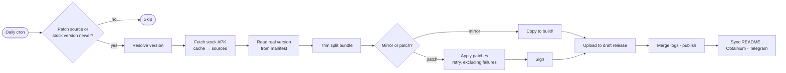

<div align="center">
<a href="#-features"></a>

[](https://github.com/softpyscho/apkforge/actions/workflows/ci.yml)   [](https://www.python.org/downloads/)   [](LICENSE)   [](https://t.me/apkforge)
<br>
[](https://github.com/softpyscho/apkforge/releases)   [](https://github.com/softpyscho/apkforge)
<br><br>

**apkforge** downloads stock Android apps, applies [Morphe](https://github.com/MorpheApp) patch bundles, signs them and
publishes a GitHub release every day — and mirrors unmodified stock APKs for apps that have no patches. Everything runs
on public GitHub Actions, so every build is reproducible and auditable.

**Using the apps** → <a href="#-supported-applications">App list</a> · <a href="#-installing">Install</a> · <a href="#-troubleshooting">Troubleshooting</a><br>
**Running your own** → <a href="#%EF%B8%8F-how-it-works">How it works</a> · <a href="#-run-it-yourself">Quick start</a> · <a href="#-configuration">Configuration</a> · <a href="#-signing">Signing</a> · <a href="#-download-sources">Sources</a><br>
**Developing** → <a href="#-project-structure">Structure</a> · <a href="#-development--testing">Testing</a> · <a href="#-continuous-integration">CI</a> · <a href="CONTRIBUTING.md">Contributing</a> · <a href="docs/ARCHITECTURE.md">Architecture</a>
</div>

---

## ✨ Features

| | |
|:--|:--|
| 🛑 **Ad-blocking** | Removes ads and trackers across supported apps. |
| 🚀 **Enhanced features** | Unlocks premium and quality-of-life functionality. |
| 🎨 **Customization** | Branding, theming, icons and per-patch options. |
| 💉 **Lean output** | Split bundles are trimmed to one ABI, `xxhdpi` and English. |
| 🔒 **Persistent** | Patched apps are not replaced or auto-updated by the Play Store. |
| 🔄 **One-tap updates** | Per-app [Obtainium](https://github.com/ImranR98/Obtainium) configs, plus a full import file. |
| 🪞 **Stock mirroring** | Re-hosts unmodified APKs for apps with no patches. |
| 🩹 **Self-healing builds** | A failing patch is excluded and retried; an unavailable version falls back to an older one. |
| 🔍 **Update detection** | Rebuilds only when a patch source or stock version actually changes. |

## 📦 Supported Applications

Grouped by patch source, with the patches applied to each app. Generated from [`config.toml`](config.toml) on every
build — see [Configuration](#-configuration) to change it.

<!-- APPS_START -->

### 

> **Source:** [`MorpheApp/morphe-patches`](https://github.com/MorpheApp/morphe-patches)

<div align="center">

| App | Arch | Version | APK Source | Patches | Obtainium |
|:---|:----:|:-------:|:----------:|:--------|:---------:|
| [](https://play.google.com/store/apps/details?id=com.reddit.frontpage) | `arm64-v8a` |  | [APKMirror](https://www.apkmirror.com/apk/redditinc/reddit) | <details><summary><b>2 patches</b></summary><br>`Custom branding`<br>`Hide ads`</details> | [](https://apps.obtainium.imranr.dev/redirect?r=obtainium%3A%2F%2Fapp%2F%7B%22id%22%3A%22com.reddit.frontpage%22%2C%22url%22%3A%22https%3A%2F%2Fgithub.com%2Fsoftpyscho%2Fapkforge%2Freleases%2Flatest%22%2C%22author%22%3A%22github.com%22%2C%22name%22%3A%22Reddit%20Morphe%22%2C%22installedVersion%22%3A%22%22%2C%22latestVersion%22%3A%22%22%2C%22apkUrls%22%3A%22%5B%5D%22%2C%22otherAssetUrls%22%3A%22%5B%5D%22%2C%22preferredApkIndex%22%3A0%2C%22additionalSettings%22%3A%22%7B%5C%22intermediateLink%5C%22%3A%5B%5D%2C%5C%22customLinkFilterRegex%5C%22%3A%5C%22reddit-morphe%5C%22%2C%5C%22filterByLinkText%5C%22%3Afalse%2C%5C%22matchLinksOutsideATags%5C%22%3Afalse%2C%5C%22skipSort%5C%22%3Afalse%2C%5C%22reverseSort%5C%22%3Afalse%2C%5C%22sortByLastLinkSegment%5C%22%3Afalse%2C%5C%22versionExtractWholePage%5C%22%3Afalse%2C%5C%22requestHeader%5C%22%3A%5B%7B%5C%22requestHeader%5C%22%3A%5C%22User-Agent%3A%20Mozilla%2F5.0%20(Linux%3B%20Android%2010%3B%20K)%20AppleWebKit%2F537.36%20(KHTML%2C%20like%20Gecko)%20Chrome%2F114.0.0.0%20Mobile%20Safari%2F537.36%5C%22%7D%5D%2C%5C%22defaultPseudoVersioningMethod%5C%22%3A%5C%22partialAPKHash%5C%22%2C%5C%22trackOnly%5C%22%3Afalse%2C%5C%22versionExtractionRegEx%5C%22%3A%5C%22reddit-morphe-v(%5B0-9.%5D%2B)%5C%22%2C%5C%22matchGroupToUse%5C%22%3A%5C%221%5C%22%2C%5C%22versionDetection%5C%22%3Atrue%2C%5C%22useVersionCodeAsOSVersion%5C%22%3Afalse%2C%5C%22apkFilterRegEx%5C%22%3A%5C%22%5C%22%2C%5C%22invertAPKFilter%5C%22%3Afalse%2C%5C%22autoApkFilterByArch%5C%22%3Atrue%2C%5C%22appName%5C%22%3A%5C%22%5C%22%2C%5C%22appAuthor%5C%22%3A%5C%22%5C%22%2C%5C%22shizukuPretendToBeGooglePlay%5C%22%3Afalse%2C%5C%22allowInsecure%5C%22%3Afalse%2C%5C%22exemptFromBackgroundUpdates%5C%22%3Afalse%2C%5C%22skipUpdateNotifications%5C%22%3Afalse%2C%5C%22about%5C%22%3A%5C%22%5C%22%2C%5C%22refreshBeforeDownload%5C%22%3Afalse%7D%22%2C%22lastUpdateCheck%22%3A1786344697135921%2C%22pinned%22%3Afalse%2C%22categories%22%3A%5B%5D%2C%22releaseDate%22%3Anull%2C%22changeLog%22%3Anull%2C%22overrideSource%22%3A%22HTML%22%2C%22allowIdChange%22%3Afalse%2C%22pendingRepoRenameUrl%22%3Anull%7D) |

</div>

---

### 

> **Source:** [`crimera/piko`](https://github.com/crimera/piko)

<div align="center">

| App | Arch | Version | APK Source | Patches | Obtainium |
|:---|:----:|:-------:|:----------:|:--------|:---------:|
| [](https://play.google.com/store/apps/details?id=com.twitter.android) | `arm64-v8a` |  | [APKMirror](https://www.apkmirror.com/apk/x-corp/twitter) | <details><summary><b>73 patches</b></summary><br>`Add ability to copy media link`<br>`Block redirecting to X Lite`<br>`Bring back twitter`<br>`Change app icon`<br>`Clear tracking params`<br>`Control video auto scroll`<br>`Custom download folder`<br>`Custom emoji font`<br>`Custom font`<br>`Custom share menu`<br>`Custom sharing domain`<br>`Customise post font size`<br>`Customize default reply sorting`<br>`Customize explore tabs`<br>`Customize Inline action Bar items`<br>`Customize Navigation Bar items`<br>`Customize notification tabs`<br>`Customize profile tabs`<br>`Customize search suggestions`<br>`Customize search tab items`<br>`Customize side bar items`<br>`Customize timeline top bar`<br>`Delete from database`<br>`Disable auto timeline scroll on launch`<br>`Disable chirp font`<br>`Disunify xchat system`<br>`Download patch`<br>`Dynamic color`<br>`Enable debug menu for posts`<br>`Enable force HD videos`<br>`Enable PiP mode automatically`<br>`Enable Undo Posts`<br>`Export all activities`<br>`Force enable translate`<br>`Handle custom twitter links`<br>`Hide badges from navigation bar icons`<br>`Hide Banner`<br>`Hide bookmark icon in timeline`<br>`Hide community badges`<br>`Hide Community Notes`<br>`Hide FAB`<br>`Hide FAB Menu Buttons`<br>`Hide followed by context`<br>`Hide hidden replies`<br>`Hide immersive player`<br>`Hide Live Threads`<br>`Hide nudge button`<br>`Hide post metrics`<br>`Hide promote button`<br>`Hide recommendation items`<br>`Hide Recommended Users`<br>`Hook feature flag`<br>`Import/Export login token`<br>`Legacy share links`<br>`Log server response`<br>`More information on profile`<br>`Native downloader`<br>`Native reader mode`<br>`Native translator`<br>`No shortened URL`<br>`Pause search suggestions`<br>`Remove Ads`<br>`Remove premium upsell`<br>`Remove search suggestions`<br>`Remove view count`<br>`Round off numbers`<br>`Selectable Text`<br>`Share Tweet as Image`<br>`Show changelogs`<br>`Show poll results`<br>`Show post source label`<br>`Show sensitive media`<br>`Support external downloader`</details> | [](https://apps.obtainium.imranr.dev/redirect?r=obtainium%3A%2F%2Fapp%2F%7B%22id%22%3A%22com.twitter.android%22%2C%22url%22%3A%22https%3A%2F%2Fgithub.com%2Fsoftpyscho%2Fapkforge%2Freleases%2Flatest%22%2C%22author%22%3A%22github.com%22%2C%22name%22%3A%22Twitter%20Morphe%22%2C%22installedVersion%22%3A%22%22%2C%22latestVersion%22%3A%22%22%2C%22apkUrls%22%3A%22%5B%5D%22%2C%22otherAssetUrls%22%3A%22%5B%5D%22%2C%22preferredApkIndex%22%3A0%2C%22additionalSettings%22%3A%22%7B%5C%22intermediateLink%5C%22%3A%5B%5D%2C%5C%22customLinkFilterRegex%5C%22%3A%5C%22twitter-morphe%5C%22%2C%5C%22filterByLinkText%5C%22%3Afalse%2C%5C%22matchLinksOutsideATags%5C%22%3Afalse%2C%5C%22skipSort%5C%22%3Afalse%2C%5C%22reverseSort%5C%22%3Afalse%2C%5C%22sortByLastLinkSegment%5C%22%3Afalse%2C%5C%22versionExtractWholePage%5C%22%3Afalse%2C%5C%22requestHeader%5C%22%3A%5B%7B%5C%22requestHeader%5C%22%3A%5C%22User-Agent%3A%20Mozilla%2F5.0%20(Linux%3B%20Android%2010%3B%20K)%20AppleWebKit%2F537.36%20(KHTML%2C%20like%20Gecko)%20Chrome%2F114.0.0.0%20Mobile%20Safari%2F537.36%5C%22%7D%5D%2C%5C%22defaultPseudoVersioningMethod%5C%22%3A%5C%22partialAPKHash%5C%22%2C%5C%22trackOnly%5C%22%3Afalse%2C%5C%22versionExtractionRegEx%5C%22%3A%5C%22twitter-morphe-v(%5B0-9.%5D%2B)%5C%22%2C%5C%22matchGroupToUse%5C%22%3A%5C%221%5C%22%2C%5C%22versionDetection%5C%22%3Atrue%2C%5C%22useVersionCodeAsOSVersion%5C%22%3Afalse%2C%5C%22apkFilterRegEx%5C%22%3A%5C%22%5C%22%2C%5C%22invertAPKFilter%5C%22%3Afalse%2C%5C%22autoApkFilterByArch%5C%22%3Atrue%2C%5C%22appName%5C%22%3A%5C%22%5C%22%2C%5C%22appAuthor%5C%22%3A%5C%22%5C%22%2C%5C%22shizukuPretendToBeGooglePlay%5C%22%3Afalse%2C%5C%22allowInsecure%5C%22%3Afalse%2C%5C%22exemptFromBackgroundUpdates%5C%22%3Afalse%2C%5C%22skipUpdateNotifications%5C%22%3Afalse%2C%5C%22about%5C%22%3A%5C%22%5C%22%2C%5C%22refreshBeforeDownload%5C%22%3Afalse%7D%22%2C%22lastUpdateCheck%22%3A1786344697135921%2C%22pinned%22%3Afalse%2C%22categories%22%3A%5B%5D%2C%22releaseDate%22%3Anull%2C%22changeLog%22%3Anull%2C%22overrideSource%22%3A%22HTML%22%2C%22allowIdChange%22%3Afalse%2C%22pendingRepoRenameUrl%22%3Anull%7D) |
| [](https://play.google.com/store/apps/details?id=com.instagram.android) | `arm64-v8a` |  | [GitHub](https://github.com/softpyscho/apkforge/releases/tag/com.instagram.android) | <details><summary><b>54 patches</b></summary><br>`Add settings`<br>`Allow user network certificate`<br>`Change like animation`<br>`Clone`<br>`Copy comment`<br>`Customise story ring size`<br>`Customise story timestamp`<br>`Disable ads`<br>`Disable analytics`<br>`Disable comments`<br>`Disable discover people`<br>`Disable double tap like`<br>`Disable explore`<br>`Disable highlights`<br>`Disable onboarding permission prompts`<br>`Disable Reels scrolling`<br>`Disable screenshot detection`<br>`Disable stories`<br>`Disable story flipping`<br>`Disable swipe to create`<br>`Disable typing status`<br>`Disable video autoplay`<br>`Download media`<br>`Download voice message`<br>`External downloader`<br>`Filter stories`<br>`Friendship status indicator`<br>`Hide group creation button on sharesheet`<br>`Hide navigation buttons`<br>`Hide notes tray`<br>`Hide reshare button`<br>`Hide stories tray`<br>`Hide suggested content`<br>`Improve image viewing`<br>`Limit feed to following profiles`<br>`Make ephemeral media permanent`<br>`Mark chat as read manually`<br>`More options on post`<br>`More options on profile`<br>`Open links externally`<br>`Remove build expired popup`<br>`Remove empty bottom space`<br>`Sanitize share links`<br>`Save media comment`<br>`Stories audio autoplay`<br>`Theme`<br>`Unlock developer options`<br>`Unlock employee options`<br>`Unlock Plus benefits`<br>`Validate links`<br>`View DMs anonymously`<br>`View live anonymously`<br>`View stories anonymously`<br>`View story mentions`</details> | [](https://apps.obtainium.imranr.dev/redirect?r=obtainium%3A%2F%2Fapp%2F%7B%22id%22%3A%22com.instagram.android%22%2C%22url%22%3A%22https%3A%2F%2Fgithub.com%2Fsoftpyscho%2Fapkforge%2Freleases%2Flatest%22%2C%22author%22%3A%22github.com%22%2C%22name%22%3A%22Instagram%20Morphe%22%2C%22installedVersion%22%3A%22%22%2C%22latestVersion%22%3A%22%22%2C%22apkUrls%22%3A%22%5B%5D%22%2C%22otherAssetUrls%22%3A%22%5B%5D%22%2C%22preferredApkIndex%22%3A0%2C%22additionalSettings%22%3A%22%7B%5C%22intermediateLink%5C%22%3A%5B%5D%2C%5C%22customLinkFilterRegex%5C%22%3A%5C%22instagram-morphe%5C%22%2C%5C%22filterByLinkText%5C%22%3Afalse%2C%5C%22matchLinksOutsideATags%5C%22%3Afalse%2C%5C%22skipSort%5C%22%3Afalse%2C%5C%22reverseSort%5C%22%3Afalse%2C%5C%22sortByLastLinkSegment%5C%22%3Afalse%2C%5C%22versionExtractWholePage%5C%22%3Afalse%2C%5C%22requestHeader%5C%22%3A%5B%7B%5C%22requestHeader%5C%22%3A%5C%22User-Agent%3A%20Mozilla%2F5.0%20(Linux%3B%20Android%2010%3B%20K)%20AppleWebKit%2F537.36%20(KHTML%2C%20like%20Gecko)%20Chrome%2F114.0.0.0%20Mobile%20Safari%2F537.36%5C%22%7D%5D%2C%5C%22defaultPseudoVersioningMethod%5C%22%3A%5C%22partialAPKHash%5C%22%2C%5C%22trackOnly%5C%22%3Afalse%2C%5C%22versionExtractionRegEx%5C%22%3A%5C%22instagram-morphe-v(%5B0-9.%5D%2B)%5C%22%2C%5C%22matchGroupToUse%5C%22%3A%5C%221%5C%22%2C%5C%22versionDetection%5C%22%3Atrue%2C%5C%22useVersionCodeAsOSVersion%5C%22%3Afalse%2C%5C%22apkFilterRegEx%5C%22%3A%5C%22%5C%22%2C%5C%22invertAPKFilter%5C%22%3Afalse%2C%5C%22autoApkFilterByArch%5C%22%3Atrue%2C%5C%22appName%5C%22%3A%5C%22%5C%22%2C%5C%22appAuthor%5C%22%3A%5C%22%5C%22%2C%5C%22shizukuPretendToBeGooglePlay%5C%22%3Afalse%2C%5C%22allowInsecure%5C%22%3Afalse%2C%5C%22exemptFromBackgroundUpdates%5C%22%3Afalse%2C%5C%22skipUpdateNotifications%5C%22%3Afalse%2C%5C%22about%5C%22%3A%5C%22%5C%22%2C%5C%22refreshBeforeDownload%5C%22%3Afalse%7D%22%2C%22lastUpdateCheck%22%3A1786344697135921%2C%22pinned%22%3Afalse%2C%22categories%22%3A%5B%5D%2C%22releaseDate%22%3Anull%2C%22changeLog%22%3Anull%2C%22overrideSource%22%3A%22HTML%22%2C%22allowIdChange%22%3Afalse%2C%22pendingRepoRenameUrl%22%3Anull%7D) |

</div>

---

### 

> **Source:** [`rushiranpise/morphe-patches`](https://github.com/rushiranpise/morphe-patches)

<div align="center">

| App | Arch | Version | APK Source | Patches | Obtainium |
|:---|:----:|:-------:|:----------:|:--------|:---------:|
| [](https://play.google.com/store/apps/details?id=com.cloudflare.onedotonedotonedotone) | `arm64-v8a` |  | [APKMirror](https://www.apkmirror.com/apk/cloudflare/1-1-1-1-faster-safer-internet) | <details><summary><b>32 patches</b></summary><br>`Change version code`<br>`Disable ad SDK calls`<br>`Disable Analytics / Telemetry`<br>`Disable clipboard access`<br>`Disable shake ads`<br>`Enable Android debugging`<br>`Enable debug build target`<br>`Enable ROM signature spoofing`<br>`Export all activities`<br>`Export internal data documents provider`<br>`Force dark theme`<br>`Hide ADB status`<br>`Hide app icon`<br>`Hide mock location`<br>`Hide VPN and proxy`<br>`Override certificate pinning`<br>`Predictive back gesture`<br>`Remove ad manifest entries`<br>`Remove share targets`<br>`Set target SDK 34`<br>`Spoof Android ID`<br>`Spoof Bluetooth identifiers`<br>`Spoof build info`<br>`Spoof keystore security level`<br>`Spoof Pixel device`<br>`Spoof Play age signals`<br>`Spoof root of trust`<br>`Spoof SIM provider`<br>`Spoof telephony IDs`<br>`Spoof WARP+ Unlimited UI`<br>`Spoof Wi-Fi connection`<br>`Spoof Wi-Fi identifiers`</details> | [](https://apps.obtainium.imranr.dev/redirect?r=obtainium%3A%2F%2Fapp%2F%7B%22id%22%3A%22com.cloudflare.onedotonedotonedotone%22%2C%22url%22%3A%22https%3A%2F%2Fgithub.com%2Fsoftpyscho%2Fapkforge%2Freleases%2Flatest%22%2C%22author%22%3A%22github.com%22%2C%22name%22%3A%22WARP%20Morphe%22%2C%22installedVersion%22%3A%22%22%2C%22latestVersion%22%3A%22%22%2C%22apkUrls%22%3A%22%5B%5D%22%2C%22otherAssetUrls%22%3A%22%5B%5D%22%2C%22preferredApkIndex%22%3A0%2C%22additionalSettings%22%3A%22%7B%5C%22intermediateLink%5C%22%3A%5B%5D%2C%5C%22customLinkFilterRegex%5C%22%3A%5C%22warp-morphe%5C%22%2C%5C%22filterByLinkText%5C%22%3Afalse%2C%5C%22matchLinksOutsideATags%5C%22%3Afalse%2C%5C%22skipSort%5C%22%3Afalse%2C%5C%22reverseSort%5C%22%3Afalse%2C%5C%22sortByLastLinkSegment%5C%22%3Afalse%2C%5C%22versionExtractWholePage%5C%22%3Afalse%2C%5C%22requestHeader%5C%22%3A%5B%7B%5C%22requestHeader%5C%22%3A%5C%22User-Agent%3A%20Mozilla%2F5.0%20(Linux%3B%20Android%2010%3B%20K)%20AppleWebKit%2F537.36%20(KHTML%2C%20like%20Gecko)%20Chrome%2F114.0.0.0%20Mobile%20Safari%2F537.36%5C%22%7D%5D%2C%5C%22defaultPseudoVersioningMethod%5C%22%3A%5C%22partialAPKHash%5C%22%2C%5C%22trackOnly%5C%22%3Afalse%2C%5C%22versionExtractionRegEx%5C%22%3A%5C%22warp-morphe-v(%5B0-9.%5D%2B)%5C%22%2C%5C%22matchGroupToUse%5C%22%3A%5C%221%5C%22%2C%5C%22versionDetection%5C%22%3Atrue%2C%5C%22useVersionCodeAsOSVersion%5C%22%3Afalse%2C%5C%22apkFilterRegEx%5C%22%3A%5C%22%5C%22%2C%5C%22invertAPKFilter%5C%22%3Afalse%2C%5C%22autoApkFilterByArch%5C%22%3Atrue%2C%5C%22appName%5C%22%3A%5C%22%5C%22%2C%5C%22appAuthor%5C%22%3A%5C%22%5C%22%2C%5C%22shizukuPretendToBeGooglePlay%5C%22%3Afalse%2C%5C%22allowInsecure%5C%22%3Afalse%2C%5C%22exemptFromBackgroundUpdates%5C%22%3Afalse%2C%5C%22skipUpdateNotifications%5C%22%3Afalse%2C%5C%22about%5C%22%3A%5C%22%5C%22%2C%5C%22refreshBeforeDownload%5C%22%3Afalse%7D%22%2C%22lastUpdateCheck%22%3A1786344697135921%2C%22pinned%22%3Afalse%2C%22categories%22%3A%5B%5D%2C%22releaseDate%22%3Anull%2C%22changeLog%22%3Anull%2C%22overrideSource%22%3A%22HTML%22%2C%22allowIdChange%22%3Afalse%2C%22pendingRepoRenameUrl%22%3Anull%7D) |
| [](https://play.google.com/store/apps/details?id=com.Splitwise.SplitwiseMobile) | `arm64-v8a` |  | [APKMirror](https://www.apkmirror.com/apk/splitwise/splitwise) | <details><summary><b>31 patches</b></summary><br>`Change version code`<br>`Disable ad SDK calls`<br>`Disable clipboard access`<br>`Disable shake ads`<br>`Enable Android debugging`<br>`Enable debug build target`<br>`Enable ROM signature spoofing`<br>`Export all activities`<br>`Export internal data documents provider`<br>`Force dark theme`<br>`Hide ADB status`<br>`Hide app icon`<br>`Hide mock location`<br>`Hide VPN and proxy`<br>`Override certificate pinning`<br>`Predictive back gesture`<br>`Remove ad manifest entries`<br>`Remove share targets`<br>`Set target SDK 34`<br>`Spoof Android ID`<br>`Spoof Bluetooth identifiers`<br>`Spoof build info`<br>`Spoof keystore security level`<br>`Spoof Pixel device`<br>`Spoof Play age signals`<br>`Spoof root of trust`<br>`Spoof SIM provider`<br>`Spoof telephony IDs`<br>`Spoof Wi-Fi connection`<br>`Spoof Wi-Fi identifiers`<br>`Unlock Pro`</details> | [](https://apps.obtainium.imranr.dev/redirect?r=obtainium%3A%2F%2Fapp%2F%7B%22id%22%3A%22com.Splitwise.SplitwiseMobile%22%2C%22url%22%3A%22https%3A%2F%2Fgithub.com%2Fsoftpyscho%2Fapkforge%2Freleases%2Flatest%22%2C%22author%22%3A%22github.com%22%2C%22name%22%3A%22Splitwise%20Morphe%22%2C%22installedVersion%22%3A%22%22%2C%22latestVersion%22%3A%22%22%2C%22apkUrls%22%3A%22%5B%5D%22%2C%22otherAssetUrls%22%3A%22%5B%5D%22%2C%22preferredApkIndex%22%3A0%2C%22additionalSettings%22%3A%22%7B%5C%22intermediateLink%5C%22%3A%5B%5D%2C%5C%22customLinkFilterRegex%5C%22%3A%5C%22splitwise-morphe%5C%22%2C%5C%22filterByLinkText%5C%22%3Afalse%2C%5C%22matchLinksOutsideATags%5C%22%3Afalse%2C%5C%22skipSort%5C%22%3Afalse%2C%5C%22reverseSort%5C%22%3Afalse%2C%5C%22sortByLastLinkSegment%5C%22%3Afalse%2C%5C%22versionExtractWholePage%5C%22%3Afalse%2C%5C%22requestHeader%5C%22%3A%5B%7B%5C%22requestHeader%5C%22%3A%5C%22User-Agent%3A%20Mozilla%2F5.0%20(Linux%3B%20Android%2010%3B%20K)%20AppleWebKit%2F537.36%20(KHTML%2C%20like%20Gecko)%20Chrome%2F114.0.0.0%20Mobile%20Safari%2F537.36%5C%22%7D%5D%2C%5C%22defaultPseudoVersioningMethod%5C%22%3A%5C%22partialAPKHash%5C%22%2C%5C%22trackOnly%5C%22%3Afalse%2C%5C%22versionExtractionRegEx%5C%22%3A%5C%22splitwise-morphe-v(%5B0-9.%5D%2B)%5C%22%2C%5C%22matchGroupToUse%5C%22%3A%5C%221%5C%22%2C%5C%22versionDetection%5C%22%3Atrue%2C%5C%22useVersionCodeAsOSVersion%5C%22%3Afalse%2C%5C%22apkFilterRegEx%5C%22%3A%5C%22%5C%22%2C%5C%22invertAPKFilter%5C%22%3Afalse%2C%5C%22autoApkFilterByArch%5C%22%3Atrue%2C%5C%22appName%5C%22%3A%5C%22%5C%22%2C%5C%22appAuthor%5C%22%3A%5C%22%5C%22%2C%5C%22shizukuPretendToBeGooglePlay%5C%22%3Afalse%2C%5C%22allowInsecure%5C%22%3Afalse%2C%5C%22exemptFromBackgroundUpdates%5C%22%3Afalse%2C%5C%22skipUpdateNotifications%5C%22%3Afalse%2C%5C%22about%5C%22%3A%5C%22%5C%22%2C%5C%22refreshBeforeDownload%5C%22%3Afalse%7D%22%2C%22lastUpdateCheck%22%3A1786344697135921%2C%22pinned%22%3Afalse%2C%22categories%22%3A%5B%5D%2C%22releaseDate%22%3Anull%2C%22changeLog%22%3Anull%2C%22overrideSource%22%3A%22HTML%22%2C%22allowIdChange%22%3Afalse%2C%22pendingRepoRenameUrl%22%3Anull%7D) |
| [](https://play.google.com/store/apps/details?id=com.oasisfeng.greenify) | `arm64-v8a` |  | [GitHub](https://github.com/softpyscho/apkforge/releases/tag/com.oasisfeng.greenify) | <details><summary><b>2 patches</b></summary><br>`Disable PairIP license check`<br>`Unlock Donation`</details> | [](https://apps.obtainium.imranr.dev/redirect?r=obtainium%3A%2F%2Fapp%2F%7B%22id%22%3A%22com.oasisfeng.greenify%22%2C%22url%22%3A%22https%3A%2F%2Fgithub.com%2Fsoftpyscho%2Fapkforge%2Freleases%2Flatest%22%2C%22author%22%3A%22github.com%22%2C%22name%22%3A%22Greenify%20Morphe%22%2C%22installedVersion%22%3A%22%22%2C%22latestVersion%22%3A%22%22%2C%22apkUrls%22%3A%22%5B%5D%22%2C%22otherAssetUrls%22%3A%22%5B%5D%22%2C%22preferredApkIndex%22%3A0%2C%22additionalSettings%22%3A%22%7B%5C%22intermediateLink%5C%22%3A%5B%5D%2C%5C%22customLinkFilterRegex%5C%22%3A%5C%22greenify-morphe%5C%22%2C%5C%22filterByLinkText%5C%22%3Afalse%2C%5C%22matchLinksOutsideATags%5C%22%3Afalse%2C%5C%22skipSort%5C%22%3Afalse%2C%5C%22reverseSort%5C%22%3Afalse%2C%5C%22sortByLastLinkSegment%5C%22%3Afalse%2C%5C%22versionExtractWholePage%5C%22%3Afalse%2C%5C%22requestHeader%5C%22%3A%5B%7B%5C%22requestHeader%5C%22%3A%5C%22User-Agent%3A%20Mozilla%2F5.0%20(Linux%3B%20Android%2010%3B%20K)%20AppleWebKit%2F537.36%20(KHTML%2C%20like%20Gecko)%20Chrome%2F114.0.0.0%20Mobile%20Safari%2F537.36%5C%22%7D%5D%2C%5C%22defaultPseudoVersioningMethod%5C%22%3A%5C%22partialAPKHash%5C%22%2C%5C%22trackOnly%5C%22%3Afalse%2C%5C%22versionExtractionRegEx%5C%22%3A%5C%22greenify-morphe-v(%5B0-9.%5D%2B)%5C%22%2C%5C%22matchGroupToUse%5C%22%3A%5C%221%5C%22%2C%5C%22versionDetection%5C%22%3Atrue%2C%5C%22useVersionCodeAsOSVersion%5C%22%3Afalse%2C%5C%22apkFilterRegEx%5C%22%3A%5C%22%5C%22%2C%5C%22invertAPKFilter%5C%22%3Afalse%2C%5C%22autoApkFilterByArch%5C%22%3Atrue%2C%5C%22appName%5C%22%3A%5C%22%5C%22%2C%5C%22appAuthor%5C%22%3A%5C%22%5C%22%2C%5C%22shizukuPretendToBeGooglePlay%5C%22%3Afalse%2C%5C%22allowInsecure%5C%22%3Afalse%2C%5C%22exemptFromBackgroundUpdates%5C%22%3Afalse%2C%5C%22skipUpdateNotifications%5C%22%3Afalse%2C%5C%22about%5C%22%3A%5C%22%5C%22%2C%5C%22refreshBeforeDownload%5C%22%3Afalse%7D%22%2C%22lastUpdateCheck%22%3A1786344697135921%2C%22pinned%22%3Afalse%2C%22categories%22%3A%5B%5D%2C%22releaseDate%22%3Anull%2C%22changeLog%22%3Anull%2C%22overrideSource%22%3A%22HTML%22%2C%22allowIdChange%22%3Afalse%2C%22pendingRepoRenameUrl%22%3Anull%7D) |

</div>

---

### 

> **Source:** [`Paresh-Maheshwari/paresh-patches`](https://gitlab.com/Paresh-Maheshwari/paresh-patches) (GitLab)

<div align="center">

| App | Arch | Version | APK Source | Patches | Obtainium |
|:---|:----:|:-------:|:----------:|:--------|:---------:|
| [](https://play.google.com/store/apps/details?id=com.truecaller) | `arm64-v8a` |  | [APKMirror](https://www.apkmirror.com/apk/true-software-scandinavia-ab/truecaller-caller-id-block) | <details><summary><b>10 patches</b></summary><br>`Disable telemetry`<br>`Disable update check`<br>`GMS sign-in bypass`<br>`Hide Assistant tab`<br>`Hide Family Protection button`<br>`Hide Premium from settings`<br>`Hide Premium tab`<br>`Hide Scams tab`<br>`Neutralize third-party SDKs`<br>`Truecaller Premium`</details> | [](https://apps.obtainium.imranr.dev/redirect?r=obtainium%3A%2F%2Fapp%2F%7B%22id%22%3A%22com.truecaller%22%2C%22url%22%3A%22https%3A%2F%2Fgithub.com%2Fsoftpyscho%2Fapkforge%2Freleases%2Flatest%22%2C%22author%22%3A%22github.com%22%2C%22name%22%3A%22Truecaller%20Morphe%22%2C%22installedVersion%22%3A%22%22%2C%22latestVersion%22%3A%22%22%2C%22apkUrls%22%3A%22%5B%5D%22%2C%22otherAssetUrls%22%3A%22%5B%5D%22%2C%22preferredApkIndex%22%3A0%2C%22additionalSettings%22%3A%22%7B%5C%22intermediateLink%5C%22%3A%5B%5D%2C%5C%22customLinkFilterRegex%5C%22%3A%5C%22truecaller-morphe%5C%22%2C%5C%22filterByLinkText%5C%22%3Afalse%2C%5C%22matchLinksOutsideATags%5C%22%3Afalse%2C%5C%22skipSort%5C%22%3Afalse%2C%5C%22reverseSort%5C%22%3Afalse%2C%5C%22sortByLastLinkSegment%5C%22%3Afalse%2C%5C%22versionExtractWholePage%5C%22%3Afalse%2C%5C%22requestHeader%5C%22%3A%5B%7B%5C%22requestHeader%5C%22%3A%5C%22User-Agent%3A%20Mozilla%2F5.0%20(Linux%3B%20Android%2010%3B%20K)%20AppleWebKit%2F537.36%20(KHTML%2C%20like%20Gecko)%20Chrome%2F114.0.0.0%20Mobile%20Safari%2F537.36%5C%22%7D%5D%2C%5C%22defaultPseudoVersioningMethod%5C%22%3A%5C%22partialAPKHash%5C%22%2C%5C%22trackOnly%5C%22%3Afalse%2C%5C%22versionExtractionRegEx%5C%22%3A%5C%22truecaller-morphe-v(%5B0-9.%5D%2B)%5C%22%2C%5C%22matchGroupToUse%5C%22%3A%5C%221%5C%22%2C%5C%22versionDetection%5C%22%3Atrue%2C%5C%22useVersionCodeAsOSVersion%5C%22%3Afalse%2C%5C%22apkFilterRegEx%5C%22%3A%5C%22%5C%22%2C%5C%22invertAPKFilter%5C%22%3Afalse%2C%5C%22autoApkFilterByArch%5C%22%3Atrue%2C%5C%22appName%5C%22%3A%5C%22%5C%22%2C%5C%22appAuthor%5C%22%3A%5C%22%5C%22%2C%5C%22shizukuPretendToBeGooglePlay%5C%22%3Afalse%2C%5C%22allowInsecure%5C%22%3Afalse%2C%5C%22exemptFromBackgroundUpdates%5C%22%3Afalse%2C%5C%22skipUpdateNotifications%5C%22%3Afalse%2C%5C%22about%5C%22%3A%5C%22%5C%22%2C%5C%22refreshBeforeDownload%5C%22%3Afalse%7D%22%2C%22lastUpdateCheck%22%3A1786344697135921%2C%22pinned%22%3Afalse%2C%22categories%22%3A%5B%5D%2C%22releaseDate%22%3Anull%2C%22changeLog%22%3Anull%2C%22overrideSource%22%3A%22HTML%22%2C%22allowIdChange%22%3Afalse%2C%22pendingRepoRenameUrl%22%3Anull%7D) |
| [](https://play.google.com/store/apps/details?id=com.ticktick.task) | `arm64-v8a` |  | [APKMirror](https://www.apkmirror.com/apk/ticktick-limited/ticktick-to-do-list-with-reminder-day-planner) | <details><summary><b>1 patch</b></summary><br>`TickTick Premium`</details> | [](https://apps.obtainium.imranr.dev/redirect?r=obtainium%3A%2F%2Fapp%2F%7B%22id%22%3A%22com.ticktick.task%22%2C%22url%22%3A%22https%3A%2F%2Fgithub.com%2Fsoftpyscho%2Fapkforge%2Freleases%2Flatest%22%2C%22author%22%3A%22github.com%22%2C%22name%22%3A%22TickTick%20Morphe%22%2C%22installedVersion%22%3A%22%22%2C%22latestVersion%22%3A%22%22%2C%22apkUrls%22%3A%22%5B%5D%22%2C%22otherAssetUrls%22%3A%22%5B%5D%22%2C%22preferredApkIndex%22%3A0%2C%22additionalSettings%22%3A%22%7B%5C%22intermediateLink%5C%22%3A%5B%5D%2C%5C%22customLinkFilterRegex%5C%22%3A%5C%22ticktick-morphe%5C%22%2C%5C%22filterByLinkText%5C%22%3Afalse%2C%5C%22matchLinksOutsideATags%5C%22%3Afalse%2C%5C%22skipSort%5C%22%3Afalse%2C%5C%22reverseSort%5C%22%3Afalse%2C%5C%22sortByLastLinkSegment%5C%22%3Afalse%2C%5C%22versionExtractWholePage%5C%22%3Afalse%2C%5C%22requestHeader%5C%22%3A%5B%7B%5C%22requestHeader%5C%22%3A%5C%22User-Agent%3A%20Mozilla%2F5.0%20(Linux%3B%20Android%2010%3B%20K)%20AppleWebKit%2F537.36%20(KHTML%2C%20like%20Gecko)%20Chrome%2F114.0.0.0%20Mobile%20Safari%2F537.36%5C%22%7D%5D%2C%5C%22defaultPseudoVersioningMethod%5C%22%3A%5C%22partialAPKHash%5C%22%2C%5C%22trackOnly%5C%22%3Afalse%2C%5C%22versionExtractionRegEx%5C%22%3A%5C%22ticktick-morphe-v(%5B0-9.%5D%2B)%5C%22%2C%5C%22matchGroupToUse%5C%22%3A%5C%221%5C%22%2C%5C%22versionDetection%5C%22%3Atrue%2C%5C%22useVersionCodeAsOSVersion%5C%22%3Afalse%2C%5C%22apkFilterRegEx%5C%22%3A%5C%22%5C%22%2C%5C%22invertAPKFilter%5C%22%3Afalse%2C%5C%22autoApkFilterByArch%5C%22%3Atrue%2C%5C%22appName%5C%22%3A%5C%22%5C%22%2C%5C%22appAuthor%5C%22%3A%5C%22%5C%22%2C%5C%22shizukuPretendToBeGooglePlay%5C%22%3Afalse%2C%5C%22allowInsecure%5C%22%3Afalse%2C%5C%22exemptFromBackgroundUpdates%5C%22%3Afalse%2C%5C%22skipUpdateNotifications%5C%22%3Afalse%2C%5C%22about%5C%22%3A%5C%22%5C%22%2C%5C%22refreshBeforeDownload%5C%22%3Afalse%7D%22%2C%22lastUpdateCheck%22%3A1786344697135921%2C%22pinned%22%3Afalse%2C%22categories%22%3A%5B%5D%2C%22releaseDate%22%3Anull%2C%22changeLog%22%3Anull%2C%22overrideSource%22%3A%22HTML%22%2C%22allowIdChange%22%3Afalse%2C%22pendingRepoRenameUrl%22%3Anull%7D) |

</div>

---

### 

> **Source:** [`hoo-dles/morphe-patches`](https://github.com/hoo-dles/morphe-patches)

<div align="center">

| App | Arch | Version | APK Source | Patches | Obtainium |
|:---|:----:|:-------:|:----------:|:--------|:---------:|
| [](https://play.google.com/store/apps/details?id=com.xodo.pdf.reader) | `arm64-v8a` |  | [APKMirror](https://www.apkmirror.com/apk/apryse-software-inc/xodo-pdf-reader-editor) | <details><summary><b>1 patch</b></summary><br>`Enable Pro`</details> | [](https://apps.obtainium.imranr.dev/redirect?r=obtainium%3A%2F%2Fapp%2F%7B%22id%22%3A%22com.xodo.pdf.reader%22%2C%22url%22%3A%22https%3A%2F%2Fgithub.com%2Fsoftpyscho%2Fapkforge%2Freleases%2Flatest%22%2C%22author%22%3A%22github.com%22%2C%22name%22%3A%22Xodo%20Morphe%22%2C%22installedVersion%22%3A%22%22%2C%22latestVersion%22%3A%22%22%2C%22apkUrls%22%3A%22%5B%5D%22%2C%22otherAssetUrls%22%3A%22%5B%5D%22%2C%22preferredApkIndex%22%3A0%2C%22additionalSettings%22%3A%22%7B%5C%22intermediateLink%5C%22%3A%5B%5D%2C%5C%22customLinkFilterRegex%5C%22%3A%5C%22xodo-morphe%5C%22%2C%5C%22filterByLinkText%5C%22%3Afalse%2C%5C%22matchLinksOutsideATags%5C%22%3Afalse%2C%5C%22skipSort%5C%22%3Afalse%2C%5C%22reverseSort%5C%22%3Afalse%2C%5C%22sortByLastLinkSegment%5C%22%3Afalse%2C%5C%22versionExtractWholePage%5C%22%3Afalse%2C%5C%22requestHeader%5C%22%3A%5B%7B%5C%22requestHeader%5C%22%3A%5C%22User-Agent%3A%20Mozilla%2F5.0%20(Linux%3B%20Android%2010%3B%20K)%20AppleWebKit%2F537.36%20(KHTML%2C%20like%20Gecko)%20Chrome%2F114.0.0.0%20Mobile%20Safari%2F537.36%5C%22%7D%5D%2C%5C%22defaultPseudoVersioningMethod%5C%22%3A%5C%22partialAPKHash%5C%22%2C%5C%22trackOnly%5C%22%3Afalse%2C%5C%22versionExtractionRegEx%5C%22%3A%5C%22xodo-morphe-v(%5B0-9.%5D%2B)%5C%22%2C%5C%22matchGroupToUse%5C%22%3A%5C%221%5C%22%2C%5C%22versionDetection%5C%22%3Atrue%2C%5C%22useVersionCodeAsOSVersion%5C%22%3Afalse%2C%5C%22apkFilterRegEx%5C%22%3A%5C%22%5C%22%2C%5C%22invertAPKFilter%5C%22%3Afalse%2C%5C%22autoApkFilterByArch%5C%22%3Atrue%2C%5C%22appName%5C%22%3A%5C%22%5C%22%2C%5C%22appAuthor%5C%22%3A%5C%22%5C%22%2C%5C%22shizukuPretendToBeGooglePlay%5C%22%3Afalse%2C%5C%22allowInsecure%5C%22%3Afalse%2C%5C%22exemptFromBackgroundUpdates%5C%22%3Afalse%2C%5C%22skipUpdateNotifications%5C%22%3Afalse%2C%5C%22about%5C%22%3A%5C%22%5C%22%2C%5C%22refreshBeforeDownload%5C%22%3Afalse%7D%22%2C%22lastUpdateCheck%22%3A1786344697135921%2C%22pinned%22%3Afalse%2C%22categories%22%3A%5B%5D%2C%22releaseDate%22%3Anull%2C%22changeLog%22%3Anull%2C%22overrideSource%22%3A%22HTML%22%2C%22allowIdChange%22%3Afalse%2C%22pendingRepoRenameUrl%22%3Anull%7D) |
| [](https://play.google.com/store/apps/details?id=com.amazon.avod.thirdpartyclient) | `arm64-v8a` |  | [APKMirror](https://www.apkmirror.com/apk/amazon-mobile-llc/amazon-prime-video) | <details><summary><b>3 patches</b></summary><br>`Enable speed control`<br>`Rename shared permissions`<br>`Skip ads`</details> | [](https://apps.obtainium.imranr.dev/redirect?r=obtainium%3A%2F%2Fapp%2F%7B%22id%22%3A%22com.amazon.avod.thirdpartyclient%22%2C%22url%22%3A%22https%3A%2F%2Fgithub.com%2Fsoftpyscho%2Fapkforge%2Freleases%2Flatest%22%2C%22author%22%3A%22github.com%22%2C%22name%22%3A%22Amazon%20Prime%20Video%20Morphe%22%2C%22installedVersion%22%3A%22%22%2C%22latestVersion%22%3A%22%22%2C%22apkUrls%22%3A%22%5B%5D%22%2C%22otherAssetUrls%22%3A%22%5B%5D%22%2C%22preferredApkIndex%22%3A0%2C%22additionalSettings%22%3A%22%7B%5C%22intermediateLink%5C%22%3A%5B%5D%2C%5C%22customLinkFilterRegex%5C%22%3A%5C%22amazon-prime-video-morphe%5C%22%2C%5C%22filterByLinkText%5C%22%3Afalse%2C%5C%22matchLinksOutsideATags%5C%22%3Afalse%2C%5C%22skipSort%5C%22%3Afalse%2C%5C%22reverseSort%5C%22%3Afalse%2C%5C%22sortByLastLinkSegment%5C%22%3Afalse%2C%5C%22versionExtractWholePage%5C%22%3Afalse%2C%5C%22requestHeader%5C%22%3A%5B%7B%5C%22requestHeader%5C%22%3A%5C%22User-Agent%3A%20Mozilla%2F5.0%20(Linux%3B%20Android%2010%3B%20K)%20AppleWebKit%2F537.36%20(KHTML%2C%20like%20Gecko)%20Chrome%2F114.0.0.0%20Mobile%20Safari%2F537.36%5C%22%7D%5D%2C%5C%22defaultPseudoVersioningMethod%5C%22%3A%5C%22partialAPKHash%5C%22%2C%5C%22trackOnly%5C%22%3Afalse%2C%5C%22versionExtractionRegEx%5C%22%3A%5C%22amazon-prime-video-morphe-v(%5B0-9.%5D%2B)%5C%22%2C%5C%22matchGroupToUse%5C%22%3A%5C%221%5C%22%2C%5C%22versionDetection%5C%22%3Atrue%2C%5C%22useVersionCodeAsOSVersion%5C%22%3Afalse%2C%5C%22apkFilterRegEx%5C%22%3A%5C%22%5C%22%2C%5C%22invertAPKFilter%5C%22%3Afalse%2C%5C%22autoApkFilterByArch%5C%22%3Atrue%2C%5C%22appName%5C%22%3A%5C%22%5C%22%2C%5C%22appAuthor%5C%22%3A%5C%22%5C%22%2C%5C%22shizukuPretendToBeGooglePlay%5C%22%3Afalse%2C%5C%22allowInsecure%5C%22%3Afalse%2C%5C%22exemptFromBackgroundUpdates%5C%22%3Afalse%2C%5C%22skipUpdateNotifications%5C%22%3Afalse%2C%5C%22about%5C%22%3A%5C%22%5C%22%2C%5C%22refreshBeforeDownload%5C%22%3Afalse%7D%22%2C%22lastUpdateCheck%22%3A1786344697135921%2C%22pinned%22%3Afalse%2C%22categories%22%3A%5B%5D%2C%22releaseDate%22%3Anull%2C%22changeLog%22%3Anull%2C%22overrideSource%22%3A%22HTML%22%2C%22allowIdChange%22%3Afalse%2C%22pendingRepoRenameUrl%22%3Anull%7D) |

</div>

---

### 

> **Source:** [`arandomhooman/hoomans-morphe-patches`](https://github.com/arandomhooman/hoomans-morphe-patches)

<div align="center">

| App | Arch | Version | APK Source | Patches | Obtainium |
|:---|:----:|:-------:|:----------:|:--------|:---------:|
| [](https://play.google.com/store/apps/details?id=com.paget96.batteryguru) | `arm64-v8a` |  | [APKMirror](https://www.apkmirror.com/apk/paget96/battery-guru-health-saver) | <details><summary><b>1 patch</b></summary><br>`Unlock PRO`</details> | [](https://apps.obtainium.imranr.dev/redirect?r=obtainium%3A%2F%2Fapp%2F%7B%22id%22%3A%22com.paget96.batteryguru%22%2C%22url%22%3A%22https%3A%2F%2Fgithub.com%2Fsoftpyscho%2Fapkforge%2Freleases%2Flatest%22%2C%22author%22%3A%22github.com%22%2C%22name%22%3A%22Battery%20Guru%20Morphe%22%2C%22installedVersion%22%3A%22%22%2C%22latestVersion%22%3A%22%22%2C%22apkUrls%22%3A%22%5B%5D%22%2C%22otherAssetUrls%22%3A%22%5B%5D%22%2C%22preferredApkIndex%22%3A0%2C%22additionalSettings%22%3A%22%7B%5C%22intermediateLink%5C%22%3A%5B%5D%2C%5C%22customLinkFilterRegex%5C%22%3A%5C%22battery-guru-morphe%5C%22%2C%5C%22filterByLinkText%5C%22%3Afalse%2C%5C%22matchLinksOutsideATags%5C%22%3Afalse%2C%5C%22skipSort%5C%22%3Afalse%2C%5C%22reverseSort%5C%22%3Afalse%2C%5C%22sortByLastLinkSegment%5C%22%3Afalse%2C%5C%22versionExtractWholePage%5C%22%3Afalse%2C%5C%22requestHeader%5C%22%3A%5B%7B%5C%22requestHeader%5C%22%3A%5C%22User-Agent%3A%20Mozilla%2F5.0%20(Linux%3B%20Android%2010%3B%20K)%20AppleWebKit%2F537.36%20(KHTML%2C%20like%20Gecko)%20Chrome%2F114.0.0.0%20Mobile%20Safari%2F537.36%5C%22%7D%5D%2C%5C%22defaultPseudoVersioningMethod%5C%22%3A%5C%22partialAPKHash%5C%22%2C%5C%22trackOnly%5C%22%3Afalse%2C%5C%22versionExtractionRegEx%5C%22%3A%5C%22battery-guru-morphe-v(%5B0-9.%5D%2B)%5C%22%2C%5C%22matchGroupToUse%5C%22%3A%5C%221%5C%22%2C%5C%22versionDetection%5C%22%3Atrue%2C%5C%22useVersionCodeAsOSVersion%5C%22%3Afalse%2C%5C%22apkFilterRegEx%5C%22%3A%5C%22%5C%22%2C%5C%22invertAPKFilter%5C%22%3Afalse%2C%5C%22autoApkFilterByArch%5C%22%3Atrue%2C%5C%22appName%5C%22%3A%5C%22%5C%22%2C%5C%22appAuthor%5C%22%3A%5C%22%5C%22%2C%5C%22shizukuPretendToBeGooglePlay%5C%22%3Afalse%2C%5C%22allowInsecure%5C%22%3Afalse%2C%5C%22exemptFromBackgroundUpdates%5C%22%3Afalse%2C%5C%22skipUpdateNotifications%5C%22%3Afalse%2C%5C%22about%5C%22%3A%5C%22%5C%22%2C%5C%22refreshBeforeDownload%5C%22%3Afalse%7D%22%2C%22lastUpdateCheck%22%3A1786344697135921%2C%22pinned%22%3Afalse%2C%22categories%22%3A%5B%5D%2C%22releaseDate%22%3Anull%2C%22changeLog%22%3Anull%2C%22overrideSource%22%3A%22HTML%22%2C%22allowIdChange%22%3Afalse%2C%22pendingRepoRenameUrl%22%3Anull%7D) |

</div>

---

### 

> **Source:** [`rabilrbl/fluffy-patches`](https://github.com/rabilrbl/fluffy-patches)

<div align="center">

| App | Arch | Version | APK Source | Patches | Obtainium |
|:---|:----:|:-------:|:----------:|:--------|:---------:|
| [](https://play.google.com/store/apps/details?id=droom.sleepIfUCan) | `arm64-v8a` |  | [APKMirror](https://www.apkmirror.com/apk/sleep-tracker-alarm-clock-by-delightroom/alarmy-challenge-alarm-clock) | <details><summary><b>1 patch</b></summary><br>`Alarmy Premium`</details> | [](https://apps.obtainium.imranr.dev/redirect?r=obtainium%3A%2F%2Fapp%2F%7B%22id%22%3A%22droom.sleepIfUCan%22%2C%22url%22%3A%22https%3A%2F%2Fgithub.com%2Fsoftpyscho%2Fapkforge%2Freleases%2Flatest%22%2C%22author%22%3A%22github.com%22%2C%22name%22%3A%22Alarmy%20Morphe%22%2C%22installedVersion%22%3A%22%22%2C%22latestVersion%22%3A%22%22%2C%22apkUrls%22%3A%22%5B%5D%22%2C%22otherAssetUrls%22%3A%22%5B%5D%22%2C%22preferredApkIndex%22%3A0%2C%22additionalSettings%22%3A%22%7B%5C%22intermediateLink%5C%22%3A%5B%5D%2C%5C%22customLinkFilterRegex%5C%22%3A%5C%22alarmy-morphe%5C%22%2C%5C%22filterByLinkText%5C%22%3Afalse%2C%5C%22matchLinksOutsideATags%5C%22%3Afalse%2C%5C%22skipSort%5C%22%3Afalse%2C%5C%22reverseSort%5C%22%3Afalse%2C%5C%22sortByLastLinkSegment%5C%22%3Afalse%2C%5C%22versionExtractWholePage%5C%22%3Afalse%2C%5C%22requestHeader%5C%22%3A%5B%7B%5C%22requestHeader%5C%22%3A%5C%22User-Agent%3A%20Mozilla%2F5.0%20(Linux%3B%20Android%2010%3B%20K)%20AppleWebKit%2F537.36%20(KHTML%2C%20like%20Gecko)%20Chrome%2F114.0.0.0%20Mobile%20Safari%2F537.36%5C%22%7D%5D%2C%5C%22defaultPseudoVersioningMethod%5C%22%3A%5C%22partialAPKHash%5C%22%2C%5C%22trackOnly%5C%22%3Afalse%2C%5C%22versionExtractionRegEx%5C%22%3A%5C%22alarmy-morphe-v(%5B0-9.%5D%2B)%5C%22%2C%5C%22matchGroupToUse%5C%22%3A%5C%221%5C%22%2C%5C%22versionDetection%5C%22%3Atrue%2C%5C%22useVersionCodeAsOSVersion%5C%22%3Afalse%2C%5C%22apkFilterRegEx%5C%22%3A%5C%22%5C%22%2C%5C%22invertAPKFilter%5C%22%3Afalse%2C%5C%22autoApkFilterByArch%5C%22%3Atrue%2C%5C%22appName%5C%22%3A%5C%22%5C%22%2C%5C%22appAuthor%5C%22%3A%5C%22%5C%22%2C%5C%22shizukuPretendToBeGooglePlay%5C%22%3Afalse%2C%5C%22allowInsecure%5C%22%3Afalse%2C%5C%22exemptFromBackgroundUpdates%5C%22%3Afalse%2C%5C%22skipUpdateNotifications%5C%22%3Afalse%2C%5C%22about%5C%22%3A%5C%22%5C%22%2C%5C%22refreshBeforeDownload%5C%22%3Afalse%7D%22%2C%22lastUpdateCheck%22%3A1786344697135921%2C%22pinned%22%3Afalse%2C%22categories%22%3A%5B%5D%2C%22releaseDate%22%3Anull%2C%22changeLog%22%3Anull%2C%22overrideSource%22%3A%22HTML%22%2C%22allowIdChange%22%3Afalse%2C%22pendingRepoRenameUrl%22%3Anull%7D) |

</div>

---

### 

> **Source:** Direct stock APK mirrors (Unpatched)

<div align="center">

| App | Arch | Version | APK Source | Patches | Obtainium |
|:---|:----:|:-------:|:----------:|:--------|:---------:|
| [](https://play.google.com/store/apps/details?id=com.bitget.exchange) | `arm64-v8a` |  | [APKMirror](https://www.apkmirror.com/apk/bg-limited/bitget-buy-sell-crypto) | *(None - Stock Mirror)* | [](https://apps.obtainium.imranr.dev/redirect?r=obtainium%3A%2F%2Fapp%2F%7B%22id%22%3A%22com.bitget.exchange%22%2C%22url%22%3A%22https%3A%2F%2Fgithub.com%2Fsoftpyscho%2Fapkforge%2Freleases%2Flatest%22%2C%22author%22%3A%22github.com%22%2C%22name%22%3A%22Bitget%22%2C%22installedVersion%22%3A%22%22%2C%22latestVersion%22%3A%22%22%2C%22apkUrls%22%3A%22%5B%5D%22%2C%22otherAssetUrls%22%3A%22%5B%5D%22%2C%22preferredApkIndex%22%3A0%2C%22additionalSettings%22%3A%22%7B%5C%22intermediateLink%5C%22%3A%5B%5D%2C%5C%22customLinkFilterRegex%5C%22%3A%5C%22bitget-mirror%5C%22%2C%5C%22filterByLinkText%5C%22%3Afalse%2C%5C%22matchLinksOutsideATags%5C%22%3Afalse%2C%5C%22skipSort%5C%22%3Afalse%2C%5C%22reverseSort%5C%22%3Afalse%2C%5C%22sortByLastLinkSegment%5C%22%3Afalse%2C%5C%22versionExtractWholePage%5C%22%3Afalse%2C%5C%22requestHeader%5C%22%3A%5B%7B%5C%22requestHeader%5C%22%3A%5C%22User-Agent%3A%20Mozilla%2F5.0%20(Linux%3B%20Android%2010%3B%20K)%20AppleWebKit%2F537.36%20(KHTML%2C%20like%20Gecko)%20Chrome%2F114.0.0.0%20Mobile%20Safari%2F537.36%5C%22%7D%5D%2C%5C%22defaultPseudoVersioningMethod%5C%22%3A%5C%22partialAPKHash%5C%22%2C%5C%22trackOnly%5C%22%3Afalse%2C%5C%22versionExtractionRegEx%5C%22%3A%5C%22bitget-mirror-v(%5B0-9a-zA-Z._-%5D%2B)%5C%22%2C%5C%22matchGroupToUse%5C%22%3A%5C%221%5C%22%2C%5C%22versionDetection%5C%22%3Atrue%2C%5C%22useVersionCodeAsOSVersion%5C%22%3Afalse%2C%5C%22apkFilterRegEx%5C%22%3A%5C%22%5C%22%2C%5C%22invertAPKFilter%5C%22%3Afalse%2C%5C%22autoApkFilterByArch%5C%22%3Atrue%2C%5C%22appName%5C%22%3A%5C%22%5C%22%2C%5C%22appAuthor%5C%22%3A%5C%22%5C%22%2C%5C%22shizukuPretendToBeGooglePlay%5C%22%3Afalse%2C%5C%22allowInsecure%5C%22%3Afalse%2C%5C%22exemptFromBackgroundUpdates%5C%22%3Afalse%2C%5C%22skipUpdateNotifications%5C%22%3Afalse%2C%5C%22about%5C%22%3A%5C%22%5C%22%2C%5C%22refreshBeforeDownload%5C%22%3Afalse%7D%22%2C%22lastUpdateCheck%22%3A1786344697135921%2C%22pinned%22%3Afalse%2C%22categories%22%3A%5B%5D%2C%22releaseDate%22%3Anull%2C%22changeLog%22%3Anull%2C%22overrideSource%22%3A%22HTML%22%2C%22allowIdChange%22%3Afalse%2C%22pendingRepoRenameUrl%22%3Anull%7D) |
| [](https://play.google.com/store/apps/details?id=com.stremio.one) | `arm64-v8a` |  | [Direct](https://www.stremio.com/downloads) | *(None - Stock Mirror)* | [](https://apps.obtainium.imranr.dev/redirect?r=obtainium%3A%2F%2Fapp%2F%7B%22id%22%3A%22com.stremio.one%22%2C%22url%22%3A%22https%3A%2F%2Fgithub.com%2Fsoftpyscho%2Fapkforge%2Freleases%2Flatest%22%2C%22author%22%3A%22github.com%22%2C%22name%22%3A%22Stremio%22%2C%22installedVersion%22%3A%22%22%2C%22latestVersion%22%3A%22%22%2C%22apkUrls%22%3A%22%5B%5D%22%2C%22otherAssetUrls%22%3A%22%5B%5D%22%2C%22preferredApkIndex%22%3A0%2C%22additionalSettings%22%3A%22%7B%5C%22intermediateLink%5C%22%3A%5B%5D%2C%5C%22customLinkFilterRegex%5C%22%3A%5C%22stremio-mirror%5C%22%2C%5C%22filterByLinkText%5C%22%3Afalse%2C%5C%22matchLinksOutsideATags%5C%22%3Afalse%2C%5C%22skipSort%5C%22%3Afalse%2C%5C%22reverseSort%5C%22%3Afalse%2C%5C%22sortByLastLinkSegment%5C%22%3Afalse%2C%5C%22versionExtractWholePage%5C%22%3Afalse%2C%5C%22requestHeader%5C%22%3A%5B%7B%5C%22requestHeader%5C%22%3A%5C%22User-Agent%3A%20Mozilla%2F5.0%20(Linux%3B%20Android%2010%3B%20K)%20AppleWebKit%2F537.36%20(KHTML%2C%20like%20Gecko)%20Chrome%2F114.0.0.0%20Mobile%20Safari%2F537.36%5C%22%7D%5D%2C%5C%22defaultPseudoVersioningMethod%5C%22%3A%5C%22partialAPKHash%5C%22%2C%5C%22trackOnly%5C%22%3Afalse%2C%5C%22versionExtractionRegEx%5C%22%3A%5C%22stremio-mirror-v(%5B0-9a-zA-Z._-%5D%2B)%5C%22%2C%5C%22matchGroupToUse%5C%22%3A%5C%221%5C%22%2C%5C%22versionDetection%5C%22%3Atrue%2C%5C%22useVersionCodeAsOSVersion%5C%22%3Afalse%2C%5C%22apkFilterRegEx%5C%22%3A%5C%22%5C%22%2C%5C%22invertAPKFilter%5C%22%3Afalse%2C%5C%22autoApkFilterByArch%5C%22%3Atrue%2C%5C%22appName%5C%22%3A%5C%22%5C%22%2C%5C%22appAuthor%5C%22%3A%5C%22%5C%22%2C%5C%22shizukuPretendToBeGooglePlay%5C%22%3Afalse%2C%5C%22allowInsecure%5C%22%3Afalse%2C%5C%22exemptFromBackgroundUpdates%5C%22%3Afalse%2C%5C%22skipUpdateNotifications%5C%22%3Afalse%2C%5C%22about%5C%22%3A%5C%22%5C%22%2C%5C%22refreshBeforeDownload%5C%22%3Afalse%7D%22%2C%22lastUpdateCheck%22%3A1786344697135921%2C%22pinned%22%3Afalse%2C%22categories%22%3A%5B%5D%2C%22releaseDate%22%3Anull%2C%22changeLog%22%3Anull%2C%22overrideSource%22%3A%22HTML%22%2C%22allowIdChange%22%3Afalse%2C%22pendingRepoRenameUrl%22%3Anull%7D) |
| [](https://play.google.com/store/apps/details?id=com.mixplorer) | `arm64-v8a` |  | [APKMirror](https://www.apkmirror.com/apk/hootan-parsa/mixplorer-hootanparsa) | *(None - Stock Mirror)* | [](https://apps.obtainium.imranr.dev/redirect?r=obtainium%3A%2F%2Fapp%2F%7B%22id%22%3A%22com.mixplorer%22%2C%22url%22%3A%22https%3A%2F%2Fgithub.com%2Fsoftpyscho%2Fapkforge%2Freleases%2Flatest%22%2C%22author%22%3A%22github.com%22%2C%22name%22%3A%22Mixplorer%22%2C%22installedVersion%22%3A%22%22%2C%22latestVersion%22%3A%22%22%2C%22apkUrls%22%3A%22%5B%5D%22%2C%22otherAssetUrls%22%3A%22%5B%5D%22%2C%22preferredApkIndex%22%3A0%2C%22additionalSettings%22%3A%22%7B%5C%22intermediateLink%5C%22%3A%5B%5D%2C%5C%22customLinkFilterRegex%5C%22%3A%5C%22mixplorer-mirror%5C%22%2C%5C%22filterByLinkText%5C%22%3Afalse%2C%5C%22matchLinksOutsideATags%5C%22%3Afalse%2C%5C%22skipSort%5C%22%3Afalse%2C%5C%22reverseSort%5C%22%3Afalse%2C%5C%22sortByLastLinkSegment%5C%22%3Afalse%2C%5C%22versionExtractWholePage%5C%22%3Afalse%2C%5C%22requestHeader%5C%22%3A%5B%7B%5C%22requestHeader%5C%22%3A%5C%22User-Agent%3A%20Mozilla%2F5.0%20(Linux%3B%20Android%2010%3B%20K)%20AppleWebKit%2F537.36%20(KHTML%2C%20like%20Gecko)%20Chrome%2F114.0.0.0%20Mobile%20Safari%2F537.36%5C%22%7D%5D%2C%5C%22defaultPseudoVersioningMethod%5C%22%3A%5C%22partialAPKHash%5C%22%2C%5C%22trackOnly%5C%22%3Afalse%2C%5C%22versionExtractionRegEx%5C%22%3A%5C%22mixplorer-mirror-v(%5B0-9a-zA-Z._-%5D%2B)%5C%22%2C%5C%22matchGroupToUse%5C%22%3A%5C%221%5C%22%2C%5C%22versionDetection%5C%22%3Atrue%2C%5C%22useVersionCodeAsOSVersion%5C%22%3Afalse%2C%5C%22apkFilterRegEx%5C%22%3A%5C%22%5C%22%2C%5C%22invertAPKFilter%5C%22%3Afalse%2C%5C%22autoApkFilterByArch%5C%22%3Atrue%2C%5C%22appName%5C%22%3A%5C%22%5C%22%2C%5C%22appAuthor%5C%22%3A%5C%22%5C%22%2C%5C%22shizukuPretendToBeGooglePlay%5C%22%3Afalse%2C%5C%22allowInsecure%5C%22%3Afalse%2C%5C%22exemptFromBackgroundUpdates%5C%22%3Afalse%2C%5C%22skipUpdateNotifications%5C%22%3Afalse%2C%5C%22about%5C%22%3A%5C%22%5C%22%2C%5C%22refreshBeforeDownload%5C%22%3Afalse%7D%22%2C%22lastUpdateCheck%22%3A1786344697135921%2C%22pinned%22%3Afalse%2C%22categories%22%3A%5B%5D%2C%22releaseDate%22%3Anull%2C%22changeLog%22%3Anull%2C%22overrideSource%22%3A%22HTML%22%2C%22allowIdChange%22%3Afalse%2C%22pendingRepoRenameUrl%22%3Anull%7D) |
| [](https://play.google.com/store/apps/details?id=com.mixplorer.addon.archive) | `arm64-v8a` |  | [APKMirror](https://www.apkmirror.com/apk/hootan-parsa/mix-archive) | *(None - Stock Mirror)* | [](https://apps.obtainium.imranr.dev/redirect?r=obtainium%3A%2F%2Fapp%2F%7B%22id%22%3A%22com.mixplorer.addon.archive%22%2C%22url%22%3A%22https%3A%2F%2Fgithub.com%2Fsoftpyscho%2Fapkforge%2Freleases%2Flatest%22%2C%22author%22%3A%22github.com%22%2C%22name%22%3A%22Mix%20Archive%22%2C%22installedVersion%22%3A%22%22%2C%22latestVersion%22%3A%22%22%2C%22apkUrls%22%3A%22%5B%5D%22%2C%22otherAssetUrls%22%3A%22%5B%5D%22%2C%22preferredApkIndex%22%3A0%2C%22additionalSettings%22%3A%22%7B%5C%22intermediateLink%5C%22%3A%5B%5D%2C%5C%22customLinkFilterRegex%5C%22%3A%5C%22mix-archive-mirror%5C%22%2C%5C%22filterByLinkText%5C%22%3Afalse%2C%5C%22matchLinksOutsideATags%5C%22%3Afalse%2C%5C%22skipSort%5C%22%3Afalse%2C%5C%22reverseSort%5C%22%3Afalse%2C%5C%22sortByLastLinkSegment%5C%22%3Afalse%2C%5C%22versionExtractWholePage%5C%22%3Afalse%2C%5C%22requestHeader%5C%22%3A%5B%7B%5C%22requestHeader%5C%22%3A%5C%22User-Agent%3A%20Mozilla%2F5.0%20(Linux%3B%20Android%2010%3B%20K)%20AppleWebKit%2F537.36%20(KHTML%2C%20like%20Gecko)%20Chrome%2F114.0.0.0%20Mobile%20Safari%2F537.36%5C%22%7D%5D%2C%5C%22defaultPseudoVersioningMethod%5C%22%3A%5C%22partialAPKHash%5C%22%2C%5C%22trackOnly%5C%22%3Afalse%2C%5C%22versionExtractionRegEx%5C%22%3A%5C%22mix-archive-mirror-v(%5B0-9a-zA-Z._-%5D%2B)%5C%22%2C%5C%22matchGroupToUse%5C%22%3A%5C%221%5C%22%2C%5C%22versionDetection%5C%22%3Atrue%2C%5C%22useVersionCodeAsOSVersion%5C%22%3Afalse%2C%5C%22apkFilterRegEx%5C%22%3A%5C%22%5C%22%2C%5C%22invertAPKFilter%5C%22%3Afalse%2C%5C%22autoApkFilterByArch%5C%22%3Atrue%2C%5C%22appName%5C%22%3A%5C%22%5C%22%2C%5C%22appAuthor%5C%22%3A%5C%22%5C%22%2C%5C%22shizukuPretendToBeGooglePlay%5C%22%3Afalse%2C%5C%22allowInsecure%5C%22%3Afalse%2C%5C%22exemptFromBackgroundUpdates%5C%22%3Afalse%2C%5C%22skipUpdateNotifications%5C%22%3Afalse%2C%5C%22about%5C%22%3A%5C%22%5C%22%2C%5C%22refreshBeforeDownload%5C%22%3Afalse%7D%22%2C%22lastUpdateCheck%22%3A1786344697135921%2C%22pinned%22%3Afalse%2C%22categories%22%3A%5B%5D%2C%22releaseDate%22%3Anull%2C%22changeLog%22%3Anull%2C%22overrideSource%22%3A%22HTML%22%2C%22allowIdChange%22%3Afalse%2C%22pendingRepoRenameUrl%22%3Anull%7D) |
| [](https://play.google.com/store/apps/details?id=com.redotpay) | `arm64-v8a` |  | [Direct](https://www.redotpay.com/app-download) | *(None - Stock Mirror)* | [](https://apps.obtainium.imranr.dev/redirect?r=obtainium%3A%2F%2Fapp%2F%7B%22id%22%3A%22com.redotpay%22%2C%22url%22%3A%22https%3A%2F%2Fgithub.com%2Fsoftpyscho%2Fapkforge%2Freleases%2Flatest%22%2C%22author%22%3A%22github.com%22%2C%22name%22%3A%22RedotPay%22%2C%22installedVersion%22%3A%22%22%2C%22latestVersion%22%3A%22%22%2C%22apkUrls%22%3A%22%5B%5D%22%2C%22otherAssetUrls%22%3A%22%5B%5D%22%2C%22preferredApkIndex%22%3A0%2C%22additionalSettings%22%3A%22%7B%5C%22intermediateLink%5C%22%3A%5B%5D%2C%5C%22customLinkFilterRegex%5C%22%3A%5C%22redotpay-mirror%5C%22%2C%5C%22filterByLinkText%5C%22%3Afalse%2C%5C%22matchLinksOutsideATags%5C%22%3Afalse%2C%5C%22skipSort%5C%22%3Afalse%2C%5C%22reverseSort%5C%22%3Afalse%2C%5C%22sortByLastLinkSegment%5C%22%3Afalse%2C%5C%22versionExtractWholePage%5C%22%3Afalse%2C%5C%22requestHeader%5C%22%3A%5B%7B%5C%22requestHeader%5C%22%3A%5C%22User-Agent%3A%20Mozilla%2F5.0%20(Linux%3B%20Android%2010%3B%20K)%20AppleWebKit%2F537.36%20(KHTML%2C%20like%20Gecko)%20Chrome%2F114.0.0.0%20Mobile%20Safari%2F537.36%5C%22%7D%5D%2C%5C%22defaultPseudoVersioningMethod%5C%22%3A%5C%22partialAPKHash%5C%22%2C%5C%22trackOnly%5C%22%3Afalse%2C%5C%22versionExtractionRegEx%5C%22%3A%5C%22redotpay-mirror-v(%5B0-9a-zA-Z._-%5D%2B)%5C%22%2C%5C%22matchGroupToUse%5C%22%3A%5C%221%5C%22%2C%5C%22versionDetection%5C%22%3Atrue%2C%5C%22useVersionCodeAsOSVersion%5C%22%3Afalse%2C%5C%22apkFilterRegEx%5C%22%3A%5C%22%5C%22%2C%5C%22invertAPKFilter%5C%22%3Afalse%2C%5C%22autoApkFilterByArch%5C%22%3Atrue%2C%5C%22appName%5C%22%3A%5C%22%5C%22%2C%5C%22appAuthor%5C%22%3A%5C%22%5C%22%2C%5C%22shizukuPretendToBeGooglePlay%5C%22%3Afalse%2C%5C%22allowInsecure%5C%22%3Afalse%2C%5C%22exemptFromBackgroundUpdates%5C%22%3Afalse%2C%5C%22skipUpdateNotifications%5C%22%3Afalse%2C%5C%22about%5C%22%3A%5C%22%5C%22%2C%5C%22refreshBeforeDownload%5C%22%3Afalse%7D%22%2C%22lastUpdateCheck%22%3A1786344697135921%2C%22pinned%22%3Afalse%2C%22categories%22%3A%5B%5D%2C%22releaseDate%22%3Anull%2C%22changeLog%22%3Anull%2C%22overrideSource%22%3A%22HTML%22%2C%22allowIdChange%22%3Afalse%2C%22pendingRepoRenameUrl%22%3Anull%7D) |
| [](https://play.google.com/store/apps/details?id=Duck.Detector) | `all` |  | [GitHub](https://github.com/eltavine/Duck-Detector-Refactoring/releases/tag/nightly) | *(None - Stock Mirror)* | [](https://apps.obtainium.imranr.dev/redirect?r=obtainium%3A%2F%2Fapp%2F%7B%22id%22%3A%22Duck.Detector%22%2C%22url%22%3A%22https%3A%2F%2Fgithub.com%2Fsoftpyscho%2Fapkforge%2Freleases%2Flatest%22%2C%22author%22%3A%22github.com%22%2C%22name%22%3A%22Duck%20Detector%22%2C%22installedVersion%22%3A%22%22%2C%22latestVersion%22%3A%22%22%2C%22apkUrls%22%3A%22%5B%5D%22%2C%22otherAssetUrls%22%3A%22%5B%5D%22%2C%22preferredApkIndex%22%3A0%2C%22additionalSettings%22%3A%22%7B%5C%22intermediateLink%5C%22%3A%5B%5D%2C%5C%22customLinkFilterRegex%5C%22%3A%5C%22Duck.Detector%5C%22%2C%5C%22filterByLinkText%5C%22%3Afalse%2C%5C%22matchLinksOutsideATags%5C%22%3Afalse%2C%5C%22skipSort%5C%22%3Afalse%2C%5C%22reverseSort%5C%22%3Afalse%2C%5C%22sortByLastLinkSegment%5C%22%3Afalse%2C%5C%22versionExtractWholePage%5C%22%3Afalse%2C%5C%22requestHeader%5C%22%3A%5B%7B%5C%22requestHeader%5C%22%3A%5C%22User-Agent%3A%20Mozilla%2F5.0%20(Linux%3B%20Android%2010%3B%20K)%20AppleWebKit%2F537.36%20(KHTML%2C%20like%20Gecko)%20Chrome%2F114.0.0.0%20Mobile%20Safari%2F537.36%5C%22%7D%5D%2C%5C%22defaultPseudoVersioningMethod%5C%22%3A%5C%22partialAPKHash%5C%22%2C%5C%22trackOnly%5C%22%3Afalse%2C%5C%22versionExtractionRegEx%5C%22%3A%5C%22Duck.Detector-(%3F%3Av)%3F(%5B0-9a-zA-Z._-%5D%2B)%5C%22%2C%5C%22matchGroupToUse%5C%22%3A%5C%221%5C%22%2C%5C%22versionDetection%5C%22%3Atrue%2C%5C%22useVersionCodeAsOSVersion%5C%22%3Afalse%2C%5C%22apkFilterRegEx%5C%22%3A%5C%22%5C%22%2C%5C%22invertAPKFilter%5C%22%3Afalse%2C%5C%22autoApkFilterByArch%5C%22%3Atrue%2C%5C%22appName%5C%22%3A%5C%22%5C%22%2C%5C%22appAuthor%5C%22%3A%5C%22%5C%22%2C%5C%22shizukuPretendToBeGooglePlay%5C%22%3Afalse%2C%5C%22allowInsecure%5C%22%3Afalse%2C%5C%22exemptFromBackgroundUpdates%5C%22%3Afalse%2C%5C%22skipUpdateNotifications%5C%22%3Afalse%2C%5C%22about%5C%22%3A%5C%22%5C%22%2C%5C%22refreshBeforeDownload%5C%22%3Afalse%7D%22%2C%22lastUpdateCheck%22%3A1786344697135921%2C%22pinned%22%3Afalse%2C%22categories%22%3A%5B%5D%2C%22releaseDate%22%3Anull%2C%22changeLog%22%3Anull%2C%22overrideSource%22%3A%22HTML%22%2C%22allowIdChange%22%3Afalse%2C%22pendingRepoRenameUrl%22%3Anull%7D) |

</div>


<!-- APPS_END -->

## 📥 Installing

Grab the APK from the [latest release](https://github.com/softpyscho/apkforge/releases/latest), or let
[Obtainium](https://github.com/ImranR98/Obtainium) track it for you:

- **One app** — tap its *Add to Obtainium* badge in the [app list](#-supported-applications).
- **Everything at once** — import [`obtainium.json`](obtainium.json) via *Obtainium → Import/Export → Import from file*.

Release assets are named `<app>-<brand>-v<version>-<arch>.apk` for patched builds and `<app>-mirror-v<version>-<arch>.apk`
for stock mirrors, so Obtainium can extract the version from the filename.

> [!IMPORTANT]
> Patched APKs are signed with a **different key** than the Play Store version, so you must uninstall the Play Store
> build first. Updates only work between builds signed with the *same* key — see [Signing](#-signing).

## ⚙️ How It Works


```mermaid
flowchart LR
    A([Daily cron]) --> B{Patch source or<br>stock version newer?}
    B -- no --> Z([Skip])
    B -- yes --> C[Resolve version]
    C --> D[Fetch stock APK<br>cache → sources]
    D --> E[Read real version<br>from manifest]
    E --> F[Trim split bundle]
    F --> G{Mirror or patch?}
    G -- mirror --> H[Copy to build/]
    G -- patch --> I[Apply patches<br>retry, excluding failures]
    I --> J[Sign]
    H --> K[Upload to draft release]
    J --> K
    K --> L[Merge logs · publish]
    L --> M[Sync README ·<br>Obtainium · Telegram]
```

1. **Detect updates** — `matrix.py` compares each patch source's newest release, and each unpinned mirror's newest stock
   version, against the date of the last apkforge release. Nothing newer means no build.
2. **Resolve the version** — from the patch bundles' compatibility list (`auto` / `latest`) or from the configured value.
   See [version selection](#version-selection).
3. **Fetch the stock APK** — the `unmodified-apks/` cache first, then each configured source in a fixed order. A download
   is rejected unless it is a real APK (ZIP magic, ≥ 100 KB).
4. **Read the real version** — from `AndroidManifest.xml`, so the artifact is labelled with what it actually contains.
5. **Trim the bundle** — `.apkm` / `.xapk` split bundles keep only the base APK, the target ABI, `xxhdpi` and English.
6. **Patch and sign** — the Morphe CLI applies the configured bundles; a patch that fails is excluded and the build
   retried (5 attempts), then signed with your keystore. Mirrors skip straight to the output.
7. **Publish** — APKs, a changelog and per-app patch lists go to a GitHub release; the README, `obtainium.json` and the
   Telegram channel are refreshed.

## 🚀 Run It Yourself

**Requirements:** [Git](https://git-scm.com/downloads), [Python 3.13+](https://www.python.org/downloads/),
[uv](https://docs.astral.sh/uv/getting-started/installation/) and [Java 21+](https://adoptium.net/temurin/releases/?version=21)
(the Morphe CLI needs it; mirror-only builds do not).

```bash
git clone --depth 1 https://github.com/softpyscho/apkforge.git
cd apkforge
uv sync                           # create .venv and install locked dependencies

uv run main.py                    # build every enabled app
uv run main.py Reddit             # build one app (the config.toml table name)
uv run main.py Reddit arm64-v8a   # build one app, overriding its arch
uv run main.py clear              # delete build/, temp/, build.md and build.json
```

| Path | Contents | Tracked |
|:-----|:---------|:-------:|
| `build/` | Finished `.apk` / `.apkm` artifacts | no |
| `unmodified-apks/` | Cached stock APKs plus `.src` / `.orig` sidecars | no |
| `temp/` | Morphe CLI jars, `.mpp` patch bundles, scratch dirs | no |
| `build.md` | Human-readable build log (becomes the release notes) | no |
| `build.json` | Machine-readable report for this run | no |
| `versions_info.json` | Last published version + source per app | yes |
| `patches_info.json` | Patches available per app, for the README table | yes |
| `obtainium.json` | Obtainium import file for every enabled app | yes |

`.env` in the project root is loaded automatically. Everything in it is optional:

| Variable | Purpose |
|:---------|:--------|
| `KEYSTORE_BASE64` / `KEYSTORE_PASS` / `KEYSTORE_ALIAS` | Signing keystore — see [Signing](#-signing). |
| `GITHUB_TOKEN` | Raises GitHub API rate limits for CLI, patch-bundle and asset lookups. |
| `APKFORGE_PROXY` | Route every request through an HTTP(S)/SOCKS proxy. `HTTPS_PROXY`, `HTTP_PROXY` and `ALL_PROXY` (either case) are honoured as fallbacks. |
| `FLARESOLVERR_URL` | A [FlareSolverr](https://github.com/FlareSolverr/FlareSolverr) instance for solving Cloudflare challenges. |
| `APKFORGE_SYNC_WA_VERSION` | Set to `1` to let a local build refresh the pinned WhatsApp versions from WaEnhancer. CI does this on its own; local builds leave `config.toml` alone. |
| `TG_TOKEN` / `TG_CHAT` | Telegram notification. CI only. |

## 🔧 Configuration

Everything lives in [`config.toml`](config.toml). Top-level keys are defaults every app inherits; each app is a TOML
table whose name is the build target. [CONTRIBUTING.md](CONTRIBUTING.md) has a guided walkthrough.

### Global keys

| Key | Description | Default |
|:----|:------------|:--------|
| `parallel-jobs` | Builds to run concurrently | CPU count, capped at 2 on CI |
| `brand` | Brand used in output filenames | `Morphe` |
| `cli-version` | Morphe CLI version: `latest`, `dev` or a tag | `latest` |
| `cli-source` | CLI repository, `github:owner/repo` or `gitlab:owner/repo` | `github:MorpheApp/morphe-desktop` |

### Per-app keys

| Key | Description | Default |
|:----|:------------|:--------|
| `app-name` | Display name used in filenames and logs | table name, hyphens → spaces |
| `pkg-name` | Package identifier. Also the stock APK cache key, so setting it is recommended | read from source metadata |
| `brand` | Overrides the global `brand` | global value |
| `arch` | `all`, `both`, `arm64-v8a`, `armeabi-v7a`, `x86_64` or `x86`. `both` builds arm64 **and** armeabi as separate artifacts | `all` |
| `dpi` | Preferred density when a source offers variants (APKMirror / Uptodown) | `""` (any) |
| `version` | `auto`, `latest`, an exact version, or a wildcard like `2.26.30.xx` — see below | `auto` |
| `microg` | Apply the bundle's GmsCore/MicroG patch. Needed for Google sign-in in a re-signed app, but makes the app **require** MicroG. When off, the patch is explicitly disabled even if the bundle enables it by default | `false` |
| `mirror` | Re-host the stock APK without patching | `false` |
| `keep-filename` | Mirrors only: keep the source filename, sanitized for release URLs | `false` |
| `exclusive-patches` | Apply only the patches listed under `[App.patches]` | `false` |
| `patcher-args` | Extra arguments passed straight to the Morphe CLI | `""` |
| `changelog-keywords` | Rebuild this app only when one of these words appears in the upstream patch notes | `[]` |
| `badge-color` / `badge-icon` | Hex colour and [simple-icons](https://simpleicons.org/) slug for the README badge | project palette |
| `enabled` | `false` removes the app from the build, the README table and `obtainium.json` | `true` |
| `apkmirror-dlurl` / `uptodown-dlurl` / `github-dlurl` / `direct-dlurl` | Where to fetch the stock APK — see [Download sources](#-download-sources) | — |

### Patch table — `[AppName.patches]`

| Field | Description | Default |
|:------|:------------|:--------|
| key | Patch source: `github:owner/repo` or `gitlab:owner/repo` | — |
| `version` | Bundle version: `latest`, `dev` or a tag | `latest` |
| `include` | Patches to enable on top of the bundle's defaults | `[]` |
| `exclude` | Patches to disable | `[]` |

Each `(source, version)` pair is downloaded once and reused by every app that references it.

### Version selection

| Value | Meaning |
|:------|:--------|
| `auto` | Highest version the **stable** patches support |
| `latest` | Highest version the patches support, including experimental ones |
| `1.2.3` | Exactly that version, or an older fallback if no source has it |
| `2.26.30.xx` | **Wildcard** — newest version matching the prefix |

A wildcard is a preference, not a guarantee: if no source can supply a matching build, the newest build a source *does*
have is published, relabelled from its manifest rather than failing the app. If patching a version fails outright, the
builder retries an older cached or online version before giving up.

```toml
[Reddit]
pkg-name = "com.reddit.frontpage"
version = "auto"
arch = "arm64-v8a"
apkmirror-dlurl = "https://www.apkmirror.com/apk/redditinc/reddit"
patcher-args = "-e 'Custom branding name for Reddit' -OappName='Reddit'"

[Reddit.patches]
"github:MorpheApp/morphe-patches" = []
```

Validate any change before committing:

```bash
uv run python -c "from src.core.config import load_toml, parse_config, parse_app_entries, CONFIG_PATH; d = load_toml(CONFIG_PATH); parse_app_entries(d, parse_config(d))"
```

## 🔑 Signing

Android only accepts an update signed with the same key as the installed app, so a stable keystore is what makes
updates work at all. Create a `.env` in the project root:

```env
KEYSTORE_BASE64=<base64-encoded keystore>
KEYSTORE_PASS=<keystore password>
KEYSTORE_ALIAS=<keystore alias>
```

Encode an existing keystore with `base64 -w 0 my.keystore`. On GitHub Actions, set the same three names as repository
secrets. The builder picks, in order:

1. `KEYSTORE_BASE64` + `KEYSTORE_PASS` + `KEYSTORE_ALIAS` — recommended. Decoded to a temporary file that is deleted
   when the run ends, and the password is redacted from all logs.
2. A `morphe.keystore` file in the project root, if present. Git-ignored and never shipped with the repository.
3. The Morphe CLI's built-in debug key — **a new signature on every run**, which makes in-place updates impossible.

> [!NOTE]
> Earlier versions verified downloaded stock APKs against a SHA-256 `sig.txt` list (`strict-sigcheck` / `skip-sigcheck`,
> `apksigner.jar`). That layer and its dependencies were removed; only signing remains.

## 🌐 Download Sources

Add any combination of `*-dlurl` keys to an app. The local cache is checked first, then the sources in this fixed
order — not the order they appear in the table. A source whose metadata lookup already failed is skipped unless
nothing else is left to try:

| Order | Key | Best for | Notes |
|:-----:|:----|:---------|:------|
| 1 | `direct-dlurl` | Vendor download pages, direct APK links | Scrapes the page for an APK link. Usually serves only the newest version |
| 2 | `github-dlurl` | APKs published as GitHub release assets | Point at a release tag; assets are matched by version and arch |
| 3 | `apkmirror-dlurl` | Broad catalogue, every old version, APK + bundle variants | Behind Cloudflare |
| 4 | `uptodown-dlurl` | Broad catalogue, XAPK support | Version lists work; downloads need a browser solver |

APKPure support was removed — its layout could not be parsed reliably and no build ever succeeded through it. See the
[roadmap](docs/ROADMAP.md).

### Getting past bot protection

APKMirror and Uptodown sit behind **Cloudflare**. apkforge handles what an HTTP client can:

- rotating TLS/HTTP2 **browser impersonation** (`curl_cffi`) across Chrome, Firefox, Edge and Safari — every
  impersonation is tried before a source is called unreachable;
- realistic navigation headers (`Accept`, `Sec-Fetch-*`, `Referer` chains) and a lazy cookie warm-up of the domain root;
- `Retry-After` backoff, per-domain request serialisation, and immediate failover on a permanent `404` / `410`.

A Cloudflare **managed challenge** (`cf-mitigated`, the "Just a moment…" page) can only be solved by a real browser, and
Uptodown additionally gates downloads behind **Turnstile**. For those, configure either:

| Variable | What it does |
|:---------|:-------------|
| `APKFORGE_PROXY` | Routes requests through an HTTP(S)/SOCKS proxy. A **residential or mobile** proxy is the most reliable fix for blocked CI IP ranges. |
| `FLARESOLVERR_URL` | A [FlareSolverr](https://github.com/FlareSolverr/FlareSolverr) instance. Solves the challenge in a real browser and returns the HTML plus a `cf_clearance` cookie, which apkforge reuses for the download. |

On GitHub Actions, set `APKFORGE_PROXY` as a secret and the repository **variable** `USE_FLARESOLVERR=true` to start a
solver container for the build. If the container fails to start the build continues without it. Direct and GitHub
Releases sources need neither.

## 🤖 Continuous Integration

| Workflow | Trigger | What it does |
|:---------|:--------|:-------------|
| `ci.yml` | Daily cron (10:00 UTC) + manual dispatch | Decides whether anything is out of date, then calls the build workflow. `force_build` skips the check |
| `build.yml` | Called by `ci.yml`, or dispatched | Opens a draft release, runs one job per app/arch, uploads artifacts and per-job reports, merges them, publishes |
| `lint.yml` | Push / PR touching `src/`, `tests/`, `config.toml`, `pyproject.toml` | ruff + unit tests + config validation, then re-syncs the README and `obtainium.json` |
| `cleanup.yml` | Weekly (Sunday 00:00 UTC) | Deletes pre-releases older than 14 days |

Release tags are dates (`YY.MM.DD`). Each app/arch builds in its own job with `fail-fast: false`, so one unreachable
source cannot stop the rest, and the release still publishes. Stock APKs are cached per app between runs.

Reading the annotations panel: a failing-over source, a retry and a bot-challenge mitigation are logged as plain output
or a warning. An **error** annotation means a build genuinely failed, a CLI or patch bundle could not be fetched, or
`config.toml` is wrong.

Optional repository settings: secrets `KEYSTORE_BASE64`, `KEYSTORE_PASS`, `KEYSTORE_ALIAS`, `APKFORGE_PROXY`,
`TG_TOKEN`, `TG_CHAT`; variable `USE_FLARESOLVERR`.

## 📁 Project Structure

```
main.py                  # CLI entry point: build / clear
config.toml              # every app and its build settings
src/core/
  builder.py             # orchestration: resolve → download → trim → patch → sign → report
  config.py              # TOML parsing and validation
  network.py             # curl_cffi session, retries, per-domain locks, challenge handling
  patcher.py             # Morphe CLI wrapper, argument building, streaming output
  prebuilts.py           # CLI jar and .mpp patch bundle fetching
  versions.py            # version parsing and comparison
  logger.py              # coloured and GitHub-annotation logging
src/scrapers/
  base.py                # scraper interface, metadata/result types, factory
  apkmirror.py           # variant table parsing, release pages
  uptodown.py            # version API, variant files
  github.py              # release assets by version and arch
  direct.py              # APK links on a vendor page
src/scripts/             # helpers; matrix/logs/telegram refuse to run outside GitHub Actions
  matrix.py              # update detection and the build matrix
  logs.py                # merge per-job logs into release notes
  readme.py              # regenerate the app table and obtainium.json
  telegram.py            # release notification
  wa_version.py          # sync WhatsApp pins from WaEnhancer
tests/                   # unittest suite
docs/                    # ARCHITECTURE.md, ROADMAP.md
```

## 🧪 Development & Testing

```bash
uv sync                                              # install locked dependencies
uvx ruff@0.16.7 check .                              # lint, same version as CI
uv run python -m unittest discover -s tests -t . -v  # 117 unit tests, no network needed
uv run python -m src.scripts.readme update           # regenerate the app table + obtainium.json
```

Both lint and tests run in CI on every push and pull request touching `src/`, `tests/`, `config.toml` or
`pyproject.toml`. Lint rules live in `pyproject.toml` (`E`, `F`, `B`, `I`, `UP`, `RUF`, `SIM`, `C4`, `PTH`, `G`, `PIE`;
`E501` off).

The app list between the `APPS_START` / `APPS_END` comments in this file, and all of `obtainium.json`, are generated —
edit `config.toml` and re-run the command above instead of editing them by hand.

## ❓ Troubleshooting

<details>
<summary><b>An app asks me to install MicroG.</b></summary>

It should not, unless the app opts in. A GmsCore/MicroG patch rewires an app's Google Play Services calls to
[MicroG](https://github.com/MorpheApp/MicroG-RE), which is what makes Google sign-in work in a re-signed APK — but it
also makes the app **require** MicroG at runtime, so it is only worth having for apps you actually sign into.

Set `microg = true` on an app in `config.toml` to apply the patch; leaving it out (the default) disables the patch
explicitly, even when the patch bundle enables it by default.

</details>

<details>
<summary><b>"Signature changed" — the app can't be updated.</b></summary>

Both signatures in that dialog can be labelled "Morphe" and still be different keys. If the repository has no
`KEYSTORE_*` secrets, every CI run signs with a fresh throwaway key, so no two releases are update-compatible. The build
log shows a `No signing keystore configured` warning when this is happening.

Fix once, permanently — generate a keystore **on your own machine** (the private key should never be pasted anywhere):

```bash
keytool -genkeypair -v -keystore apkforge.keystore -alias apkforge -keyalg RSA -keysize 4096 -validity 36500
base64 -w 0 apkforge.keystore        # macOS: base64 -i apkforge.keystore
```

Then add three **Secrets** (Settings → Secrets and variables → Actions → *Secrets*): `KEYSTORE_BASE64` (the base64
output), `KEYSTORE_PASS` (the password you chose — use the same for the key), and `KEYSTORE_ALIAS` (`apkforge`). Keep a
backup of the keystore: losing it means losing updates again. Apps installed from earlier builds must be uninstalled once;
every build signed with this key then updates in place.

</details>

<details>
<summary><b>An app failed to install, or stopped updating.</b></summary>

The signature changed. Uninstall the previous build — backing up its data first if you need it — and reinstall. To keep
updates working long-term, build with your own keystore and keep using it; see [Signing](#-signing).

</details>

<details>
<summary><b>A build fails with "Stock APK not found".</b></summary>

Every configured source refused. On GitHub-hosted runners this is almost always Cloudflare: APKMirror serves a managed
challenge and Uptodown gates downloads behind Turnstile, neither of which an HTTP client can solve. Set the repository
variable `USE_FLARESOLVERR=true` and/or the `APKFORGE_PROXY` secret — see
[Getting past bot protection](#getting-past-bot-protection).

A `HTTP 410` in the log means something different: that source page was permanently removed and its `*-dlurl` in
`config.toml` needs updating.

**Reading the failure lines.** Each one ends with what that source actually lists, e.g.
`[lists 14 version(s), newest '4.7.5']`:

| The log says | It means | What helps |
|:-------------|:---------|:-----------|
| `Download is gated behind a Cloudflare Turnstile challenge` | Uptodown **has** this exact version — the message is only reachable after the version was found in its listing — but refuses the download. The build asks that source once, not once per version | A solver or proxy (`USE_FLARESOLVERR`, `APKFORGE_PROXY`) |
| `Version not found` | That source does not carry this version | Another source, or `github-dlurl` (below) |
| `Bot challenge … could not be bypassed` | The source is behind a Cloudflare managed challenge | A solver or proxy |

**The solver does not help with Uptodown's Turnstile.** Tested in CI with `USE_FLARESOLVERR=true`: the container started
and `FLARESOLVERR_URL` was set, yet the gate remained — the solver is only invoked when a request returns a Cloudflare
challenge response, and Uptodown's gate is an in-page widget on a page that loads normally with the download link
missing. It can still help with APKMirror's managed challenge (Settings → Secrets and variables → Actions → Variables →
`USE_FLARESOLVERR` = `true`). For an app whose only up-to-date source is Uptodown, self-host the APK (below).

If no source is reachable you can pin a stock APK yourself: upload it to a release in this repository and point the app
at it with `github-dlurl = "https://github.com/<you>/apkforge/releases/tag/<package-name>"` — it is the second source
tried, ahead of APKMirror and Uptodown.

</details>

<details>
<summary><b>An app is missing patches, or its release notes list a patch that was not applied.</b></summary>

Patches are written against specific app versions — they match obfuscated classes that change between releases. When
the newest version the patch bundle supports cannot be downloaded, the builder falls back to an older one and patches
it with `-f`; a patch can then fail to match (`Failed to match the fingerprint`), is excluded, and the build retries.

If that leaves **nothing** to apply (`Applying 0 patches`), the build now fails with
`No patches could be applied to '<app>' v<version>` instead of publishing a re-signed stock APK labelled as patched.
The fix is to obtain the supported version, not to change the patch: see
[A build fails with "Stock APK not found"](#-troubleshooting).

</details>

<details>
<summary><b>A patch was skipped, or an app shows fewer patches than expected.</b></summary>

When a patch fails to apply, the builder excludes it and retries — up to 5 attempts per app — and annotates it in the
release notes and the app table. If that leaves no patch to apply, the build fails rather than shipping an unpatched
APK. When the newest supported version cannot be downloaded, the builder prefers the newest version a source *can*
serve over a cached APK, and only then falls back to the cache. Patch compatibility is entirely up to the upstream
bundles; report broken patches to their authors.

</details>

<details>
<summary><b>Where did WhatsApp go? How do I keep it on a WaEnhancer-supported version?</b></summary>

`[WhatsApp]` and `[WhatsApp-Business]` are disabled (`enabled = false`). They are pinned to the newest version
[WaEnhancer](https://github.com/Dev4Mod/WaEnhancer) supports, but the only source reachable from GitHub-hosted runners
is `whatsapp.com`, which serves the **newest** build only — so the pinned version cannot be fetched. WhatsApp Business'
Uptodown page also returns HTTP 410.

You do not need this repository for it: **Obtainium can track a WaEnhancer-supported version by itself.** Add WhatsApp
using the **APKMirror** source (`https://www.apkmirror.com/apk/whatsapp-inc/whatsapp/`) and set:

| Setting | Value |
|:--------|:------|
| `filterReleaseTitlesByRegEx` | `2\.26\.3[4-7]\.` — the versions WaEnhancer currently supports |
| `fallbackToOlderReleases` | **on**, so Obtainium walks back to the newest *matching* release |

APKMirror release titles carry the version (*WhatsApp Messenger 2.26.37.74*), so the regex pins the range. Update it
when WaEnhancer's [`supported_versions_wpp`](https://github.com/Dev4Mod/WaEnhancer/blob/master/app/src/main/res/values/arrays.xml)
changes — once per WaEnhancer release, not per WhatsApp release. For Business use the `whatsapp-business` URL and
`supported_versions_business`. Uptodown declares no such filter, so prefer APKMirror.

To mirror here again instead, set `enabled = true` and configure a solver or proxy so the build can reach a source that
carries older versions.

</details>

<details>
<summary><b>Why is an app missing or out of date?</b></summary>

A build only runs when an upstream patch source or stock version is newer than the last release, and an app is only
published when its build succeeds. Check the [latest release](https://github.com/softpyscho/apkforge/releases/latest) —
failures are listed in the release notes — and the
[workflow logs](https://github.com/softpyscho/apkforge/actions/workflows/ci.yml).

</details>

<details>
<summary><b>How do I add or remove an app?</b></summary>

Edit `config.toml`; no workflow changes are needed. The README table and `obtainium.json` regenerate themselves. See
[CONTRIBUTING.md](CONTRIBUTING.md) → *Adding an app or patch source*.

</details>

## 🚧 Limitations

- **Uptodown downloads** need a browser solver (`FLARESOLVERR_URL`); without one the source is usable for version
  lookups only and downloads fall through to another source.
- **Debug signing** is used when no keystore is configured, producing a new signature per build and breaking in-place
  updates.
- **Patch compatibility** is upstream's. If no bundle supports the newest stock release the build falls back to an older
  version, and a failing patch is excluded rather than fixed.
- **Bundle trimming** ships only the target ABI, `xxhdpi` and English splits, so other languages and densities are not
  included in mirrored `.apkm` files.
- **A brand-new app** shows no patch list until its first successful build, because the table is generated from the
  previous run's cache.
- **Pre-release marking** is computed by the build matrix but deliberately not applied: GitHub resolves
  `/releases/latest` to the newest non-pre-release, and both the update check and every Obtainium config depend on that
  URL.

## 🤝 Contributing

Pull requests are welcome — read the [contributing guide](CONTRIBUTING.md), the
[architecture notes](docs/ARCHITECTURE.md) and the [roadmap](docs/ROADMAP.md). Run `ruff` and the unit tests before
opening one. AI-assisted contributions are fine, but review every line you submit; you are responsible for it. By
contributing you agree to license your work under the **GNU GPLv3**.

Bug in the **build script**? → [Script Bug Report](https://github.com/softpyscho/apkforge/issues/new?template=script.yml).
Problem with a **built APK**? → [Build Result Bug Report](https://github.com/softpyscho/apkforge/issues/new?template=build.yml).
Ideas belong in [Discussions](https://github.com/softpyscho/apkforge/discussions).

## ⚖️ License & Credits

**Copyright (C) 2026 softpyscho**, licensed under the **GNU GPLv3**. You may modify and redistribute this software, but
you must keep the original copyright notices intact. See [LICENSE](LICENSE) and [AUTHORS](AUTHORS).

- 🔗 **Canonical source:** [github.com/softpyscho/apkforge](https://github.com/softpyscho/apkforge)
- 💉 **Patches & CLI:** [MorpheApp](https://github.com/MorpheApp) and the patch authors listed in the
  [app table](#-supported-applications)
- 🧱 **Foundation:** a Python rewrite inspired by [j-hc](https://github.com/j-hc)'s ReVanced build scripts
- 🎨 **Assets:** base icon designs by [kazimmt](https://github.com/kazimmt) — see [icons/README.md](icons/README.md)

## ⚠️ Disclaimer

- Not affiliated with any patch creator or app vendor. Intended for educational and personal use.
- Builds use publicly available tools only; this repository automates the process and redistributes the result.
- Everything runs in public GitHub Actions for transparency. For maximum trust, build the apps yourself from this source.
- If a build breaks because an app or a patch changed upstream, report it to the patch authors or wait for an update.

---

<div align="center">
<i>Maintained with ❤️ by <a href="https://github.com/softpyscho">softpyscho</a></i>
</div>
